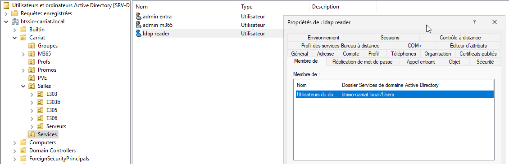
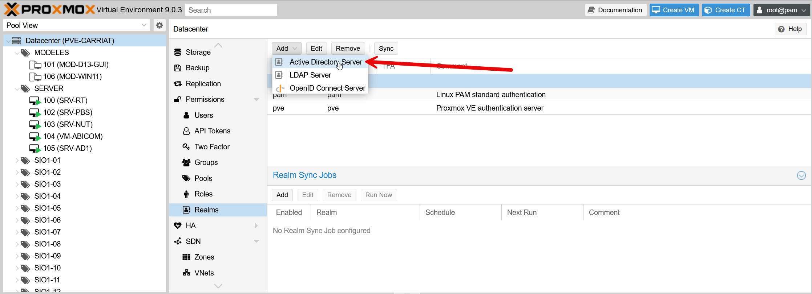
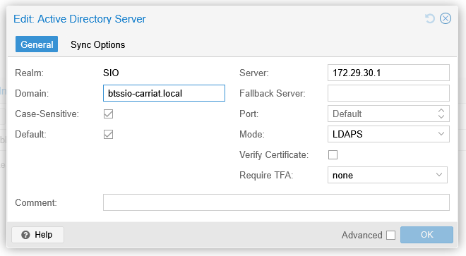
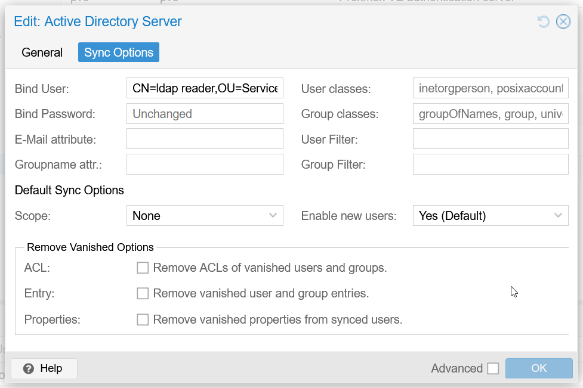
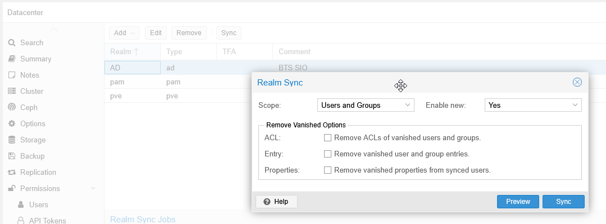
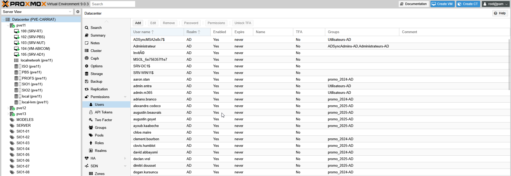

Nous allons configurer l’authentification sur le domaine afin que les étudiants puissent ouvrir une session avec leurs comptes de domaine.

Il faut au préalable avoir ajouté [le rôle Services de certificats Active Directory](/win2025-certificat/).

Il faut également avoir créé un utilisateur du domaine comme compte de service pour la synchronisation.

Il faut ensuite aller sur le Datacenter > Realms > Add > Active Directory Server

On va lui donner un nom, le nom de domaine, l’IP et on passe en LDAPS.

Dans l’onglet Sync Options, nous allons préciser le nom d’utilisateur ainsi que son mot de passe.

Une fois validé, il est possible de lancer une synchronisation (en preview pour vérifier que tout fonctionne).

Les comptes ont bien été importés.

<iframe width="720" height="576" src="https://www.youtube.com/embed/X_aSJ8x4nO4?si=-BtVvt2Zceak-lHc" title="YouTube video player" frameborder="0" allow="accelerometer; autoplay; clipboard-write; encrypted-media; gyroscope; picture-in-picture; web-share" referrerpolicy="strict-origin-when-cross-origin" allowfullscreen></iframe>