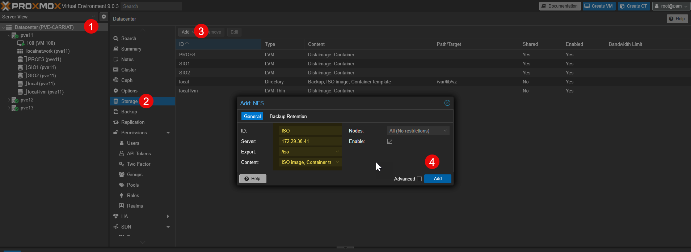
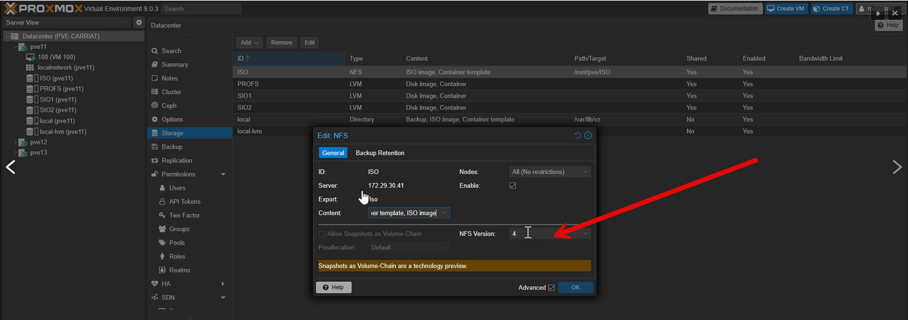

Nous allons attacher un partage QNAP destiné au stockage des ISO dans Proxmox.
On se connecte sur le Datacenter puis Storage > Add

On va préciser :

    Le nom
    L’IP
    Le dossier
    Le type de contenu (ISO images/image et Container template).

On peut forcer la version 4 dans les paramètres avancés

