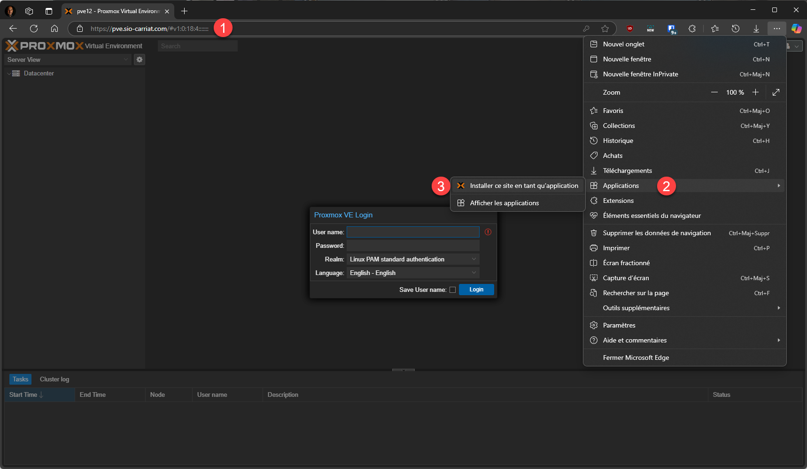
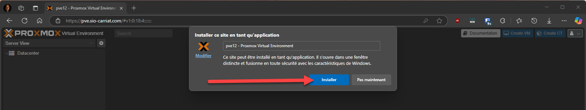
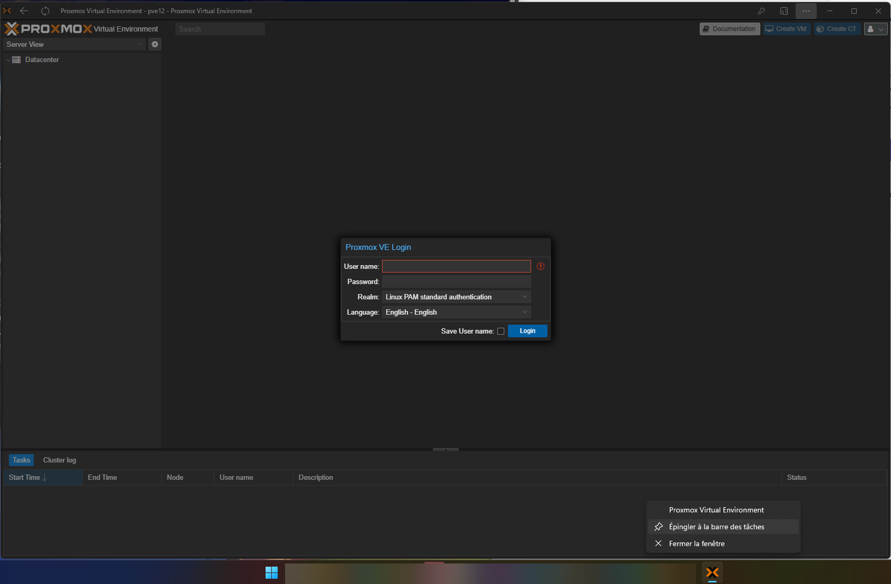

Pour améliorer encore l’expérience utilisateur, j’aime bien créer une application à partir d’une page web. Dans notre cas, Proxmox VE.

On ouvre le site dans Edge > … > Applications > Installer ce site en tant qu’application

On clique ensuite sur Installer (personnellement, j’ai retiré le nom du nœud)

On obtient une application qu’on peut intégrer dans la barre des taches.
