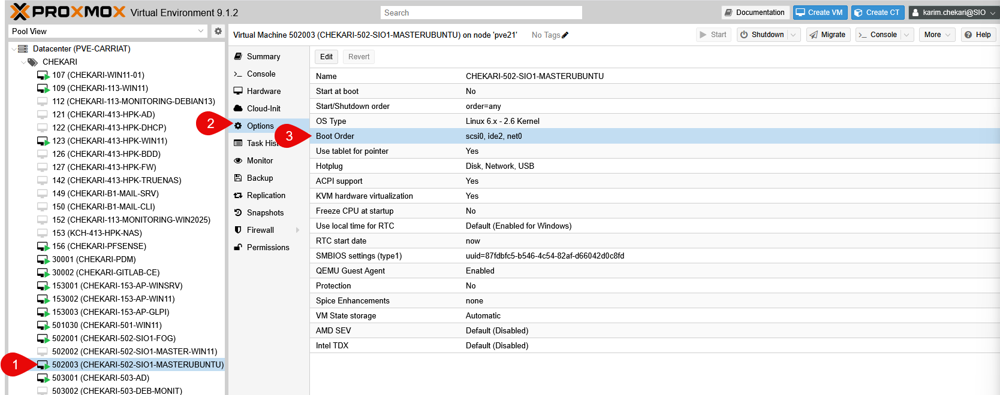
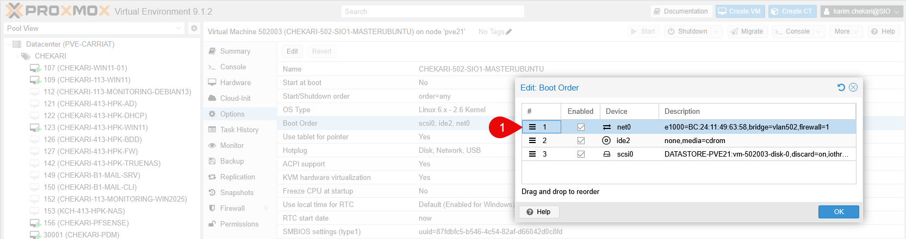
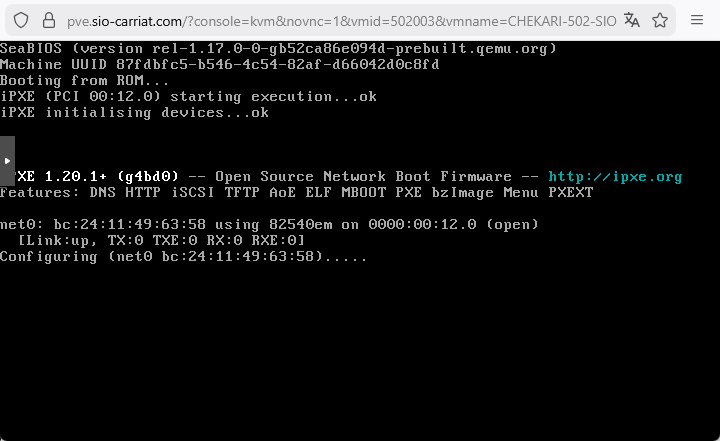
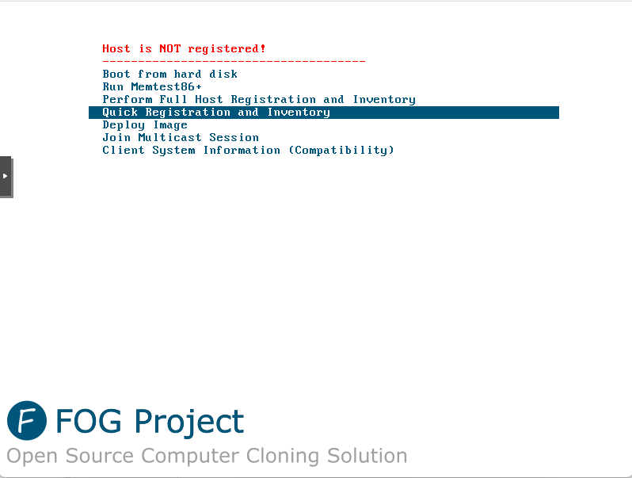

Comme pour un ordinateur physique, il est possible de configurer l'ordre de démarrage (boot order) des machines virtuelles dans Proxmox VE. Cela permet de définir quel périphérique la VM doit tenter de démarrer en premier, que ce soit un disque dur virtuel, une image ISO, ou un périphérique réseau.

Par exemple, si nous souhaitons démarrer une VM à partir d'une image ISO pour installer un système d'exploitation ou démarrer sur un serveur PXE, nous devons configurer l'ordre de démarrage en conséquence.

Il faut aller dans les options de la VM, puis dans l'onglet "Options".

Ensuite, nous sélectionnons "Boot Order" pour modifier l'ordre des périphériques de démarrage.

Pour que le changement soit pris en compte, il est nécessaire d'arrêter la VM avant de modifier l'ordre de démarrage.

En démarrant la VM, elle tentera de démarrer sur le réseau si le PXE est configuré, puis sur le CD-ROM (image ISO), et enfin sur le disque dur virtuel.

