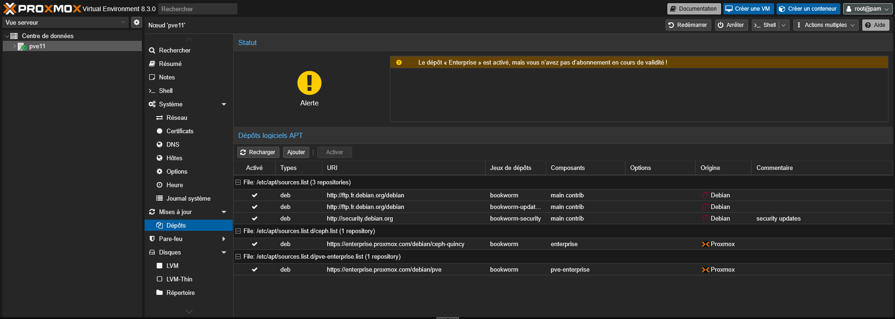
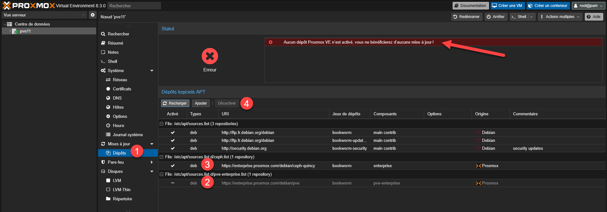
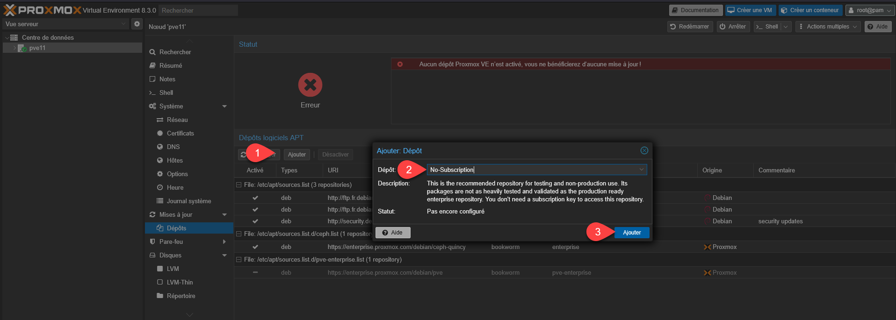

Lors d’une installation « standard », Proxmox configure automatiquement les dépôts entreprise.

Pour passer sur une solution Community Edition (gratuite, mais hors maintenance) il faut modifier les dépôts.

Allez sur le serveur > Mises à jour > Dépôts.

On va commencer par désactiver les dépôts Proxmox VE Entreprise.

On va ensuite ajouter un dépôt « No-Subscription ».

Le dépôt est automatiquement activé.

Vous avez noté qu’une alerte vous prévient qu’il n’est pas recommandé de l’utiliser en production.

