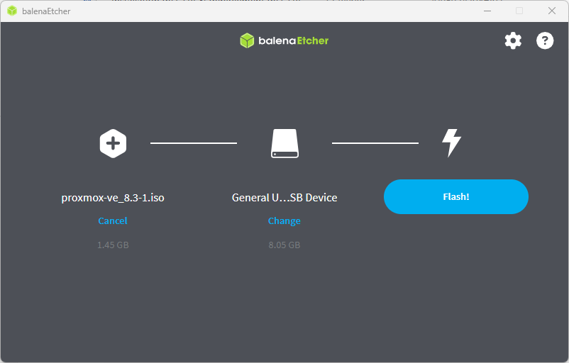
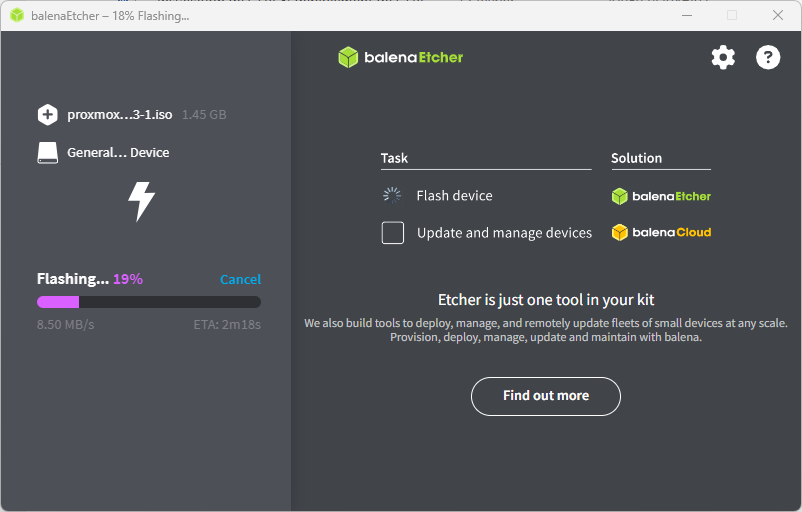

L’objectif est de pouvoir installer Proxmox VE sur mes serveurs.

Dans un premier temps, récupérer l’iso sur le site de Proxmox

[https://www.proxmox.com/en/downloads](https://www.proxmox.com/en/downloads)

:::tip
Testé sur les versions 8.3, 8.4 et 9.1
:::

Il existe déjà une base de connaissance sur le wiki de Proxmox

[https://pve.proxmox.com/wiki/Prepare_Installation_Media](https://pve.proxmox.com/wiki/Prepare_Installation_Media)

Télécharger Etcher (ou Rufus) et l’installer (si vous ne l’avez pas déjà).

[https://etcher.balena.io](https://etcher.balena.io)

Ensuite, c’est tout simple, choisir l’iso, la clé USB et lancer le Flash!

La copie se lance

Il ne reste plus qu’à booter sur la clé USB depuis le serveur.

