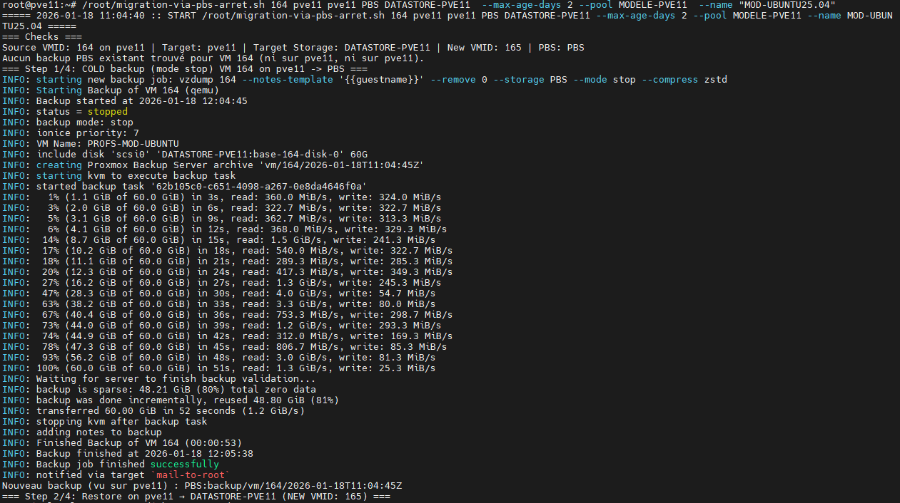
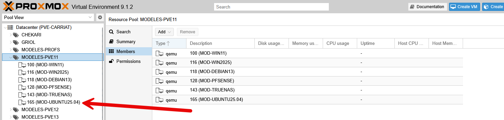

Voici un script bash simple pour déployer des modèles de machines virtuelles (VM) dans Proxmox VE (PVE). Ce script utilise l'outil en ligne de commande `qm` pour cloner et configurer les VM à partir d'un modèle existant.

L’objectif va être de déployer une machine ou un modèle vers un pool situé sur un autre serveur (même vers un stockage distant).

Nous allons utiliser PBS, Proxmox Backup Server pour faire une sauvegarde et une restauration en utilisant un script automatique.

```bash
nano /root/migration-via-pbs-arret.sh
```

Fonctionnement du script :
- Vérifie si un backup de la VM a été fait depuis moins de x jours sinon, en fait un.
- Restaure la VM sur le serveur de destination et sur le stockage demandé.
- Conversion la machine en template.
- Création du pool si il n’existe pas.

```bash
#!/usr/bin/env bash
set -euo pipefail
 
LOG=/var/log/migration-via-pbs.log
mkdir -p "$(dirname "$LOG")"
 
{
echo "===== $(date -u +'%F %T') :: START $0 $* ====="
 
# === Usage ===
# ./migration-via-pbs-arret.sh <VMID> <SRC_NODE> <DST_NODE> <PBS_STORAGE> <DST_STORAGE> [NEW_VMID] [--pool <POOLNAME>] [--max-age-days N] [--name NAME]
 
VMID="${1:-}"; SRC="${2:-}"; DST="${3:-}"; PBS="${4:-}"; DSTSTOR="${5:-}"
if [[ -z "${VMID}" || -z "${SRC}" || -z "${DST}" || -z "${PBS}" || -z "${DSTSTOR}" ]]; then
  echo "Usage: $0 <VMID> <SRC_NODE> <DST_NODE> <PBS_STORAGE> <DST_STORAGE> [NEW_VMID] [--pool <POOLNAME>] [--max-age-days N] [--name NAME]"
  exit 1
fi
shift 5
 
# NEWID optionnel (6e arg s'il n'est pas une option), sinon auto
NEWID=""
if [[ $# -gt 0 && "${1:0:2}" != "--" ]]; then
  NEWID="$1"; shift 1
fi
 
# Options
POOL=""
MAX_AGE_DAYS=""
NAME=""
while [[ $# -gt 0 ]]; do
  case "$1" in
    --pool)         POOL="${2:-}";         shift 2;;
    --max-age-days) MAX_AGE_DAYS="${2:-}"; shift 2;;
    --name)         NAME="${2:-}";         shift 2;;
    *) echo "Unknown arg: $1"; exit 1;;
  esac
done
 
# --- Ajout auto des clés SSH si nécessaire ---
ensure_ssh_known_host() {
  local HOST="$1"
  local FILE="/root/.ssh/known_hosts"
  mkdir -p /root/.ssh
  touch "$FILE"
  chmod 600 "$FILE"
  if ! ssh-keygen -F "$HOST" >/dev/null 2>&1; then
    echo "Ajout de la clé SSH de $HOST dans known_hosts..."
    ssh-keyscan -H "$HOST" >> "$FILE" 2>/dev/null || echo "  Impossible d'obtenir la clé SSH de $HOST"
  fi
}
ensure_ssh_known_host "$SRC"
ensure_ssh_known_host "$DST"
 
echo "=== Checks ==="
ssh -o BatchMode=yes "root@${SRC}" qm status "${VMID}" >/dev/null
ssh -o BatchMode=yes "root@${DST}" true >/dev/null
 
# NEWID auto si non fourni
if [[ -z "${NEWID}" ]]; then
  NEWID="$(ssh "root@${DST}" pvesh get /cluster/nextid)"
fi
echo "Source VMID: ${VMID} on ${SRC} | Target: ${DST} | Target Storage: ${DSTSTOR} | New VMID: ${NEWID} | PBS: ${PBS}"
 
# Vérifier PBS 'active' sur la source (colonne 3 == active)
if ! ssh "root@${SRC}" pvesm status | awk -v s="${PBS}" '$1==s && $3=="active"{ok=1} END{exit ok?0:1}'; then
  echo "ERREUR: le storage '${PBS}' n'est pas actif sur ${SRC}. Corrige via GUI ou: pvesm set ${PBS} --nodes all ; systemctl reload pvedaemon"
  exit 2
fi
 
# --- Helpers ---
find_latest_vol_on() {
  local NODE="$1"
  ssh "root@${NODE}" bash -s -- "${PBS}" "${VMID}" <<'EOS'
PBS="$1"; VMID="$2"
pvesm list "${PBS}" 2>/dev/null \
| awk -v id="${VMID}" 'NF>=1 {if ($NF==id) print $1}' \
| sort \
| tail -n1
EOS
}
 
extract_ts_from_vol() {
  local VOLID="$1"
  echo "${VOLID}" | sed -n 's/.*\([0-9]\{4\}-[0-9]\{2\}-[0-9]\{2\}T[0-9]\{2\}:[0-9]\{2\}:[0-9]\{2\}Z\).*/\1/p'
}
 
# Chercher un backup existant (cible d'abord, puis source)
LATEST_VOL_DST="$(find_latest_vol_on "${DST}")"
LATEST_VOL_SRC=""
if [[ -z "${LATEST_VOL_DST}" ]]; then
  LATEST_VOL_SRC="$(find_latest_vol_on "${SRC}")"
fi
LATEST_VOL="${LATEST_VOL_DST:-${LATEST_VOL_SRC}}"
 
if [[ -n "${LATEST_VOL_DST}" ]]; then
  echo "Dernier backup visible sur ${DST} : ${LATEST_VOL_DST}"
elif [[ -n "${LATEST_VOL_SRC}" ]]; then
  echo "Dernier backup trouvé via ${SRC} : ${LATEST_VOL_SRC}"
else
  echo "Aucun backup PBS existant trouvé pour VM ${VMID} (ni sur ${DST}, ni sur ${SRC})."
fi
 
# Décision de (re)sauvegarder selon --max-age-days
SHOULD_BACKUP=1
if [[ -n "${LATEST_VOL}" && -n "${MAX_AGE_DAYS}" && "${MAX_AGE_DAYS}" =~ ^[0-9]+$ ]]; then
  TS="$(extract_ts_from_vol "${LATEST_VOL}")"
  if [[ -n "${TS}" ]]; then
    NOWS="$(date -u +%s)"
    BKS="$(date -u -d "${TS}" +%s)"
    AGE_SEC=$((NOWS - BKS))
    THRESH=$(( MAX_AGE_DAYS * 86400 ))
    echo "Backup existant: ${TS} (age_sec=${AGE_SEC}, seuil=${THRESH})"
    if (( AGE_SEC <= THRESH )); then
      echo "=== Backup <= ${MAX_AGE_DAYS} jour(s) → on NE refait PAS de sauvegarde ==="
      SHOULD_BACKUP=0
    fi
  fi
fi
if [[ -z "${LATEST_VOL}" ]]; then SHOULD_BACKUP=1; fi
 
# Étape 1 : sauvegarde à froid si nécessaire
if (( SHOULD_BACKUP == 1 )); then
  echo "=== Step 1/4: COLD backup (mode stop) VM ${VMID} on ${SRC} -> ${PBS} ==="
  ssh "root@${SRC}" vzdump "${VMID}" --storage "${PBS}" --mode stop --compress zstd --remove 0 --notes-template '{{guestname}}'
  # refresh (cible prioritaire)
  LATEST_VOL_DST="$(find_latest_vol_on "${DST}")"
  if [[ -n "${LATEST_VOL_DST}" ]]; then
    LATEST_VOL="${LATEST_VOL_DST}"
    echo "Nouveau backup (vu sur ${DST}) : ${LATEST_VOL}"
  else
    LATEST_VOL_SRC="$(find_latest_vol_on "${SRC}")"
    if [[ -n "${LATEST_VOL_SRC}" ]]; then
      LATEST_VOL="${LATEST_VOL_SRC}"
      echo "Nouveau backup (vu via ${SRC}) : ${LATEST_VOL}"
    else
      echo "ERREUR: impossible de lister le backup fraîchement créé."
      exit 3
    fi
  fi
else
  echo "=== Step 1: SKIPPED (backup récent utilisé) ==="
fi
 
# Étape 2 : restauration (sur le nœud cible)
echo "=== Step 2/4: Restore on ${DST} → ${DSTSTOR} (NEW VMID: ${NEWID}) ==="
ssh "root@${DST}" qmrestore "${LATEST_VOL}" "${NEWID}" --storage "${DSTSTOR}" --unique 1
 
# Nom de la VM restaurée (si --name absent: on copie celui de la source, sinon fallback vm-<NEWID>)
if [[ -z "${NAME}" ]]; then
  SRC_NAME="$(ssh "root@${SRC}" bash -lc "qm config ${VMID} | awk -F': ' '/^name:/{print \$2}'" || true)"
  if [[ -n "${SRC_NAME}" ]]; then
    NAME="${SRC_NAME}"
  else
    NAME="vm-${NEWID}"
  fi
fi
echo "=== Naming restored VM: ${NAME} ==="
ssh "root@${DST}" qm set "${NEWID}" --name "${NAME}"
 
# Étape 3 : conversion en template
echo "=== Step 3/4: Convert to TEMPLATE ==="
ssh "root@${DST}" qm set "${NEWID}" -template 1
 
# Étape 4 : ajout au pool (optionnel, sans jq, idempotent)
if [[ -n "${POOL}" ]]; then
  echo "=== Step 4/4: Add template ${NEWID} to pool '${POOL}' ==="
  ssh "root@${DST}" bash -s -- "${POOL}" "${NEWID}" <<'EOS'
POOL="$1"; NEWID="$2"
set -e
# Créer le pool s'il n'existe pas
if ! pvesh get /pools --output-format json | tr -d '\n' | grep -q "\"poolid\":\"${POOL}\""; then
  pvesh create /pools -poolid "${POOL}" >/dev/null
fi
# Lister les VM qemu existantes (extraction JSON en shell pur)
CUR=$(pvesh get /pools/${POOL} --output-format json \
  | tr -d '\n' \
  | grep -o '"type":"qemu","vmid":[0-9]\+' \
  | grep -o '[0-9]\+$' \
  | tr '\n' ',' | sed 's/,$//')
# Ajouter NEWID si absent
if [ -z "$CUR" ]; then
  VMS_LIST="${NEWID}"
else
  case ",$CUR," in
    *,"$NEWID",*) VMS_LIST="$CUR" ;;        # déjà présent
    *)            VMS_LIST="$CUR,${NEWID}" ;;
  esac
fi
pvesh set /pools/${POOL} -vms "$VMS_LIST" >/dev/null
EOS
fi
 
echo "=== DONE === Template VMID: ${NEWID} on ${DST} (storage: ${DSTSTOR}) | Restored: ${LATEST_VOL}"
echo "===== $(date -u +'%F %T') :: END ====="
} 2>&1 | tee -a "$LOG"
```
On va ensuite le rendre exécutable :
```bash
chmod +x /root/migration-via-pbs-arret.sh
```

On peut maintenant lancer le script avec les paramètres :

```bash
/root/migration-via-pbs-arret.sh VMID-A-CLONER PVE-SOURCE PVE-DESTINATION STOCKAGE-PBS STOCKAGE-DESTINATION  --max-age-days ANCIENNETE-DU-BACKUP --pool NOM-POOL --name "NOUVEAU-NOM"
 
Exemple :
/root/migration-via-pbs-arret.sh 110 pve11 pve23 PBS DATASTORE-PVE23  --max-age-days 2 --pool CHEKARI  --name "MODELE-SCRIPTD13"
```



La VM est bien créé !



Vous pouvez relancer le script, la fois suivante il ne fera pas de nouvelle sauvegarde si le backup est récent.