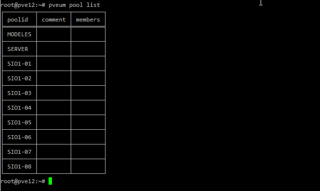
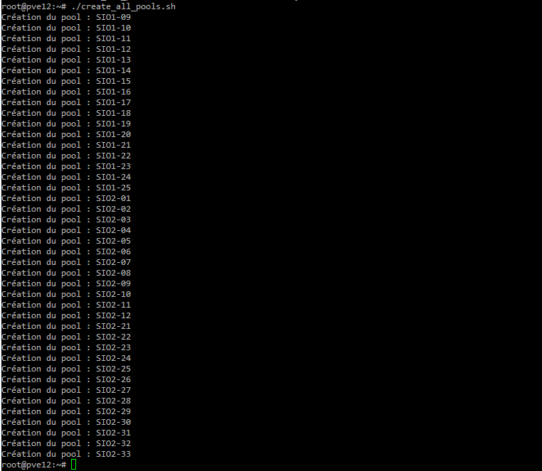
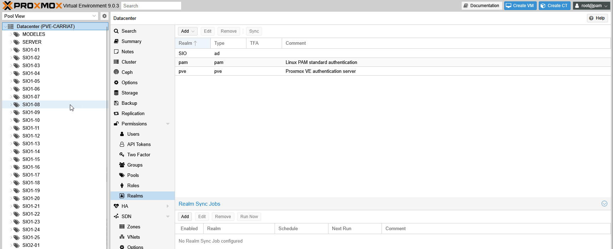

Dans Proxmox, il est possible de gérer ses pools en ligne de commande avec les commandes pvesh et pveum.

### Créer un pool

```bash	
pveum pool add <nom_du_pool> -comment "Mon pool"
```

### Liste les pools

```bash
pveum pool list
```



### Supprimer un pool

```bash
pveum pool delete <nom_du_pool>
```

### Script de création de pool par exemple :

Créer un fichier /root/create_all_pools.sh

```bash
	
#!/bin/bash
 
# Liste des pools à créer
POOLS=(
# --- SIO1 ---
"SIO1-09"
"SIO1-10"
"SIO1-11"
"SIO1-12"
"SIO1-13"
"SIO1-14"
"SIO1-15"
"SIO1-16"
"SIO1-17"
"SIO1-18"
"SIO1-19"
"SIO1-20"
"SIO1-21"
"SIO1-22"
"SIO1-23"
"SIO1-24"
"SIO1-25"
 
# --- SIO2 ---
"SIO2-01"
"SIO2-02"
"SIO2-03"
"SIO2-04"
"SIO2-05"
"SIO2-06"
"SIO2-07"
"SIO2-08"
"SIO2-09"
"SIO2-10"
"SIO2-11"
"SIO2-12"
"SIO2-21"
"SIO2-22"
"SIO2-23"
"SIO2-24"
"SIO2-25"
"SIO2-26"
"SIO2-27"
"SIO2-28"
"SIO2-29"
"SIO2-30"
"SIO2-31"
"SIO2-32"
"SIO2-33"
)
 
# Boucle de création
for pool in "${POOLS[@]}"; do
    echo "Création du pool : $pool"
    pveum pool add "$pool" -comment "Pool $pool"
done

```

Rendre le fichier executable

```bash
chmod +x /root/create_all_pools.sh
```

Le lancer

```bash
./create_all_pools.sh
```



Les pools apparaissent bien dans Proxmox.

