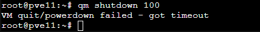

J’ai eu un souci, impossible de stopper une VM (ID 100).

Du coup, dans le shell, vous pouvez essayer ses commandes :

```bash
qm shutdown 100
```



Si ça ne fonctionne pas, on peut tenter un arrêt brutal.

```bash
qm stop 100 --skiplock
```

La machine s’arrête bien.

On peut vérifier le statut de la VM avec la commande :

```bash
qm status 100
```

Si nécessaire, on peut supprimer le fichier lock

```bash
rm -f /var/lock/qemu-server/lock-100.conf
```