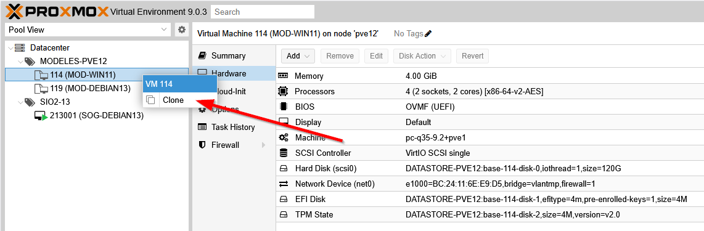
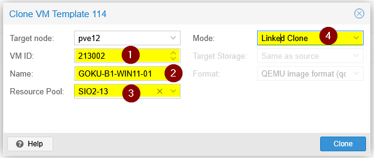
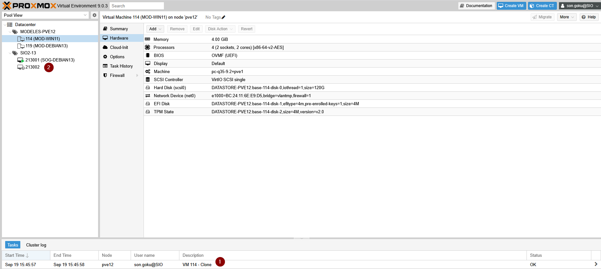
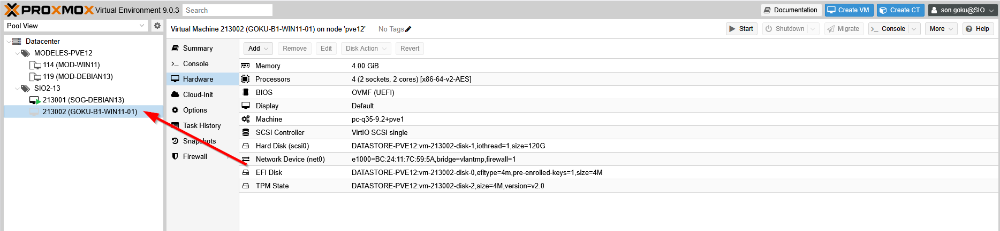
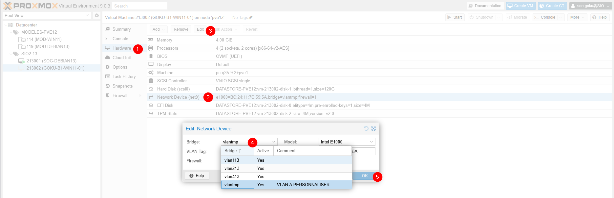
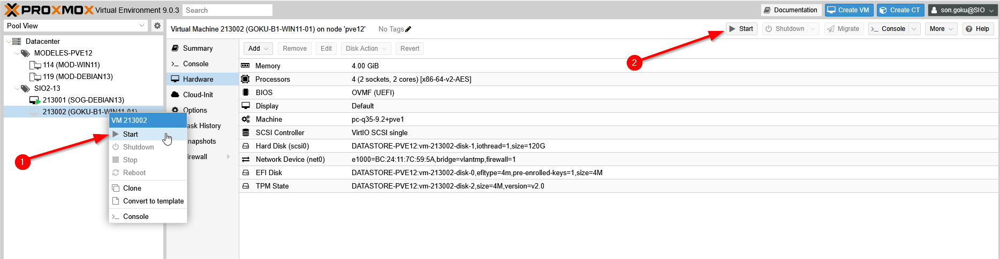
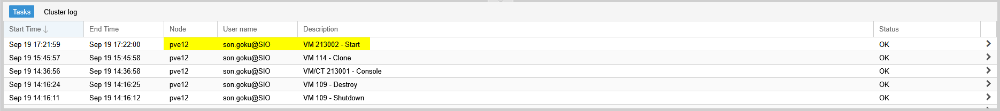

Votre enseignant met à disposition plusieurs modèles de machine afin de vous faire gagner du temps d’installation ou vous faire travailler sur un environnement spécifique.

## Clonage

Connectez-vous avez votre compte Carriat et faite un clic droit sur le modèle demandé > **Option Clone**.

:::caution
CETTE ÉTAPE EST TRÈS IMPORTANTE ET DOIT ÊTRE RESPECTÉE A LA LETTRE
:::

Dans la fenêtre qui s’ouvre, il faut mettre en place la configuration suivante :
- VMID : il faut mettre votre numéro unique ainsi qu’un compteur à 3 chiffres (que vous devez noter) afin que votre identifiant soit unique. Dans mon exemple, Goku est SIO2–13. Son id sera donc 213. Ayant déjà une VM avec l’ID 213001, j’ai mis 213002.
- Le nom doit toujours commencer par votre nom de famille en MAJUSCULE puis séparé par des tirets, vous mettez des précisions sur l’objectif de la VM ainsi que son système d’exploitation.

- Nous pouvons voir dans les logs que le clonage c’est bien passé.
- La machine est en cours de création.

Une fois le processus terminé, elle est disponible à gauche avec son VM ID et son nom.

## Personnalisation

Par défaut, le modèle est sur un réseau temporaire, il faut obligatoirement le modifier.

Dans l’onglet **Hardware (1)** de la machine, sélectionner la ligne **Network Device (2)** et faite ensuite **Édit (3)**.

Dans le paramètre **Bridge (4)**, choisissez votre réseau(par défaut, **mettre le vlan1xx**).

Valider avec OK (5).

## Démarrage

Un clic droit permet de la démarrer, sinon, utiliser le bouton en haut à droite.

Nous pouvons voir dans les logs que la machine a bien démarrée.

Pour avoir accès à son écran virtuel, vous pouvez utiliser l’onglet Console (1) de la machine (une fenêtre sera intégrée).

(2) Noter que vous avez un menu sur la gauche de l’écran pour lancer des commandes sur la VM (clavier, alimentation …).

Ou bien, en haut à droite, la console qui s’ouvrira sera en pop-up.

