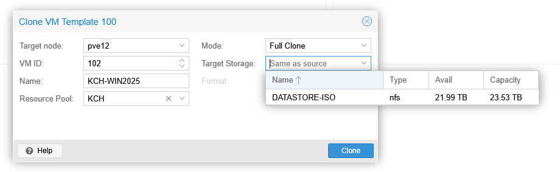

En voulant cloner une VM sur un autre PVE, je me suis aperçu que je n’ai pas le stockage DATASTORE-VM car il n’est pas partagé :



Il faut editer le fichier /etc/pve/storage.cfg
```bash
nano /etc/pve/storage.cfg
 
lvmthin: datastore-vm
    thinpool thin_san
    vgname vg_san_md32xx
    content rootdir,images
    nodes pve11,pve12
    shared 1
```

Ajouter `shared 1`

Cette modification est appliquée sur les 3 serveurs en une seule modification.

Il faut ensuite redémarrer les services

```bash
systemctl restart pvedaemon
systemctl restart pveproxy
```

On réinitialise l’interface web et cela fonctionne.