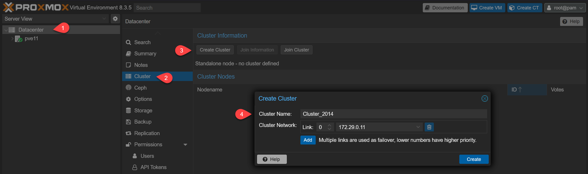
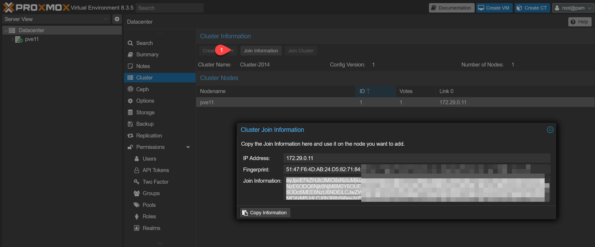
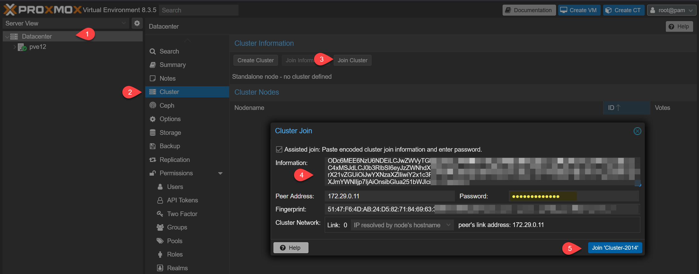
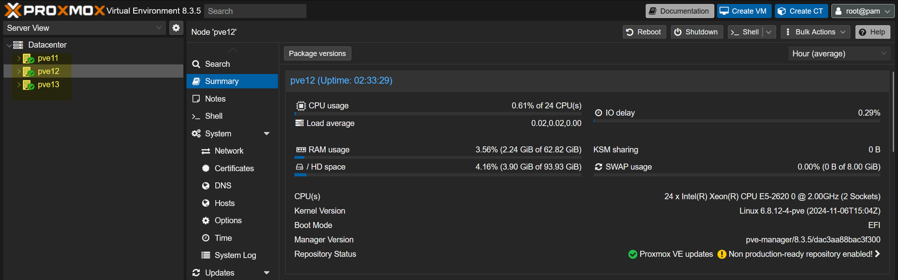

Pour créer un cluster, il faut disposer d'au moins deux machines sous Proxmox VE (dans une version similaire si possible) et qu’elles soient capables de se joindre à travers le réseau auquel elles sont connectées. L’idéal est d’en avoir au moins trois : si l’une tombe, les deux autres disposent d’un « quorum » suffisant pour décider que faire.

Pour commencer, aller dans le Datacenter (centre de données) > Cluster > Create Cluster.

Dans cette fenêtre, il suffit de lui donner un nom et choisir la carte réseau pour la jonction.

Lorsque tout est validé, le cluster apparait, vous pouvez alors demander à voir ses « Join Information ».

Elles prennent la forme d'une clé qui est une forme encodée de l’adresse IP du serveur et de son empreinte, utilisées pour la connexion.

Dans l’interface des autres serveurs, on sélectionne Join Cluster et on peut simplement copier la clé pour remplir les champs automatiquement, ou le faire manuellement. Il faudra néanmoins connaitre le mot de passe administrateur (root) du serveur ayant initié le cluster pour finaliser la procédure.

Si tout s’est bien passé, après avoir rechargé la page (et une reconnexion), tous les serveurs (nœuds) apparaissent dans chaque interface, au sein de la section Datacenter du menu de gauche. On peut alors les gérer de manière unifiée, depuis l’un ou l’autre membre du cluster, sans distinction.

La section Summary affichera également les ressources de manière globale : stockage, mémoire, CPU, VM et conteneurs des nœuds y sont additionnés.
