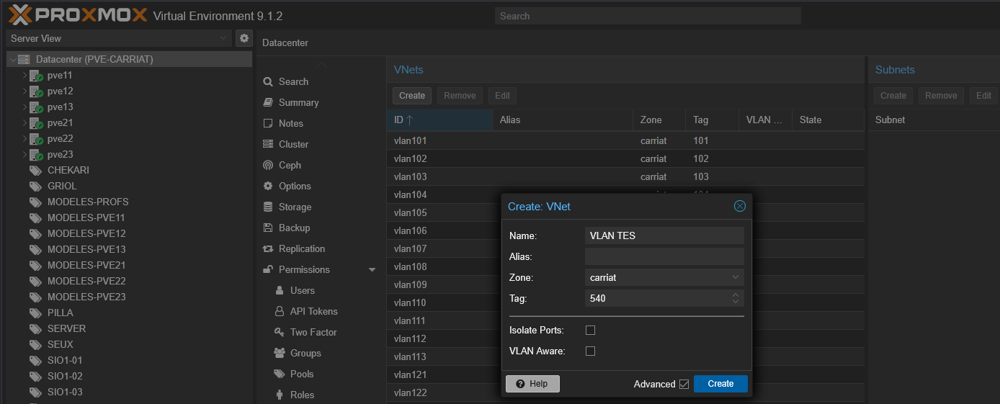
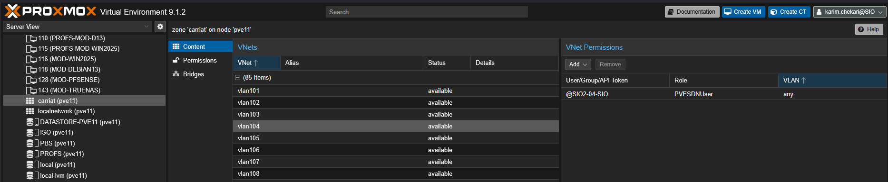
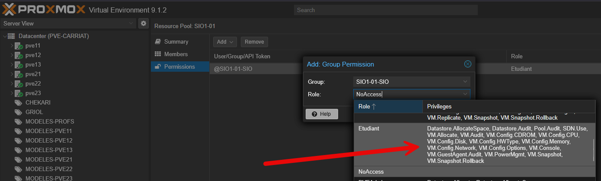

## Création du VNet

Dans un premier temps, il faut créer le VNets

Par contre le switch ne connait pas le VLAN.

## Ajout des droits

Sur un serveur, dans la zone `carriat`
Ajout des droits avec le rôle pour le groupe AD.


Création d'un pool pour l'étudiant et mise en place des droits


## Configuration de l'accès depuis le Huawei

```bash
sys
```

Création du VLAN :

```bash
vlan 10
description vLan Management
```

Ajout d'une IP sur l'interface

```bash
interface Vlanif32
 ip address 172.29.32.253 255.255.255.0
 dhcp select relay
 dhcp relay server-ip 172.29.30.1
q
```

Voir la configuration

```bash
display current-configuration
```

Sauvegarde :

```bash
<SW-CORE>save
Warning: The current configuration will be written to the device. Continue? [Y/N]:y
Now saving the current configuration to the slot 2 .
Info: Save the configuration successfully.
Now saving the current configuration to the slot 1 ..
Info: Save the configuration successfully.
<SW-CORE>
```
