La création d’une machine virtuelle (VM) dans Proxmox consiste à définir les ressources matérielles (processeurs, mémoire, disque, carte réseau) et à installer un système d’exploitation comme on le ferait sur un ordinateur physique.

Une VM fonctionne de manière isolée, ce qui permet de faire cohabiter plusieurs environnements sur un même serveur. En production, la virtualisation offre de nombreux avantages : meilleure utilisation des ressources matérielles, souplesse dans la gestion des serveurs, possibilité de déplacer ou sauvegarder facilement des machines, et haute disponibilité en cas de panne matérielle.

Dans un contexte pédagogique, elle est encore plus utile : les étudiants peuvent expérimenter, installer et casser des systèmes sans risque pour l’infrastructure réelle, et revenir en arrière rapidement grâce aux snapshots. Ainsi, la virtualisation combine optimisation des ressources, sécurité, flexibilité et réduction des coûts, ce qui en fait une technologie incontournable aujourd’hui.

Il y a des particularités dans l’installation d’une VM Windows et Linux, elles seront expliquées plus bas.

## Création de la machine

En haut à droite, cliquer sur Create VM

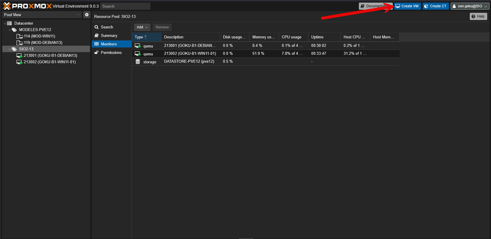

Une fenêtre se lance avec différents onglets

### Onglet Général

- Node : Correspond au serveur qui vous a été attribué. si vous ne le connaissez pas, il est inscrit à la fin du nom du pool MODELES-PVExx
- VM ID : Mettre votre numéro unique ainsi qu’un compteur à 3 chiffres (que vous devez noter) afin que votre identifiant soit unique. Dans mon exemple, Goku est SIO2–13. Son id sera donc 213. Ayant déjà une VM avec l’ID 213003.
- Name : Le nom doit toujours commencer par votre nom de famille en MAJUSCULE puis séparé par des tirets,vous mettez des précisions sur l’objectif de la VM ainsi que son système d’exploitation.
- Resource Pool : Votre pool SIOx-XX.

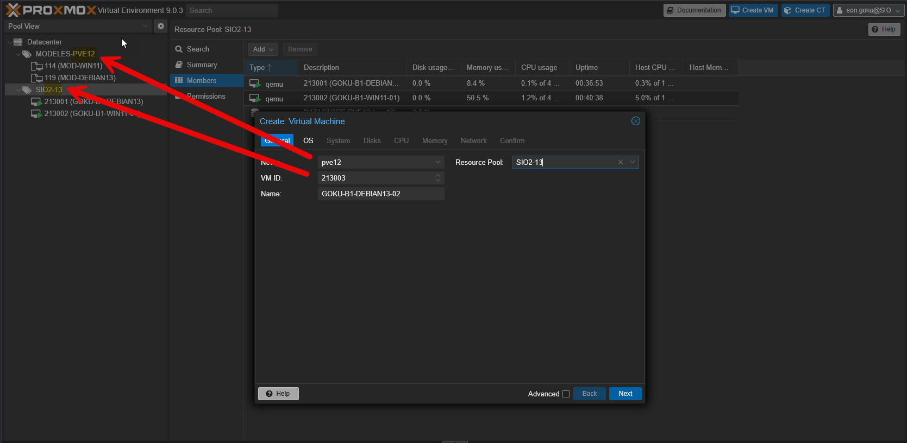

### OS

Debian

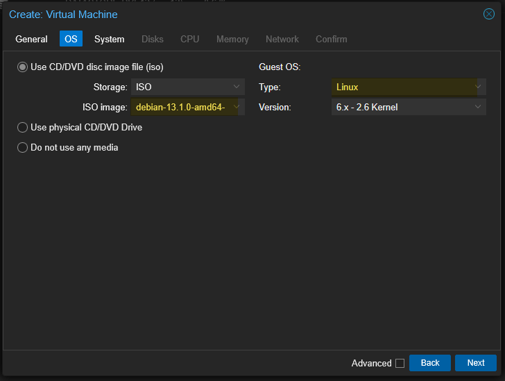

Windows

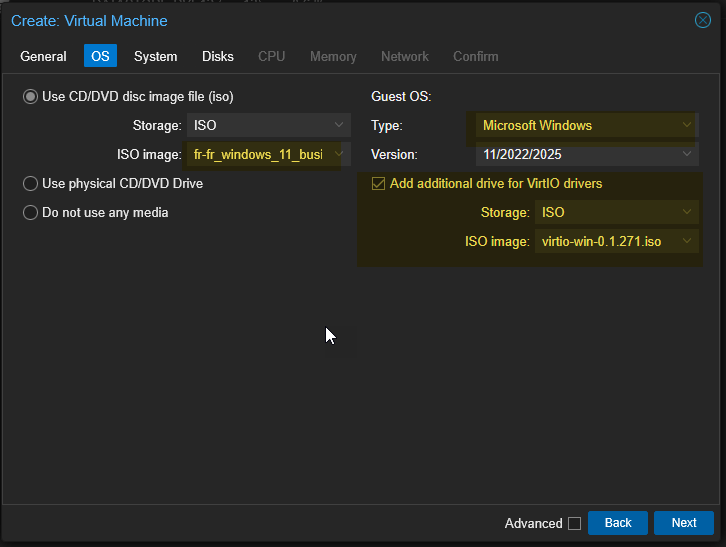

- Use CD/DVD disc image file (iso), Storage iso : Aller chercher votre fichier iso.
- Guest OS : Microsoft Windows ou Linux

Pour Windows :

Windows n’intègre pas les drivers disque dur de Proxmox. Il faut donc ajouter un second iso pour réaliser l’installation.

- Cocher Add additional drive for VirtIO drivers
- ISO Image : Virtio-win-xxx.iso

### System

Linux

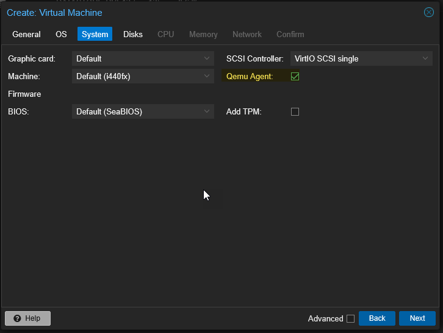

Windows

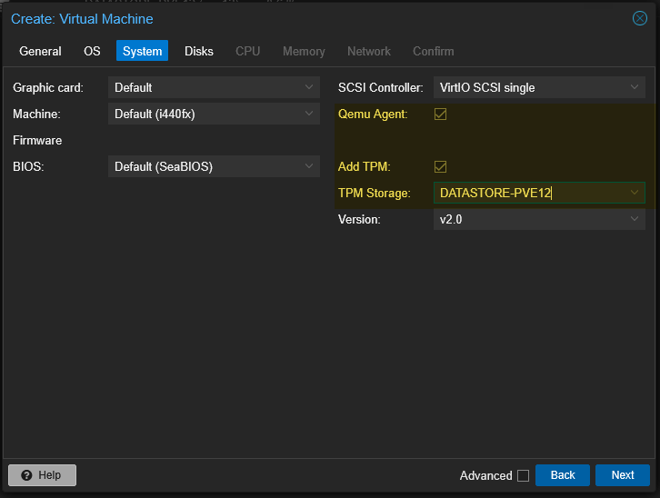

- Qemu Agent : Cocher pour l’activer, il faudra toutefois l’installer sur le système.

Pour Windows :

- Windows a besoin d’un TPM pour fonctionner.
- Add TPM : À cocher.
- TPM Storage : Emplacement de stockage du TPM virtuel (dans votre datastore).

### Disks

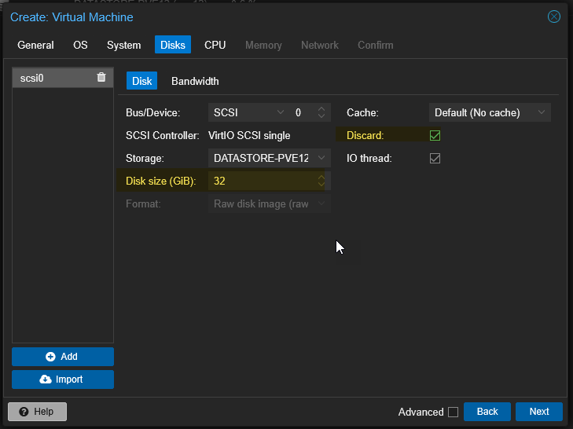

- Discard : cocher la case.

L’option Discard optimise l’utilisation du stockage en permettant à Proxmox de récupérer automatiquement l’espace réellement libre dans la VM. C’est particulièrement utile en environnement de production pour éviter le gaspillage de stockage, mais aussi en pédagogie quand plusieurs étudiants créent et suppriment souvent des fichiers dans leurs VM.

Option

    Disk size : nous pouvons laisser la taille par défaut, mais votre enseignant peut vous demander de la modifier.

### CPU

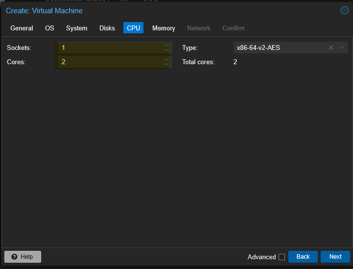

- Pour Linux : 1 sockets, 2 cores.
- Pour Windows : 2 socket, 2 cores.

Sauf demande spécifique de votre enseignant.

### Memory

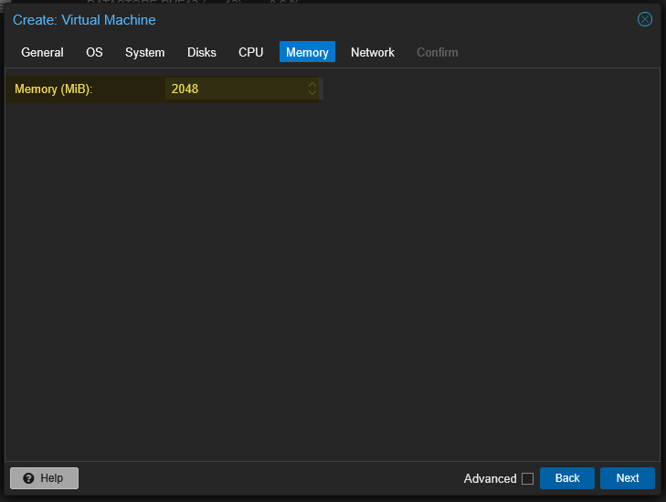

- Pour Linux : 2048
- Pour Windows 11 : 4096
- Pour Windows Server : 6144

Sauf demande spécifique de votre enseignant.

### Network

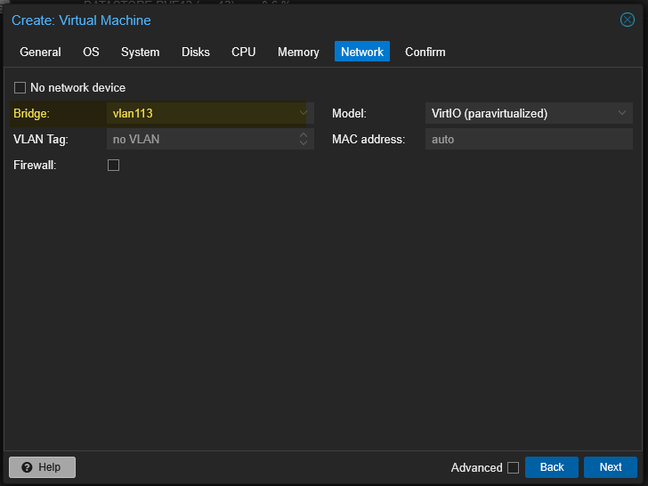

Bridge : Sélectionner votre réseau

### Confirm

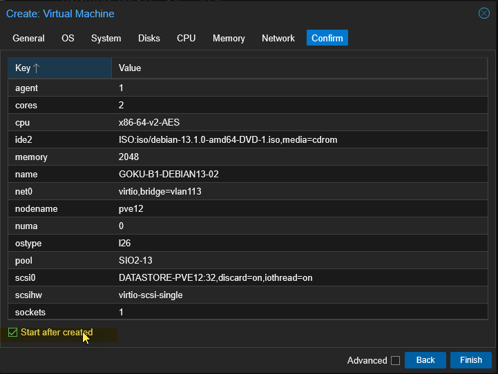

Nous avons un résumé de la configuration prévue.

Il est possible de lancer la VM après sa création.

La machine démarre.

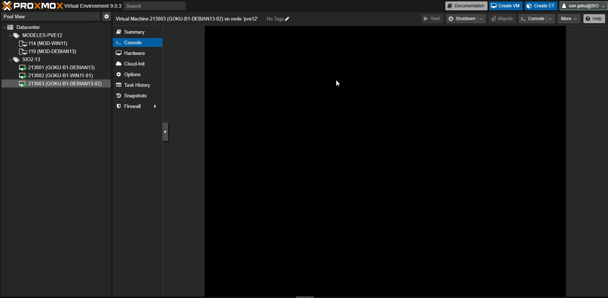