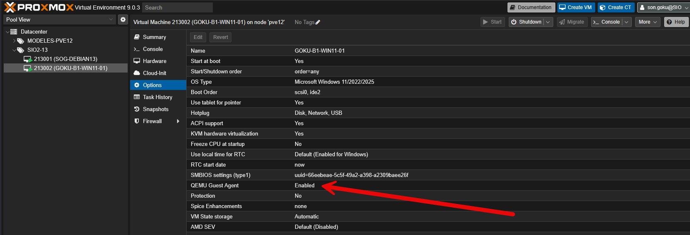
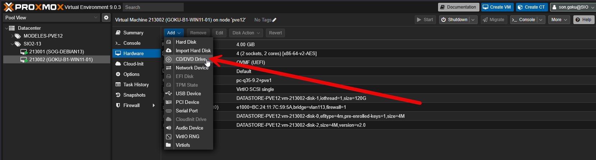
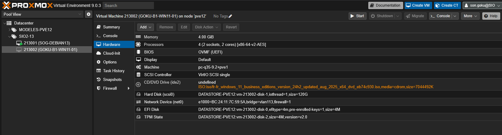
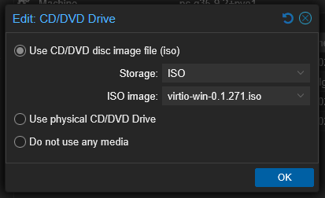
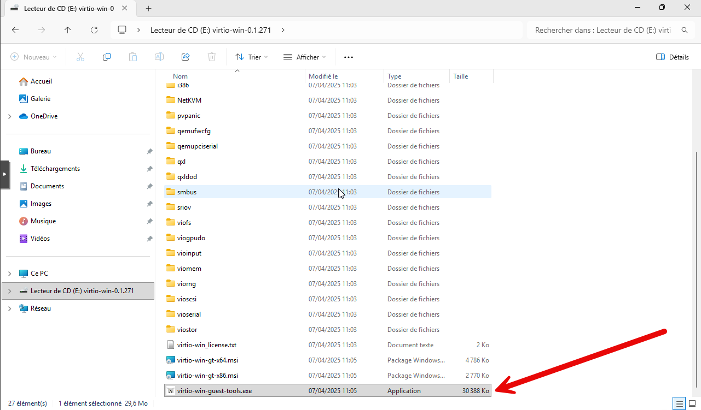
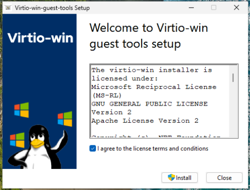
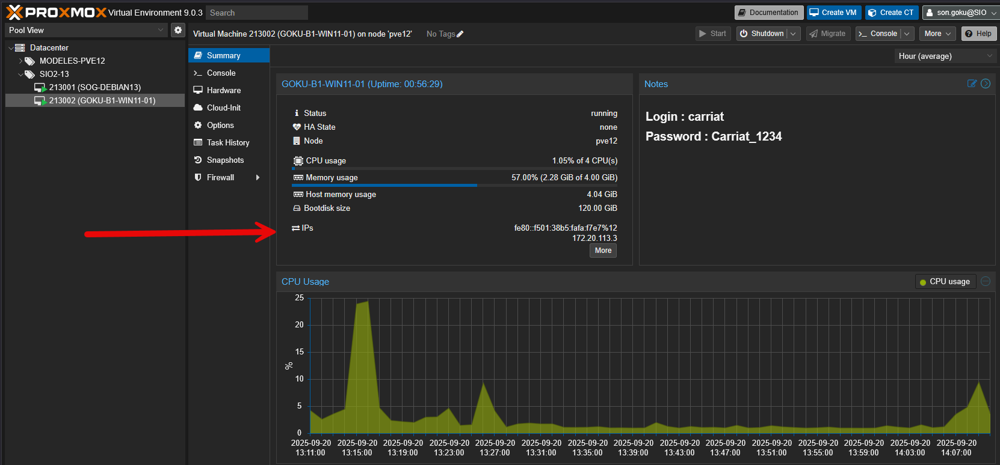

Dans Proxmox, l’installation des drivers VirtIO et du QEMU Guest Agent est fortement recommandée pour optimiser les performances et enrichir les fonctionnalités des machines virtuelles. Les pilotes VirtIO offrent une meilleure intégration entre l’hyperviseur et le système invité en améliorant la rapidité des accès disque, réseau et périphériques virtuels, par rapport aux pilotes émulés classiques qui sont plus lents. Le QEMU Guest Agent, quant à lui, ajoute des fonctionnalités supplémentaires comme l’arrêt propre de la machine depuis l’interface Proxmox, la synchronisation de l’heure avec l’hôte, la récupération d’informations précises sur l’état de la VM ou encore la possibilité de faire des sauvegardes cohérentes à chaud. En résumé, ces deux composants permettent d’obtenir des performances optimisées, une gestion plus fine des VM et une meilleure stabilité globale de l’infrastructure virtuelle.

Il faut dans un premier temps, activer le QEMU Guest Agent dans les options de la VM.



### Installation sous Windows

Pour télécharger l’iso : [https://pve.proxmox.com/wiki/Windows_VirtIO_Drivers](https://pve.proxmox.com/wiki/Windows_VirtIO_Drivers) (déjà disponible sur nos serveurs).

Nous allons monter l’iso sur la machine. Il faut aller dans l’onglet Hardware de la VM.

Si elle n’a pas de CD/DVD, il faut en ajouter un :



- Storage : ISO
- ISO Image : virtio-win-0.1.271.iso

Il faut ensuite arrêter et démarrer la VM pour que le changement soir appliqué.



Et ensuite charger le fichier iso.



Une fois l’iso monté, il faut installer le logiciel à partir du fichier virtio-win-guest-tools.exe



Le fichier exe va installer les drivers virtio ainsi que les qemu agent, il y aura donc deux installations.
On accepte la licence et on lance l’installation.



Accepter ensuite toutes les étapes par défaut.
Une fois terminé, vous devez redémarrer.
Si tout est bon, dans le résumé de la machine, vous devez voir son IP



### Installation sous Linux

[https://pve.proxmox.com/wiki/Qemu-guest-agent#Linux](https://pve.proxmox.com/wiki/Qemu-guest-agent#Linux)

Il faut lancer l’installation avec la commande :

```bash
apt install qemu-guest-agent
```

Sur une VM Debian 12/3, le paquet est déjà installé.