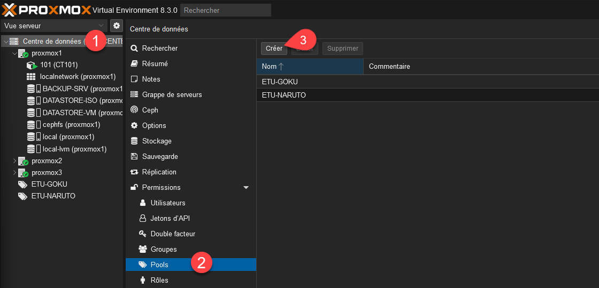
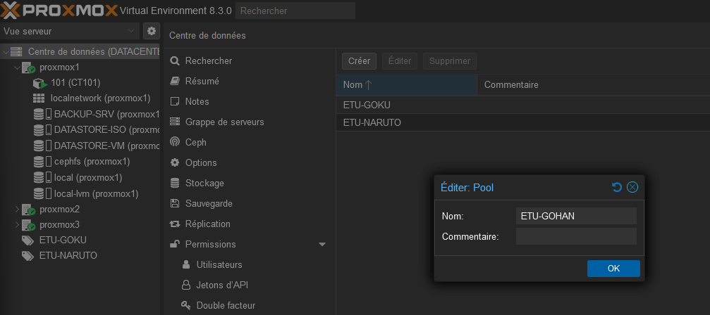
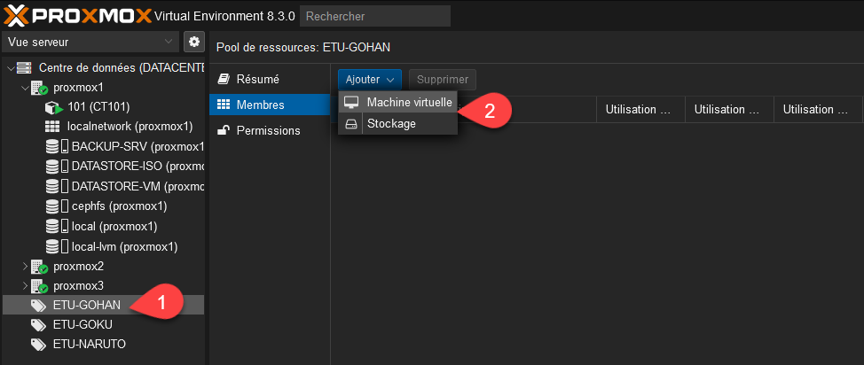
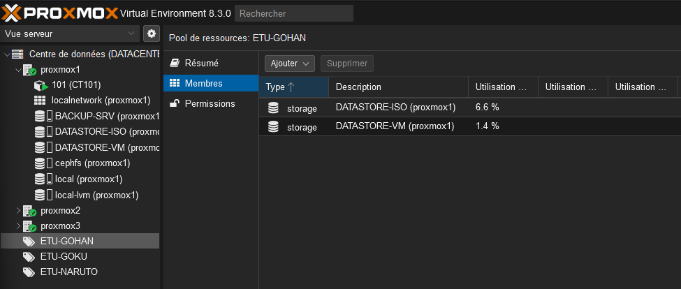
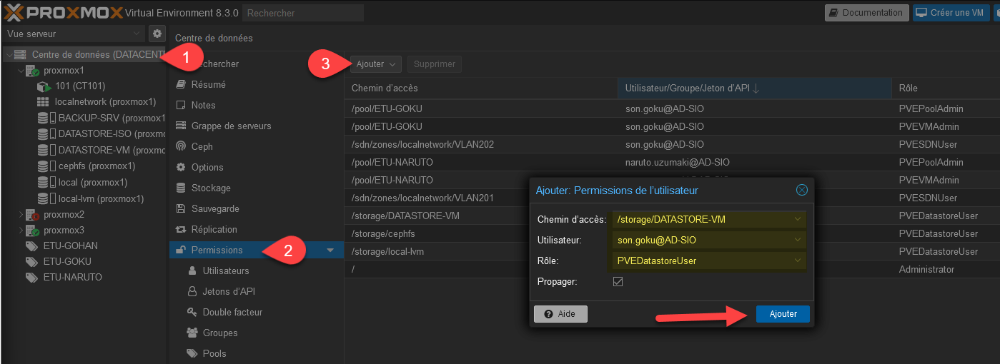
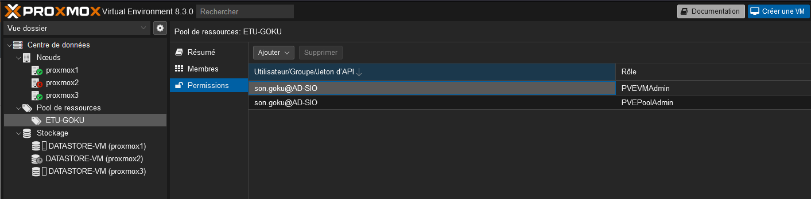
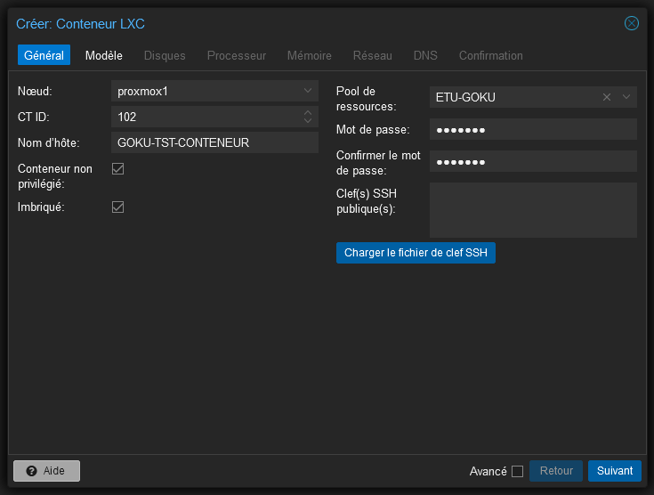
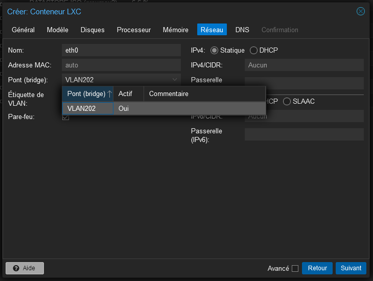
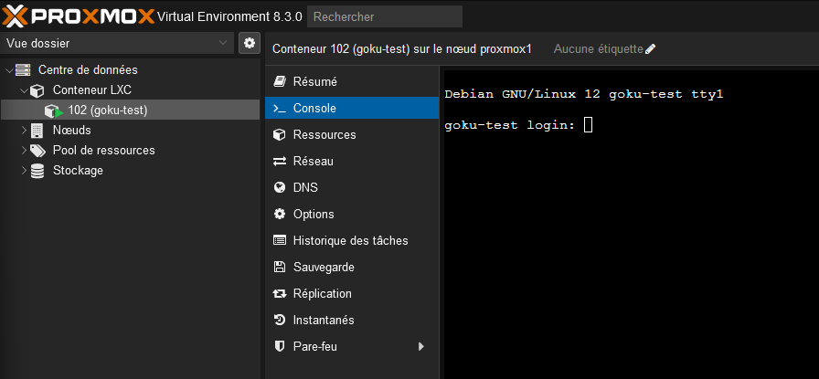

Voici la procédure pour donner aux étudiants, uniquement accès à leurs ressources.

### Création d’un pool

Aller dans le centre de données > Pool puis créer

Simplement lui donner un nom.

Il apparaitra sur la gauche dans le menu « Vue Serveur ».

Dans « Membres » il est possible de lui donner accès au stockage ou à des VM (une VM ne peut être que dans un pool).

Dans notre cas, on va lui donner accès à DATASTORE-ISO et DATASTORE-VM.

Ensuite, il est possible de définir les permissions dans le pool ou dans le centre de données.

Pour chaque étudiant ou groupe d’étudiant, on va distribuer les droits suivants :

- Pool de l’étudiant : PVEPoolAdmin
- Pool de l’étudiant : PVEVMAdmin
- Sur son VLAN : PVESDNUser (Attention, il faut ajouter un /[NOM_DU_VLAN])
- Sur les datastores autorisés : PVEDatastoreUser

Ainsi, il ne verra que ce qui est dans son pool avec les droits associés.

Il n’aura accès qu’à son pool lors de la création d’une VM ou d’un conteneur.

L’étudiant ne voit que ses conteneurs ou VM.

