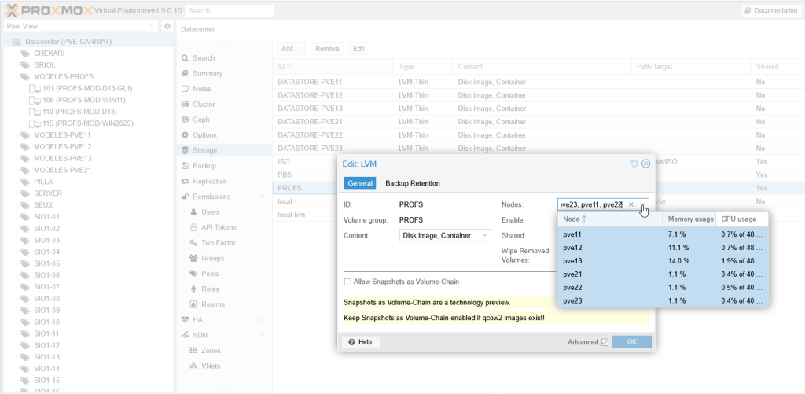
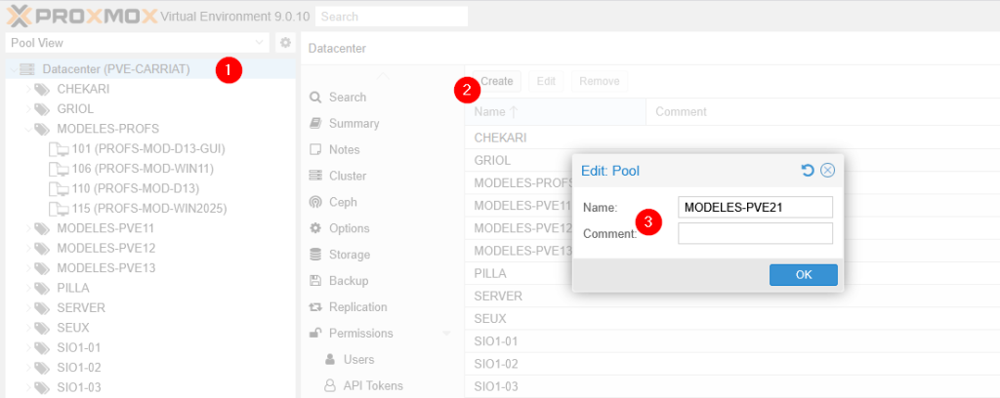
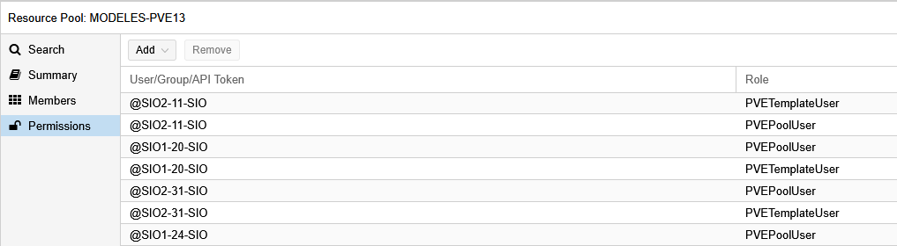
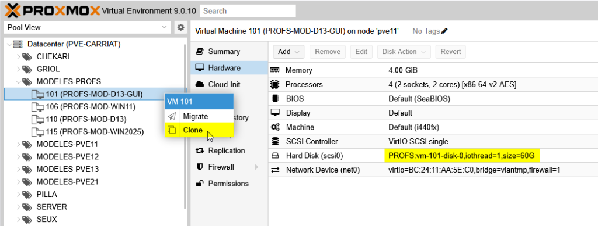
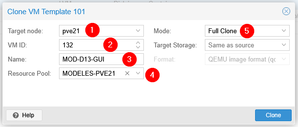
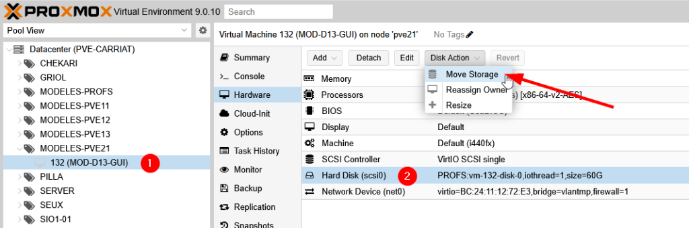
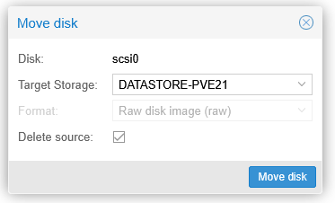

Dans notre infrastructure, nous avons les étudiants répartis sur nos 3 serveurs. Le stockage étant dédié par serveur pour pouvoir être en LVM_Thin, il faut déployer les modèles sur chaque serveur.

Pour diffuser un modèle, il faut que le stockage d’origine du modèle soit accessible sur le serveur de destination.

## Gestion du pool MODELES

### Ajout d'un pool

Nous allons donc créer un pool dédié pour un serveur :

### Droits sur le pool
Il faut ensuite donner les droits PVETemplateUser et les droits PVEPoolUser à nos étudiants.

Nous passons par un groupe AD par étudiant pour simplifier les changements d’effectifs annuel.
:::note
Noter qu’il n’est pas possible d’ "encapsuler" les groupes.
:::

## Déploiement d’un modèle

Nous allons partir d’un modèle stocké dans notre pool MODELES-PROFS et stocké sur le stockage PROFS.

Clic droit > Clone

Dans la fenêtre qui s’ouvre, nous allons ensuite choisir le noeud (1), l’ID (2), le nom (3) ainsi que le pool de destination de notre modèle (4) en faisant un full clone (5).

Une fois le clonage terminé, la machine est bien dans notre pool.

Il faut maintenant choisir de déplacer le stockage de PROFS à mon datastore de destination (DATASTORE-PVE21).

On choisit de supprimer le fichier source.

Le stockage est bien déplacé, il ne reste plus qu’à le convertir en template.