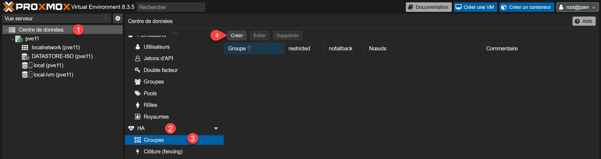
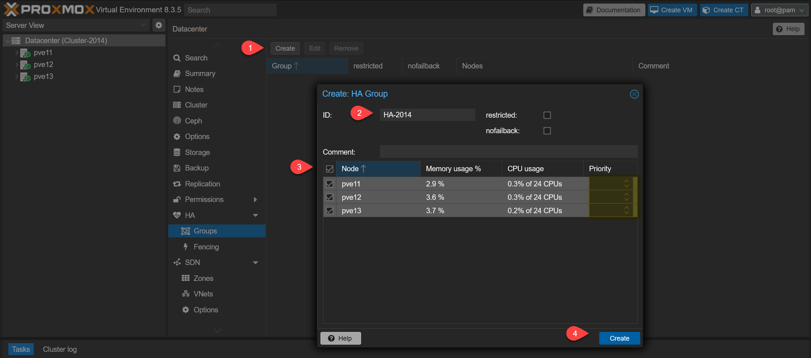
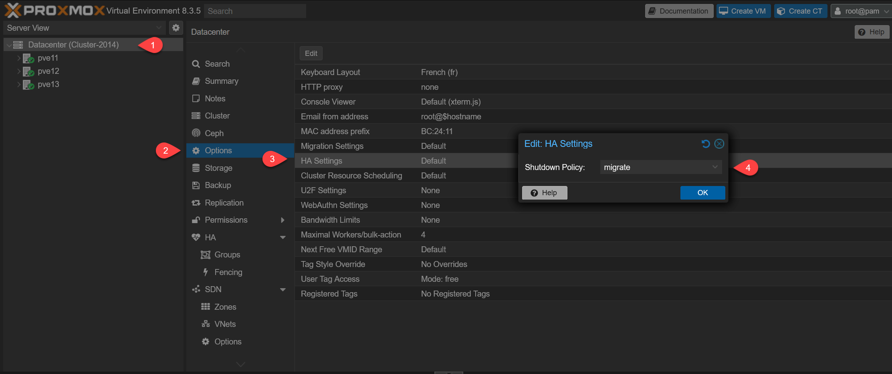

Dans notre contexte, nous avons 3 serveurs Proxmox VE :

- PVE11 : 172.29.0.11
- PVE12 : 172.29.0.12
- PVE13 : 172.29.0.13

Pour créer un cluster, il faut aller au niveau du Centre de données > HA > Groupes > Créer.

Les groupes permettent d’établir des règles communes à plusieurs nœuds du cluster avec des niveaux de priorité (sous la forme d’un entier).

Si ces derniers sont définis, une machine virtuelle créée sur un serveur ira en priorité sur celui ayant la plus haute priorité, sauf exception.

Chaque élément ajouté à la gestion de la haute disponibilité est vu comme une ressource, dont l’état doit être maintenu : démarré, arrêté, ignoré ou désactivé.

On indique combien de fois une tentative de redémarrage ou de relocalisation (migration offline) peut être effectuée (1 par défaut).

Dans les options du Datacenter on choisit la politique d’arrêt d’un nœud. En le passant sur Migrate par exemple, les ressources seront déplacées dans un autre nœud avant que l’arrêt ne soit effectif.

