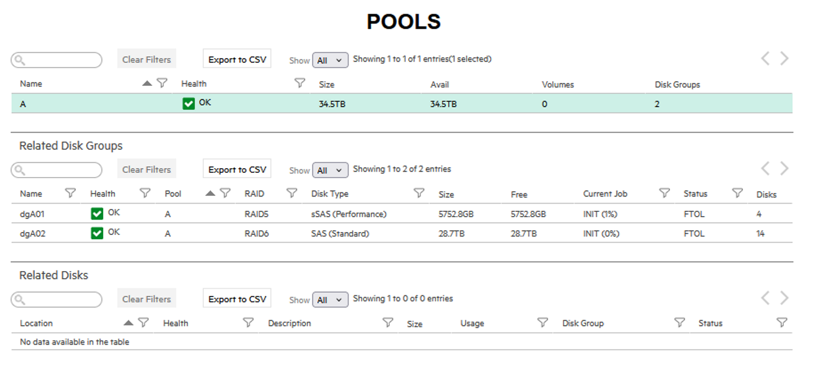
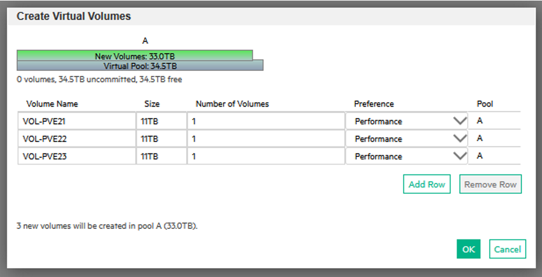
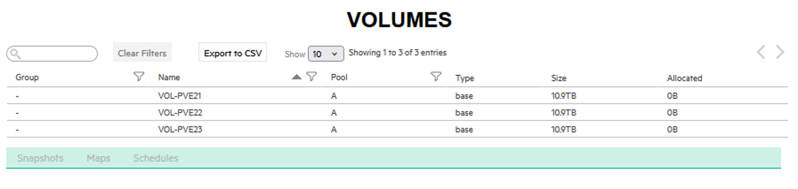
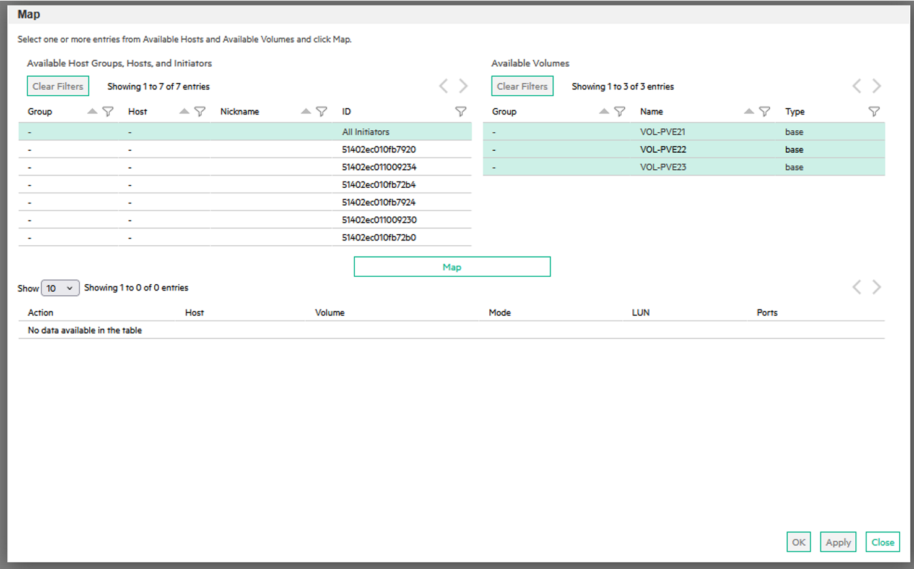
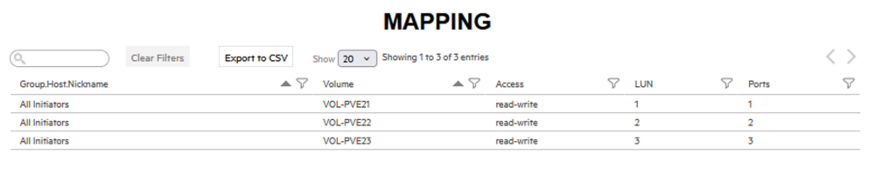
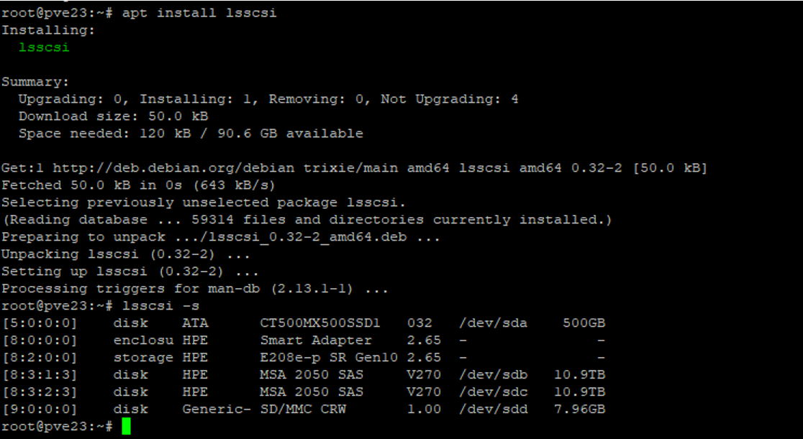
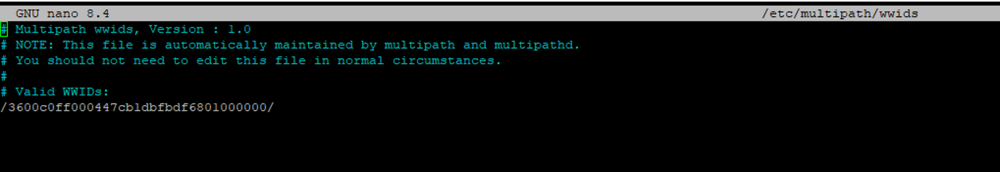

Sur notre ancienne infrastructure, nous avons 3 serveurs HPe et une baie de stockage HP MSA2050 avec un mix SSD/SAS.

Pour pouvoir utiliser du stockage LVM_Thin, il ne faut pas que le stockage soit partagé.

Néanmoins, la baie a un double attachement, il faudra donc utiliser le Multipath.

Commençons par la configuration de la baie SAN.
## Configuration HP MSA2050 
La baie est accessible via une interface web, il faut lui attribuer une adresse IP dans le même sous-réseau que les serveurs Proxmox.
On va partir d’une baie vierge au niveau stockage.

### Création des Pools de disques
Je suis parti de l’idée de faire un seul pool avec tous mes disques. Je ferai ensuite un volume par serveur.

Mon pool SSD sera en RAID5 quand mon pool SAS sera en RAID6 (j’ai plus de disques).

### Création des volumes
Je vais faire un volume de 11Tb par serveur.



### Rattachement aux contrôleurs

On va ensuite mapper les volumes sur les contrôleurs.

`Mappage > Action > Mapper`

Pour limiter les soucis, on va monter le stockage PVE21 sur le port 1, PVE22 sur le port 2 et PVR23 sur le port 3.

Coté baie, c’est bon, on passe à Proxmox.

## Configuration de Proxmox

Si le paquet lsscsci n’est pas installé, on le fait
```bash
root@pve23:~# apt install lsscsi
```
On peut voir le stockage avec la commande :
```bash
lsscsi -s
```
Il apparait deux fois, une fois par contrôleur. Si j’avais mappé les 3 stockages, on aurait eu 6 lignes.

On va récupérer l’id du stockage, on voit qu’il est identique pour les deux stockages sdx car c’est le même, mais sur un contrôleur différent.
```bash
root@pve21:~# /lib/udev/scsi_id -g -u -d /dev/sdb
3600c0ff000447cb1dbfbdf6801000000
root@pve21:~# /lib/udev/scsi_id -g -u -d /dev/sdc
3600c0ff000447cb1dbfbdf6801000000
root@pve21:~#
```
Maintenant, on va installer et configurer le Multipath
```bash
apt install multipath-tools
```
Sur chaque serveur, on va ajouter l’id de notre stockage.
```bash
multipath -a <ID>
```
On peut le voir ensuite dans le fichier wwids
```bash
nano /etc/multipath/wwids
```

Ensuite, il faut configurer le fichier multipath à personnaliser avec l’id et l’alias.
```bash
nano /etc/multipath.conf
 
defaults {
    user_friendly_names yes
    find_multipaths yes
}
 
blacklist {
    devnode "^sda"   # disque système
}
 
multipaths {
    multipath {
        wwid  3600c0ff000447cb1ddfbdf6801000000
        alias PVE23
    }
}
 
devices {
    device {
        vendor "HPE"
        product "MSA 2050 SAS"
        path_grouping_policy group_by_prio
        path_checker tur
        path_selector "service-time 0"
        hardware_handler "1 alua"
        failback immediate
        no_path_retry 12
        rr_min_io 100
    }
}
```
Ensuite, il faut recharger le multipath, créer les PV/VG et LV puis l’ajouter dans ProxMox
```bash
# (Re)charger multipath
systemctl restart multipathd
multipath -r
multipath -ll
ls -l /dev/mapper/
 
# Créer le PV/VG/LV
pvcreate /dev/mapper/PVE23
vgcreate DATASTORE-PVE23 /dev/mapper/PVE23
lvcreate -n THINPOOL-DATASTORE-PVE23 -l 95%VG -T DATASTORE-PVE23
 
# Ajouter dans Proxmox
pvesm add lvmthin DATASTORE-PVE23 --vgname DATASTORE-PVE23 \
  --thinpool THINPOOL-DATASTORE-PVE23 --content images,rootdir --nodes pve23
```
On peut ensuite vérifier dans l’interface web que le stockage est bien là.