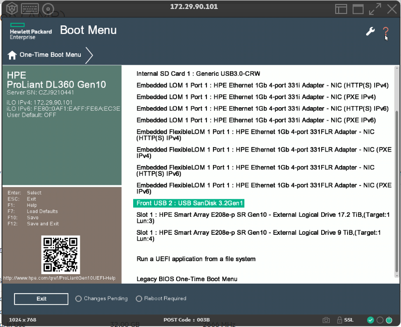
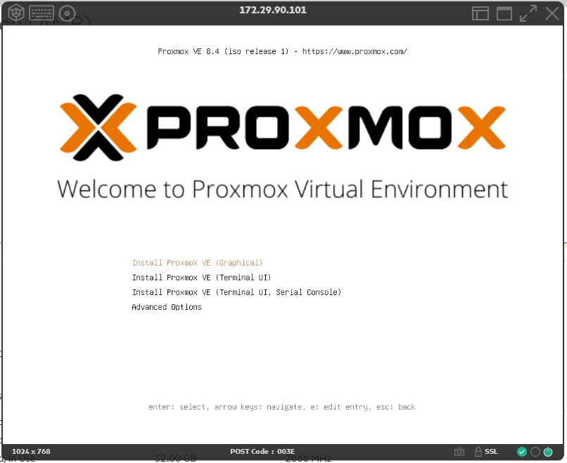

Après avoir téléchargé l’iso (8.4 pour moi), se connecter sur l’iLo de votre serveur et lancer une console HTML 5.
Mettre la clé USB de Proxmox sur le serveur.
Faire F11 pour lancer le boot menu puis choisir la clé USB

L’installation de ProxMox se lance

[La suite dans la documentation d’installation](/pve-install/)