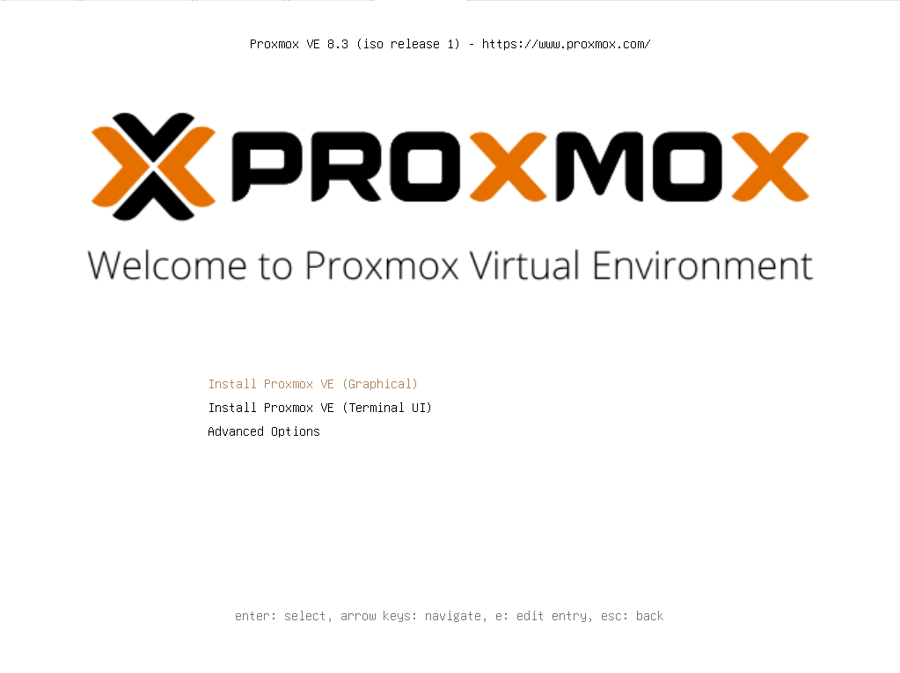
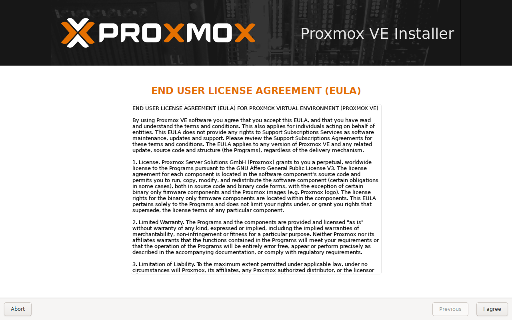
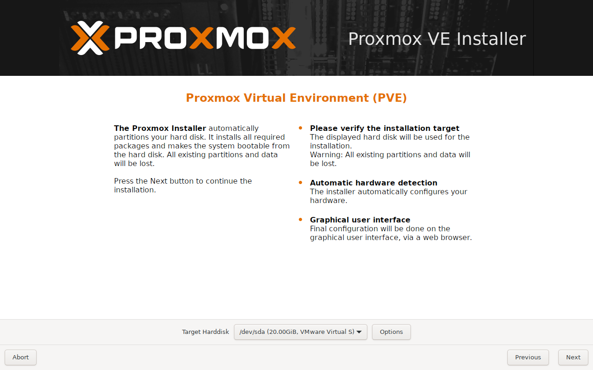
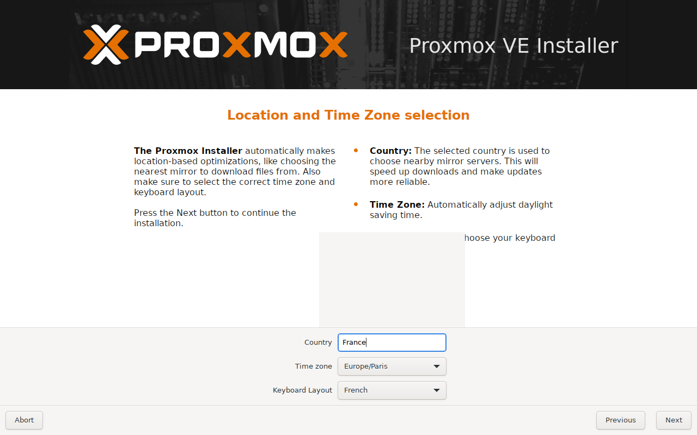
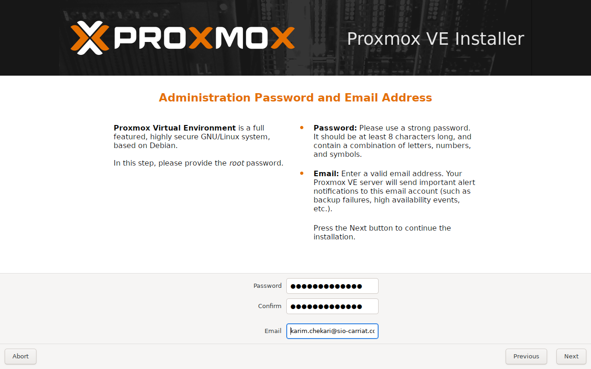
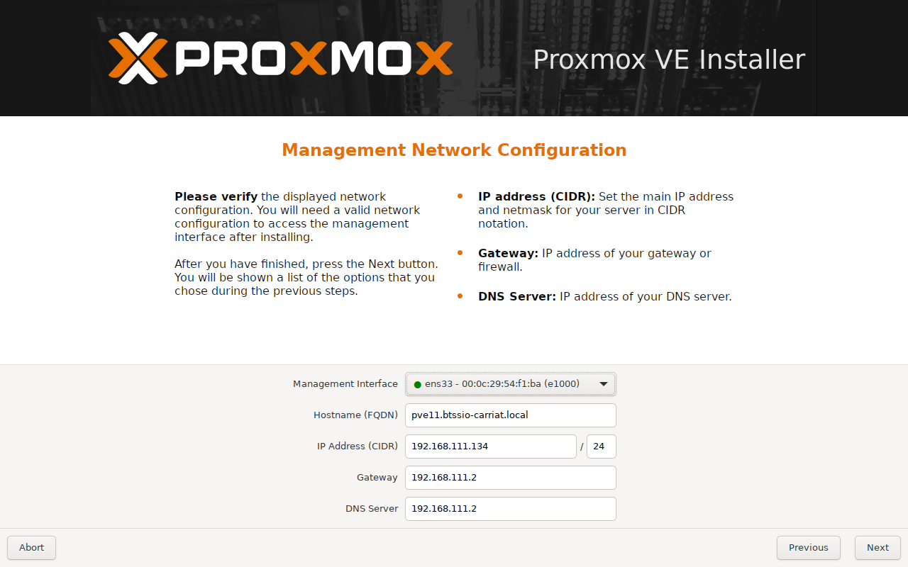
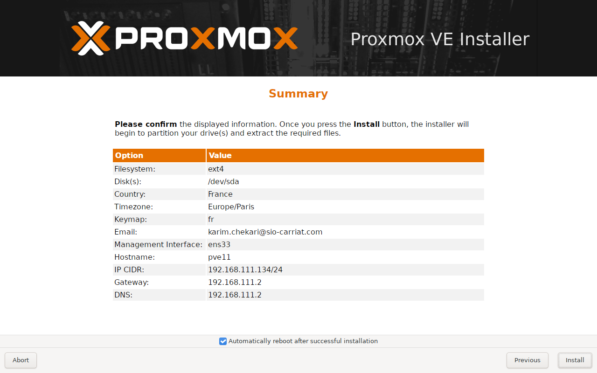
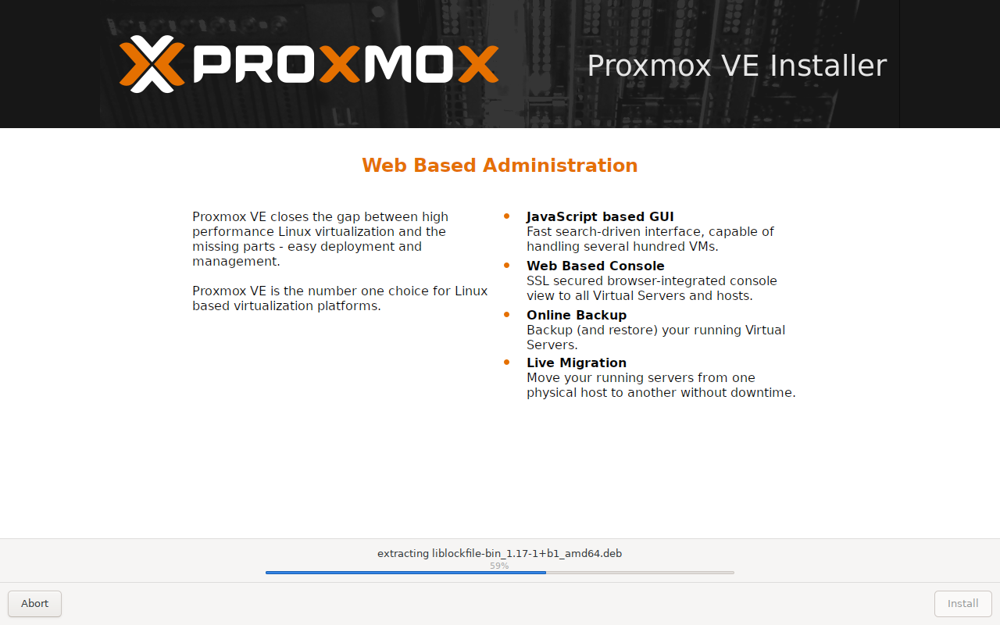
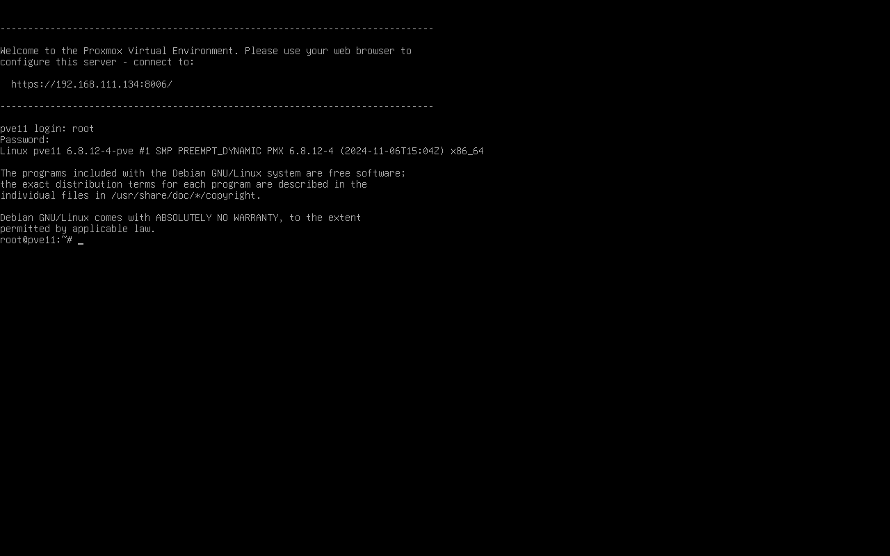
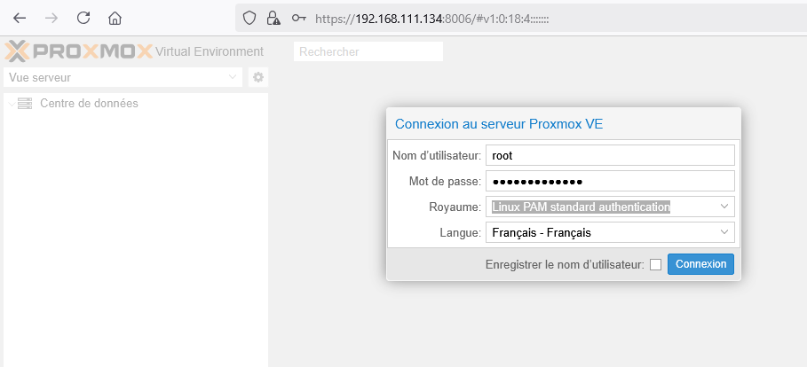

:::note
Fonctionnalité testé avec Proxmox VE 8.3
:::
Voici un guide d’installation pour Proxmox VE 8.3
Booter sur le média d’installation

Choisir **Install** Proxmox VE (Graphical)

Si votre machine est sur un serveur DHCP, elle va automatiquement récupérer sa configuration IP.
On commence par accepter les termes d’utilisation (EULA)

On sélectionne ensuite le stockage

On passe maintenant aux paramètres régionaux.

On va ensuite définir le mot de passe root ainsi que le mail de contact.

On lui donne ensuite un nom (à créer sur l’AD) ainsi qu’une IP, un masque et une passerelle.
NB : Les informations sont reprises du DHCP si il y en a un sur le réseau.

On valide les informations pour lancer l’installation.

L’installation se lance

Une fois l’installation terminée et le redémarrage réalisé, on peut se connecter dans le shell

ou depuis le navigateur.
