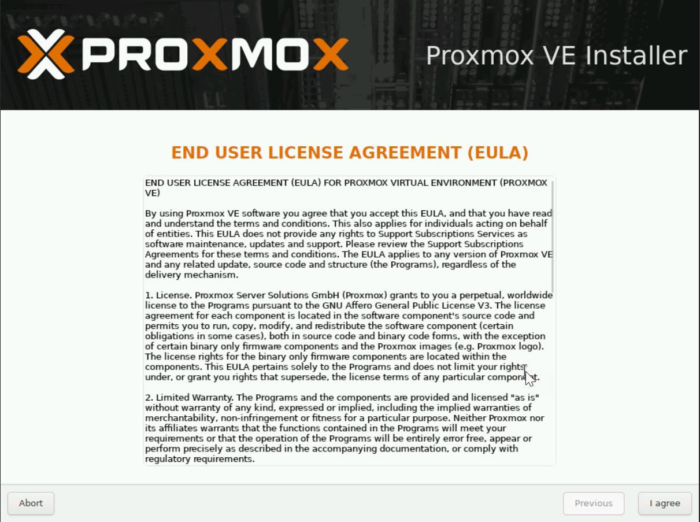
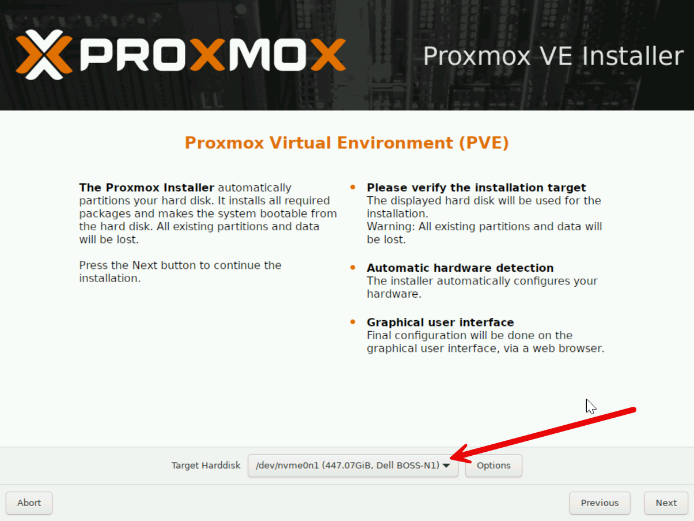
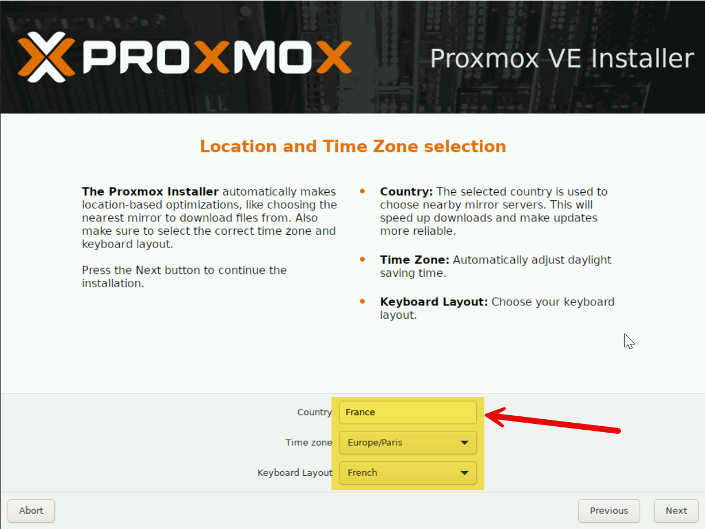
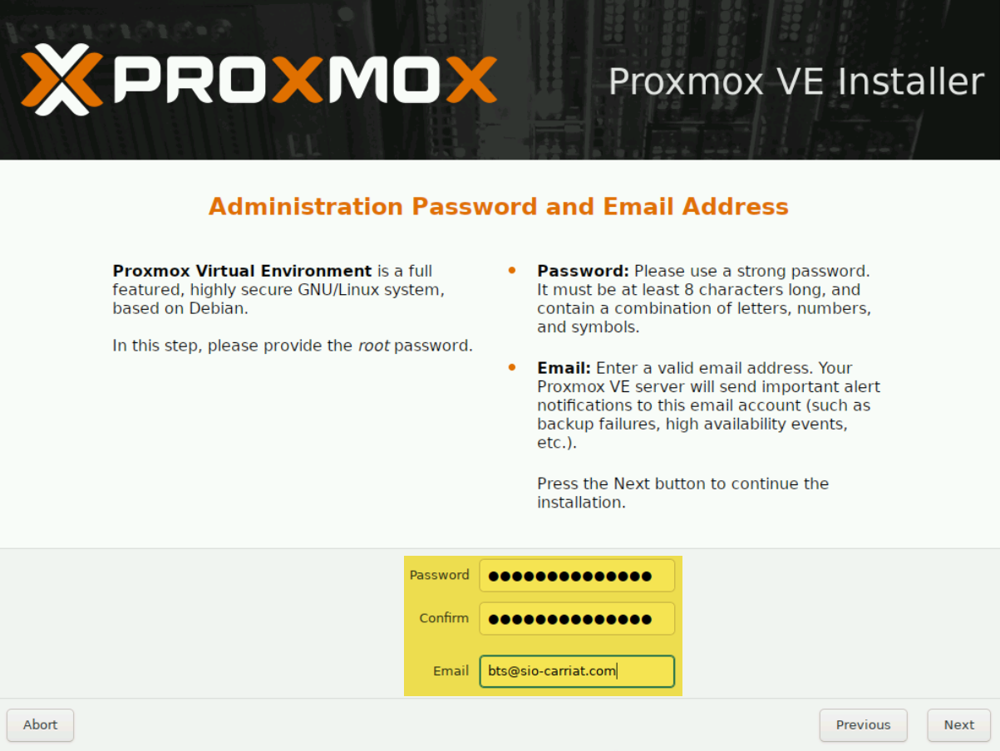
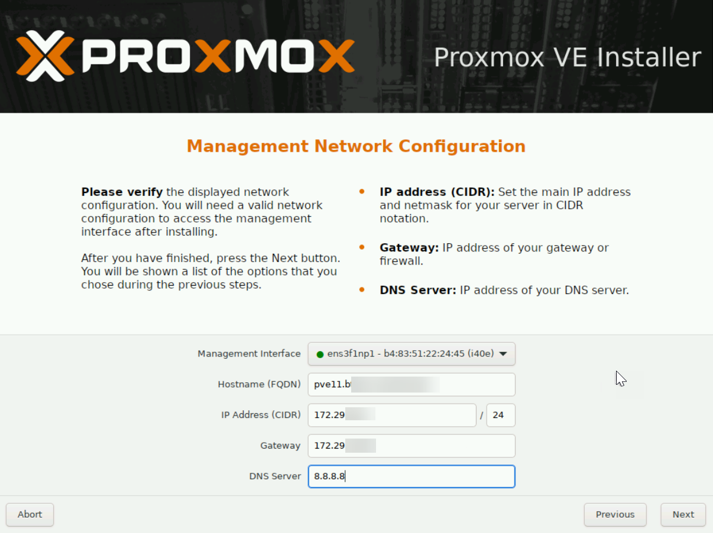
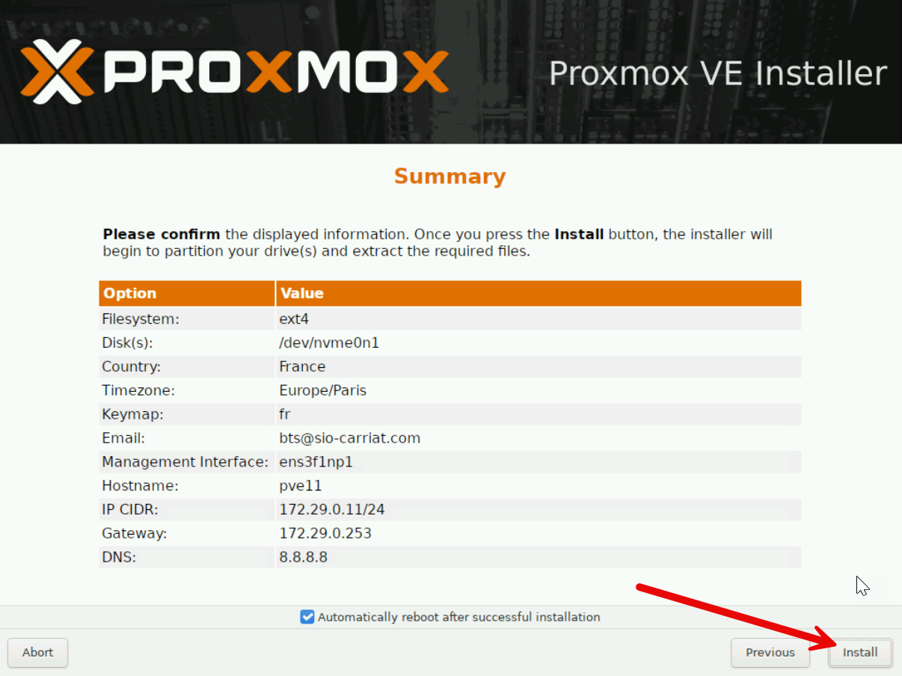
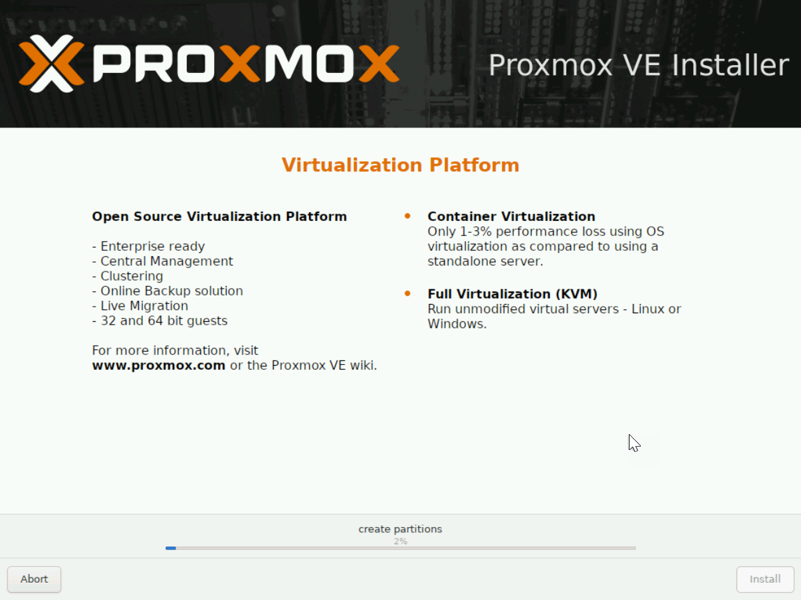

:::tip
Installation de Proxmox v9.0/9.1 sur serveur Dell PowerEdge
:::
Démarrer sur l'iso puis choisir Install Proxmox VE (Graphical).

Accepter le contrat de licence  (EULA)

On sélectionne ensuite le stockage

On passe maintenant aux paramètres régionaux.

On va ensuite définir le mot de passe root ainsi que le mail de contact.

On lui donne ensuite un nom (à créer sur l’AD) ainsi qu’une IP, un masque et une passerelle.
NB : Les informations sont reprises du DHCP si il y en a un sur le réseau.

On valide les informations pour lancer l’installation.

L’installation se lance

Une fois l’installation terminée et le redémarrage réalisé, on peut se connecter dans le shell

