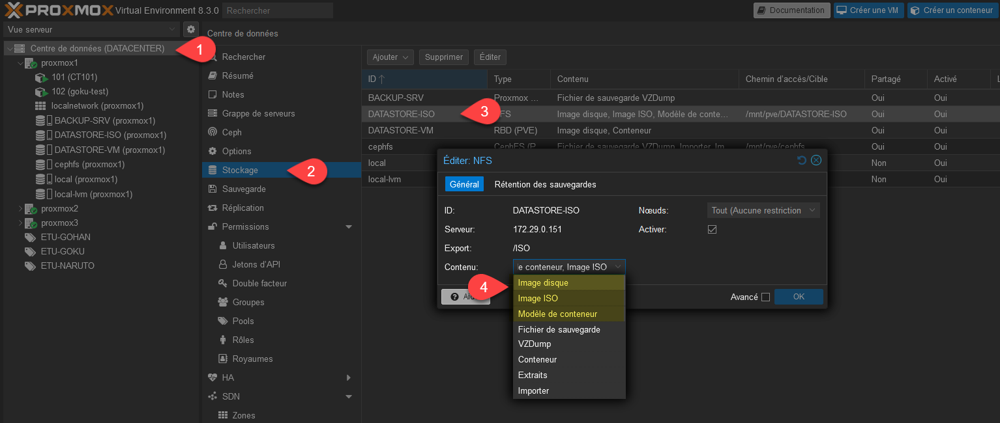
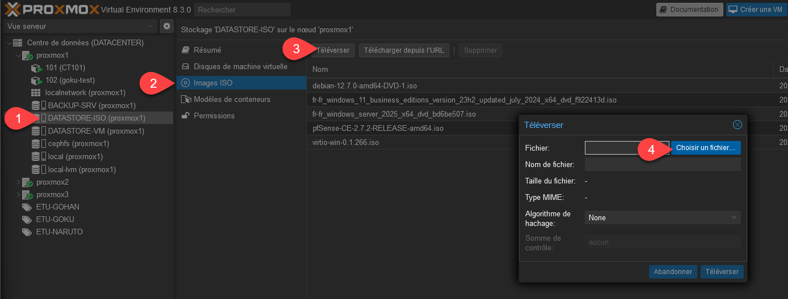
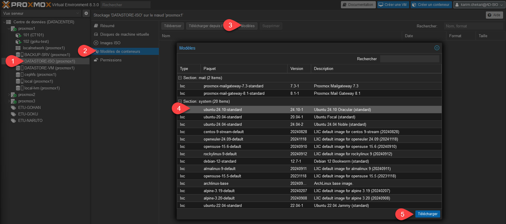

Dans un premier temps, il faut déclarer le contenu du stockage :
- Image ISO : Pour stocker des iso.
- Modèle de conteneur : pour héberger des conteneurs.

### Ajout d’ISO

Dans le stockage, aller dans ISO et choisir l’option téléverser.

Les isos seront disponibles aux utilisateurs qui auront les droits sur le stockage.

### Ajout de conteneur

Dans les modèles de conteneurs, il est possible d’ajouter des conteneurs à partir de modèles prédéfinis.

