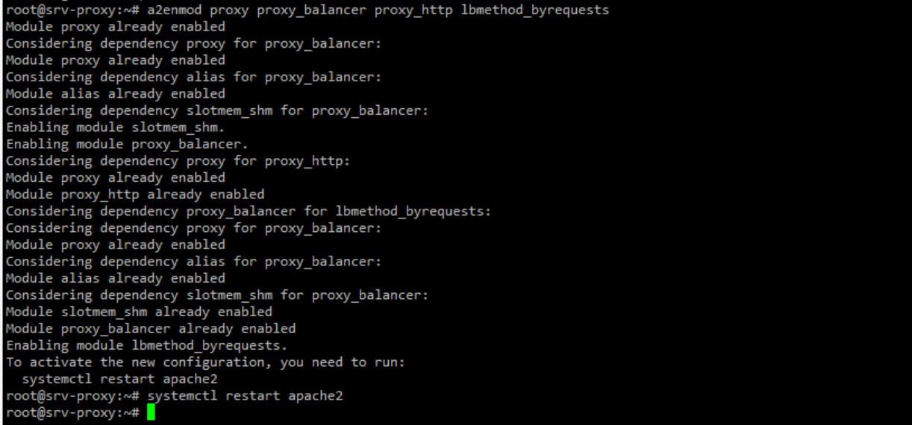
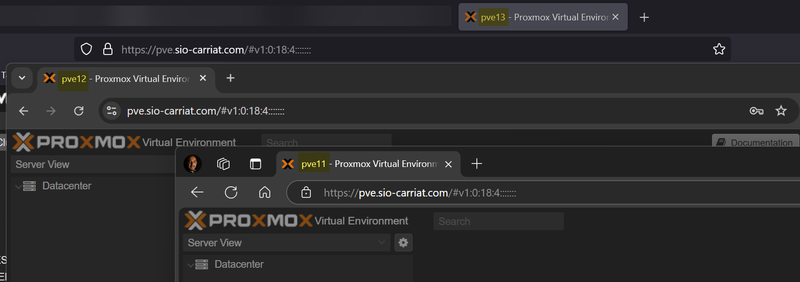

Dans la plateforme, j’ai 3 serveurs Proxmox :

- pve11.btssio-carriat.local (172.29.0.11)
- pve12.btssio-carriat.local (172.29.0.12)
- pve13.btssio-carriat.local (172.29.0.13)

L’idée est d’utiliser un nom de domaine pve.sio-carriat.com qui va répartir les utilisateurs sur un des trois serveurs.

Ayant déjà un serveur Apache, nous allons l’utiliser.

On va déjà vérifier que tous les modules Apache nécessaire sont activés

```bash
a2enmod proxy proxy_balancer proxy_http lbmethod_byrequests
systemctl restart apache2
```



Nous allons créer un fichier /etc/apache2/sites-available/pve.conf

```bash	
nano /etc/apache2/sites-available/pve.conf
```

On va mettre le contenu suivant :

```bash
<VirtualHost *:80>
    ServerAlias pve.sio-carriat.com
    RewriteEngine on
    RewriteCond %{HTTPS} !on
    RewriteRule (.*) https://%{HTTP_HOST}%{REQUEST_URI}
</VirtualHost>
 
<VirtualHost *:443>
    ServerName pve.sio-carriat.com
    ServerAdmin karim.chekari@sio-carriat.com
 
    Include conf-available/ssl-letsencrypt-wildcard.conf
 
    # Activer SSL Proxy
    SSLProxyEngine On
    SSLProxyCheckPeerCN Off
    SSLProxyCheckPeerName Off
    SSLProxyVerify none
 
    # Balancer HTTP/HTTPS classique
    <Proxy "balancer://proxmox">
        BalancerMember https://172.29.0.11:8006 route=1
        BalancerMember https://172.29.0.12:8006 route=2
        BalancerMember https://172.29.0.13:8006 route=3
        ProxySet lbmethod=byrequests stickysession=ROUTEID
    </Proxy>
 
    # WebSockets
    ProxyPassMatch ^/(api2/json/nodes/.*|api2/json/access/ticket|api2/json/.*console.*) wss://172.29.0.11:8006/$1
    ProxyPassReverse ^/(api2/json/nodes/.*|api2/json/access/ticket|api2/json/.*console.*) wss://172.29.0.11:8006/$1
 
    # Standard proxy
    ProxyPass / balancer://proxmox/
    ProxyPassReverse / balancer://proxmox/
    ProxyTimeout 600
    ProxyPreserveHost On
 
    # Headers importants pour WebSocket
    RequestHeader set Upgrade "websocket" env=websocket
    RequestHeader set Connection "Upgrade" env=websocket
 
    LogLevel warn
    ErrorLog ${APACHE_LOG_DIR}/error.log
    CustomLog ${APACHE_LOG_DIR}/access.log combined
</VirtualHost>
```

- Le bloc <VirtualHost:80> permet une redirection http ver https.
- On inclut mon fichier de configuration ssl qui contient les informations pour mon certificat Let’s Encrypt.
- Le bloc <Proxy> définit mes noeuds Proxmox.
- Les lignes SSL sont utiles car les serveurs Proxmox sont eux-memes en SSL avec des certificats auto-signés.
- Les ProxyPass dirige les utilisateurs sur les serveurs du bloc Proxy.

On peut voir que les utilisateurs sont redirigés sur des nœuds différents, avec un seul point d’entrée.

