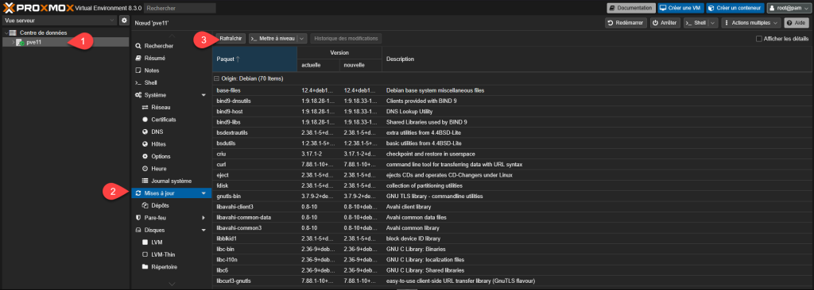
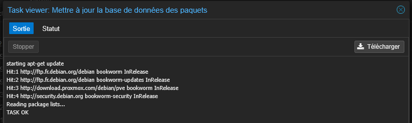
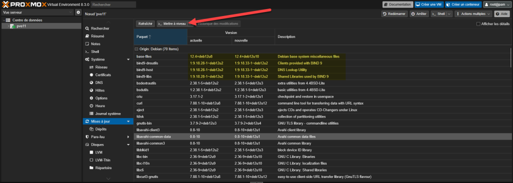
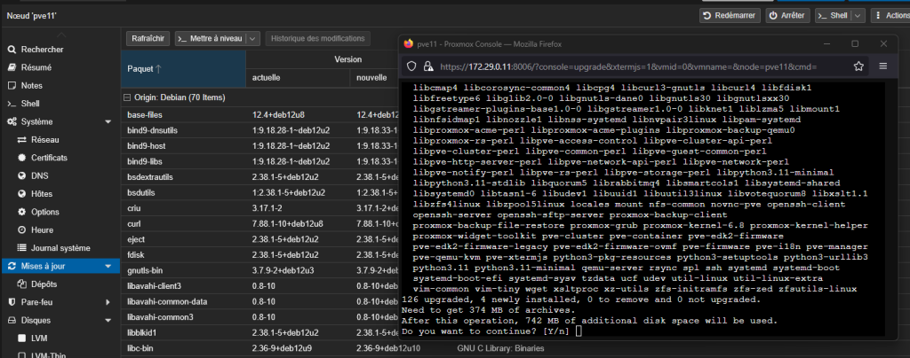
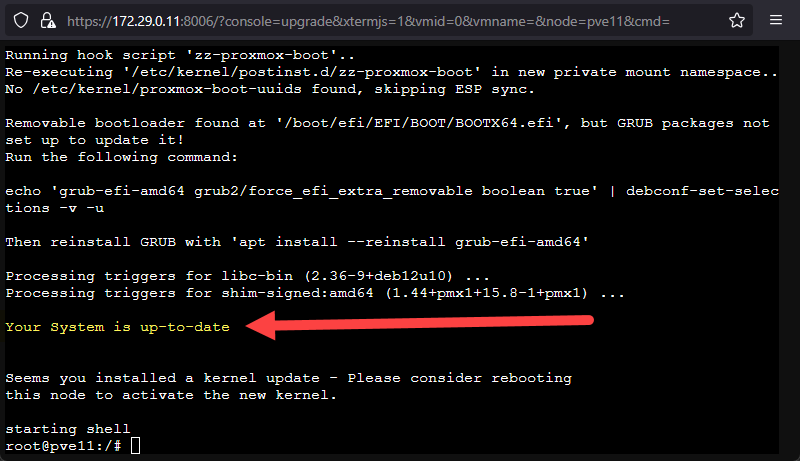
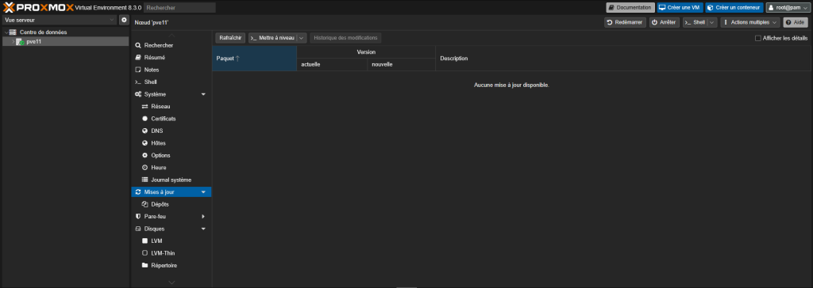

Proxmox VE est un hyperviseur basé sur un système Linux Debian.

Pour faire une mise à jour, il faut donc, dans un premier temps, mettre à jour la liste des paquets. Puis mettre à jour ceux qui disposent d’une version plus récente.

À noter que si vous n’avez pas d’abonnement, il faut désactiver les dépôts payant et ajouter le No-Subscription.

Dans un premier temps, nous allons sur notre serveur > Mises à jour > Rafraîchir.

On peut voir qu’il y a des différences entre la version actuelle et la version nouvelle. On peut lancer la mise à jour en cliquant sur le bouton « Mettre à jour ».

Une fenêtre bien connue des Linuxiens vous demande de valider l’installation des paquets.

On valide avec Y

La mise à jour, c’est bien terminé.

Et il n’y a plus de mise à jour de proposée.

