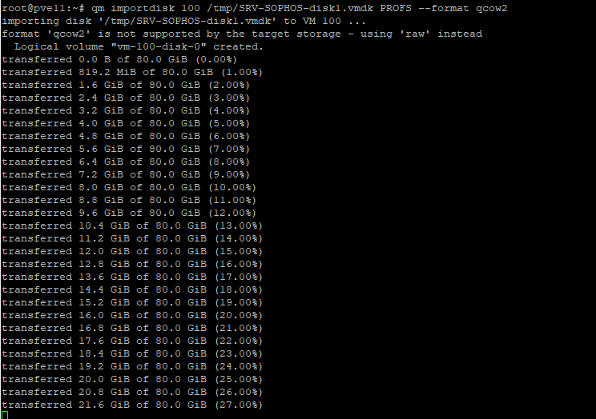
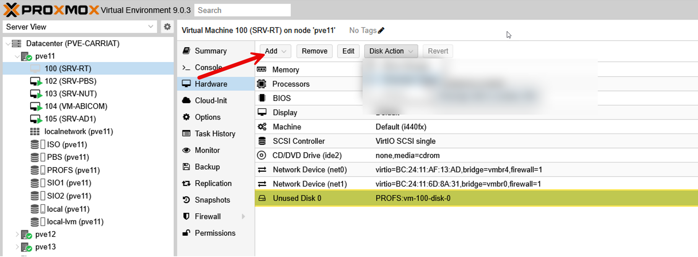
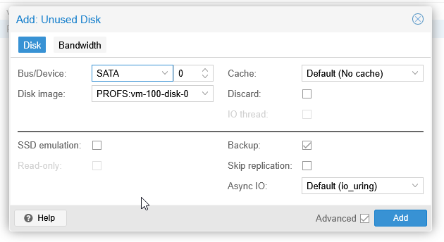
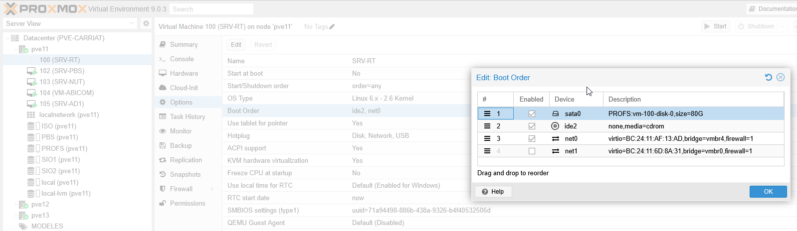

Le principe pour basculer une VM d’un environnement VMWare dans un environnement Proxmox est de créer une machine sans disque dur, migrer le disque puis l’attacher à la VM de destination.

Commencer par :
- Transférer le fichier VMDK sur le serveur PVE.
- Créer la VM de destination, sans disque dur.

### Conversion du disque dur VMDK

Utiliser la commande suivante :
```bash
qm importdisk 100 &lt;fichier_vmdk> &lt;datastore> --format qcow2

# Exemple :
qm importdisk 100 /tmp/SRV-SOPHOS-disk1.vmdk PROFS --format qcow2
```



Une fois converti, il faut l’attacher à la VM.

### Configuration de la VM

Le disque non utilisé apparait.

Il faut aller sur la VM et faire Add.



Dans le doute (car il s’agit d’une VM Sophos), nous allons choisir SATA pour le Bus/Device

Dans les Options > Boot Order, nous allons mettre le disque dans la séquence de boot.

Le VM démarre.
