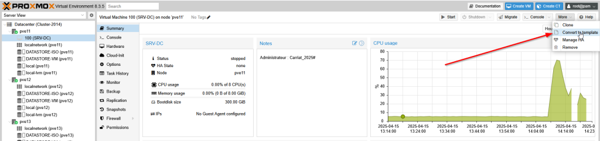
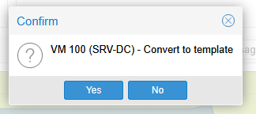
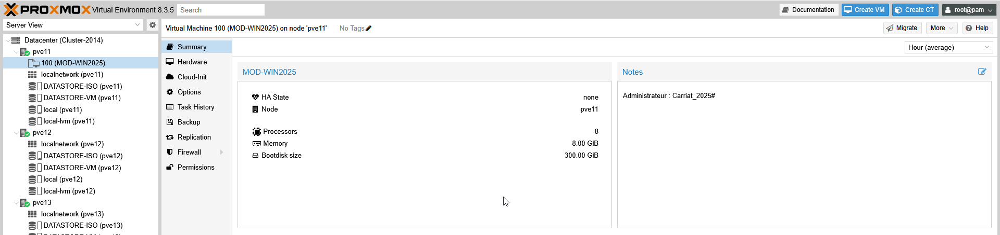
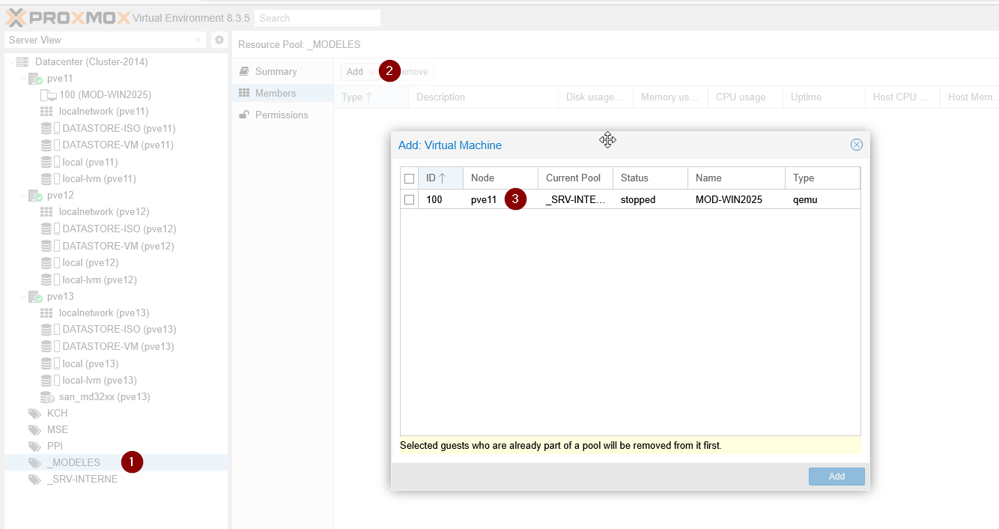
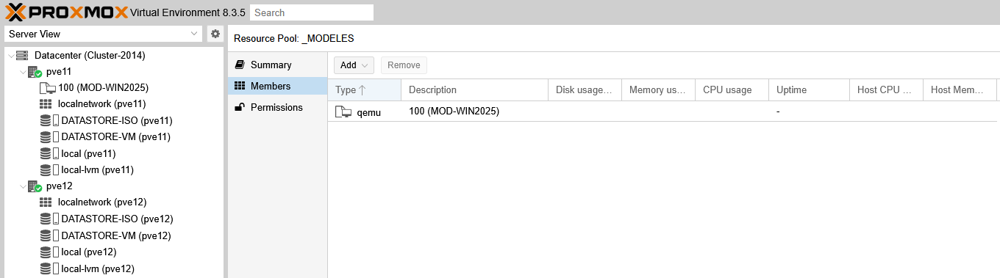

Pour convertir une machine en modèle, il faut utiliser la fonction "More" de Proxmox VE et utiliser le menu "Convert to template".

On fait ensuite Yes

La machine est maintenant un template et ne peut plus être démarré.

Pour la rendre accessible aux étudiants, il est possible de la placer dans le pool associé.

Elle est bien disponible.

