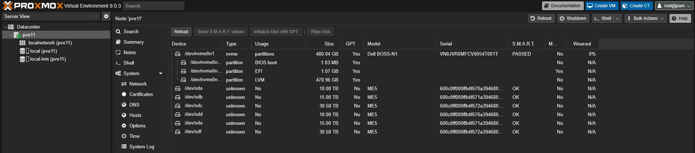
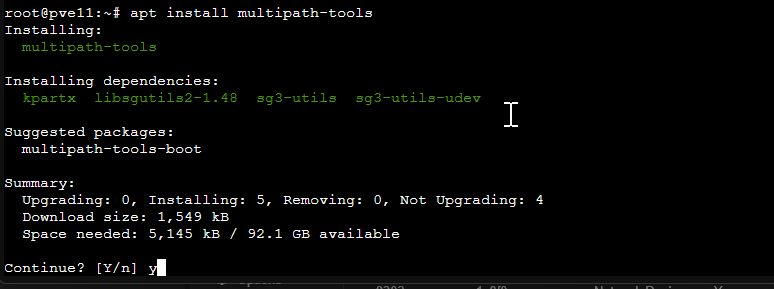
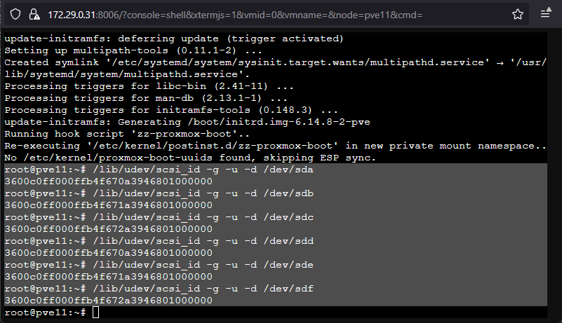
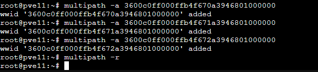
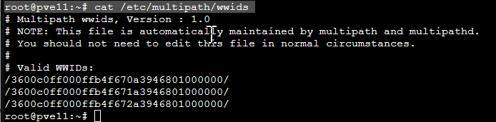
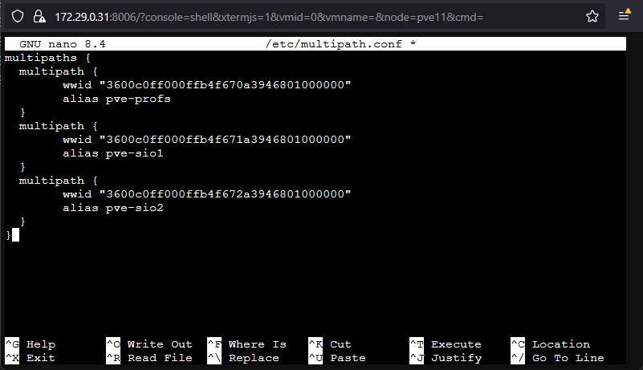
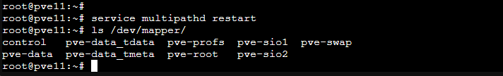
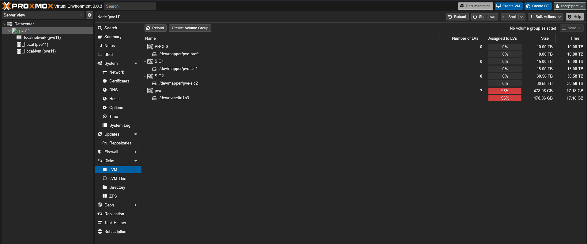

La baie est connectée aux serveurs en double attachement.

Les disques apparaissent donc deux fois :



Pour leur permettre d’être vu comme un seul disque et d’être écrit par plusieurs serveurs, il faut installer le paquet Multipath sur les serveurs.

```bash
apt update
apt install multipath-tools
```



On va récupérer l’id des disques à partir de leurs chemins

```bash
/lib/udev/scsi_id -g -u -d /dev/sdX
```



On va ensuite exécuter la commande pour chaque id :

```bash
multipath -a <id>
```



On va ensuite créer le /etc/multipath.conf pour que les deux disques soient vus comme un seul.

Il faut que l’alias soit identique sur chaque nœud.

On peut vérifier l’id avec la commande :

```bash
cat /etc/multipath/wwids
```



```bash
nano /etc/multipath.conf
```

Le fichier doit être identique sur les trois serveurs.

```bash
multipaths {
  multipath {
        wwid "3600c0ff000ffb4f670a3946801000000"
        alias pve-profs
  }
  multipath {
        wwid "3600c0ff000ffb4f671a3946801000000"
        alias pve-sio1
  }
  multipath {
        wwid "3600c0ff000ffb4f672a3946801000000"
        alias pve-sio2
  }
}
```



On redémarre le service



À faire uniquement sur un serveur

```bash
pvcreate /dev/mapper/pve-profs
vgcreate PROFS /dev/mapper/pve-profs
 
pvcreate /dev/mapper/pve-sio1
vgcreate SIO1 /dev/mapper/pve-sio1
 
pvcreate /dev/mapper/pve-sio2
vgcreate SIO2 /dev/mapper/pve-sio2
```

Les LVM sont bien montés sur Proxmox.

