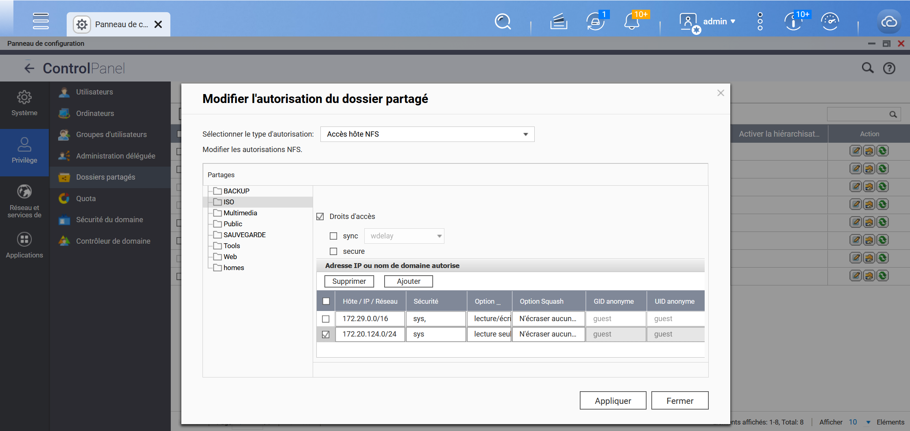
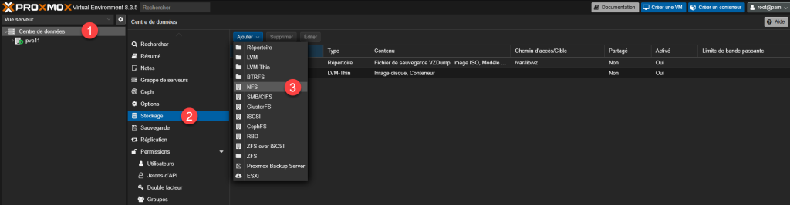
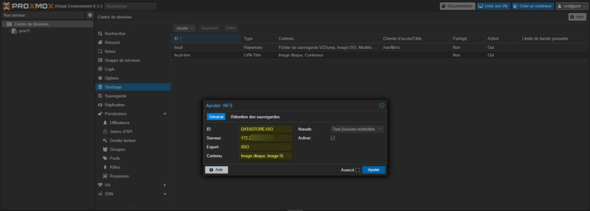
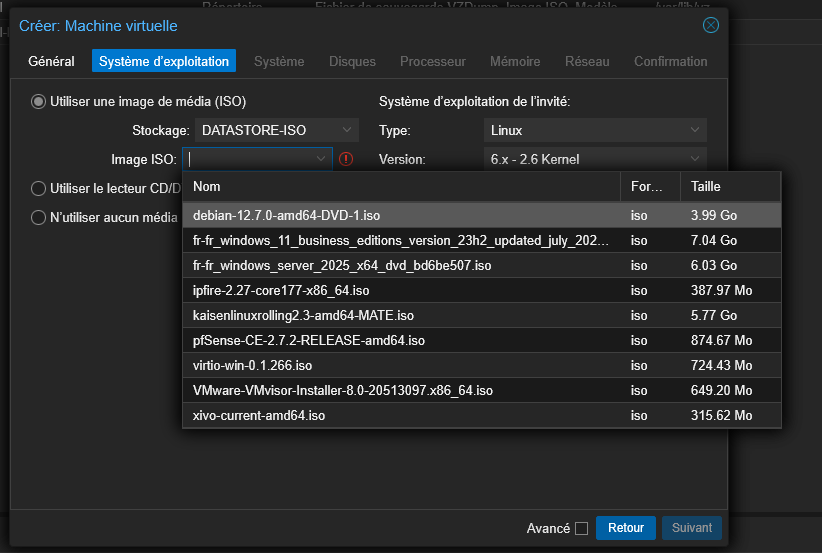
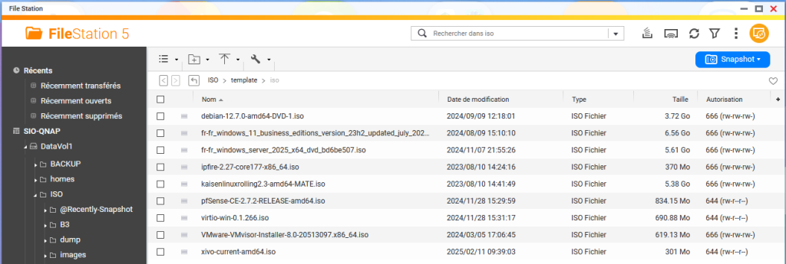

L’idée est de pouvoir monter un partage NFS disponible sur le NAS afin de mettre à disposition des fichiers iso.

Dans un premier temps, pensez bien à vérifier que l’hôte est autorisé à se connecter au partage NFS.

On va ensuite dans "Centre de données" > Stockage > Ajouter > NFS

On va renseigner un nom, une IP, un dossier et enfin, un type de contenu disponible.

Dans un VM, le stockage permet bien de sélectionner un iso.

On notera toutefois que sur le NAS, un dossier template > iso a été créé (les iso doivent être dedans).

