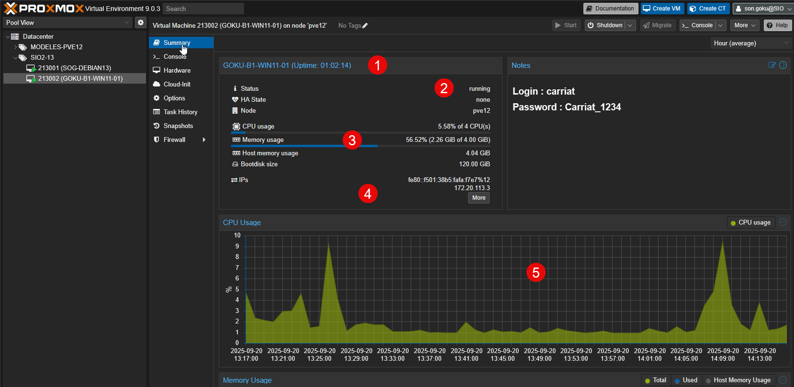
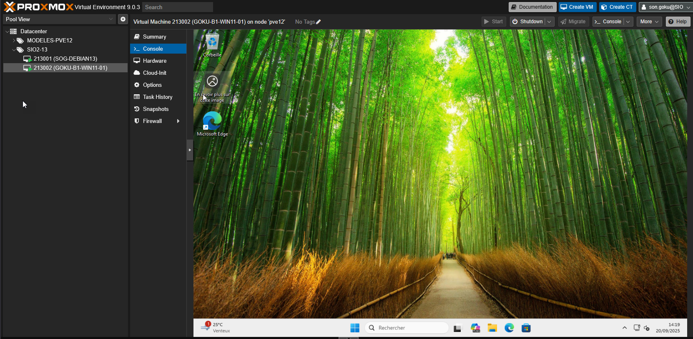
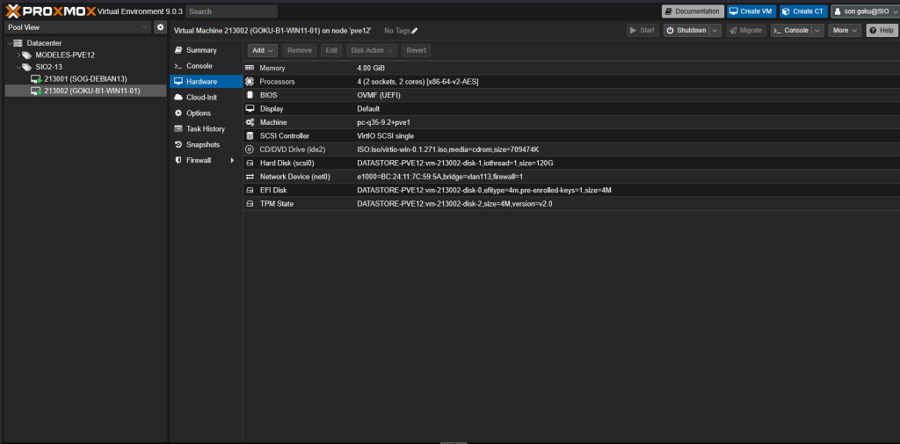
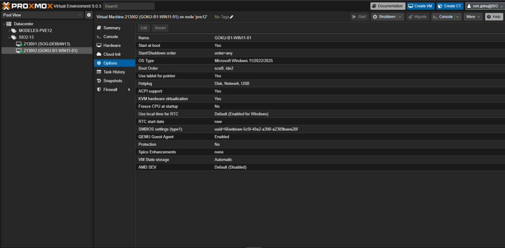
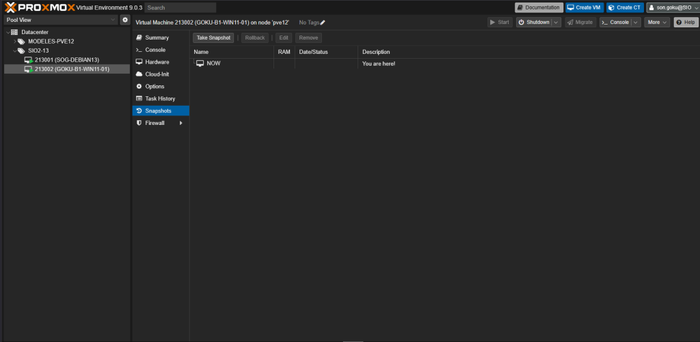

Summary (Résumé) : cet onglet donne une vue d’ensemble de la machine virtuelle avec ses informations principales (nom (1), état (2) running/stopped), ses ressources (3) (CPU, RAM, disque, réseau), ainsi que l’adresse IP (4) si le QEMU Guest Agent est activé. On y retrouve aussi des graphiques de consommation (5) en temps réel (CPU, mémoire, disque, réseau).

Console : permet d’accéder directement à l’écran de la VM comme si l’on était physiquement devant la machine. On peut ainsi voir le processus de démarrage, saisir des commandes ou interagir avec l’OS même si la connexion réseau n’est pas configurée. C’est un écran virtuel.

Hardware : regroupe toute la configuration matérielle attribuée à la VM : processeurs, mémoire, disque dur, carte réseau, lecteur CD/DVD virtuel, périphériques USB, etc. C’est ici que l’on peut ajouter, modifier ou supprimer des ressources virtuelles.

Options : contient les paramètres avancés de la VM, comme l’activation du QEMU Guest Agent, l’ordre de démarrage, les réglages d’amorçage (BIOS/UEFI), la protection contre l’arrêt accidentel.

Snapshots : permet de créer et gérer des instantanés de la VM. Un snapshot enregistre l’état complet de la machine (système, disque, mémoire optionnelle) à un instant T, ce qui permet de revenir en arrière facilement en cas de problème ou pour tester une configuration.

