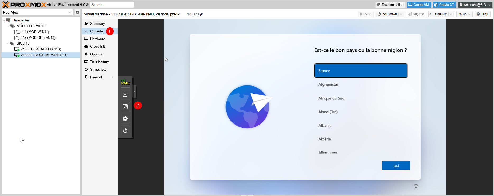
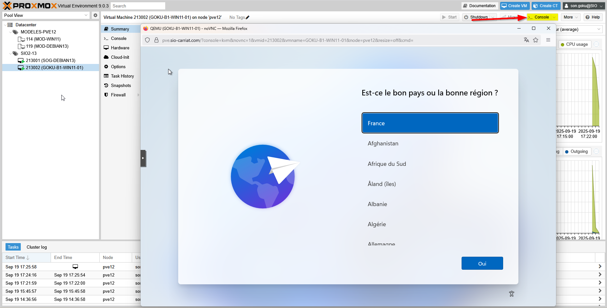

Pour avoir accès à son écran virtuel, vous pouvez utiliser l’onglet Console (1) de la machine (une fenêtre sera intégrée).

(2) Noter que vous avez un menu sur la gauche de l’écran pour lancer des commandes sur la VM (clavier, alimentation …).

Ou bien, en haut à droite, la console qui s’ouvrira sera en pop-up
