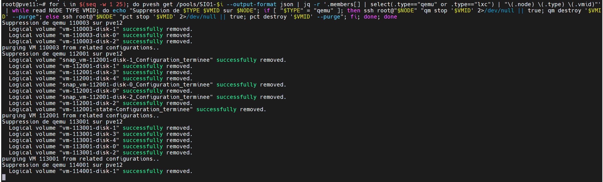

## Proxmox : Purger les VM des pools

### Contexte

En fin d'année scolaire, j'ai environ 500 VM étudiants à supprimer. Pour éviter de le faire manuellement, j'ai créé un script pour purger les VM des pools.

### Script

Pour executer la commande suivante, il est nécessaire d'avoir installé `jq` sur le serveur Proxmox. Pour l'installer, exécutez la commande suivante :

```bash
apt install jq -y
```

jq est un outil en ligne de commande pour traiter des données JSON. Il est utilisé dans le script pour filtrer les informations des VM à supprimer.

Pour simplement purger les VM d'un pool, il suffit de personnaliser le script ci-dessous avec le nom du pool à purger et de l'exécuter sur le serveur Proxmox.

```bash
pvesh get /pools/[NOM_DU_POOL] --output-format json | jq -r '.members[] | select(.type=="qemu") | "\(.node) \(.vmid) \(.name // "")"'
```

Tous les étudiants étant dans des pools "SIO1-XX" et "SIO2-XX", j'ai utilisé le script suivant pour purger tous les pools SIO1 et SIO2. Le script peux s'executer sur n'importe quel serveur Proxmox du cluster, il se connectera aux autres serveurs pour purger les VM.

```bash
for i in $(seq -w 1 25); do pvesh get /pools/[DEBUT DU NOM DU POOL]-$i --output-format json | jq -r '.members[] | select(.type=="qemu" or .type=="lxc") | "\(.node) \(.type) \(.vmid)"' | while read -r NODE TYPE VMID; do echo "Suppression de $TYPE $VMID sur $NODE"; if [ "$TYPE" = "qemu" ]; then ssh -n root@"$NODE" "qm stop '$VMID' 2>/dev/null || true; qm destroy '$VMID' --purge"; else ssh -n root@"$NODE" "pct stop '$VMID' 2>/dev/null || true; pct destroy '$VMID' --purge"; fi; done; done
```


