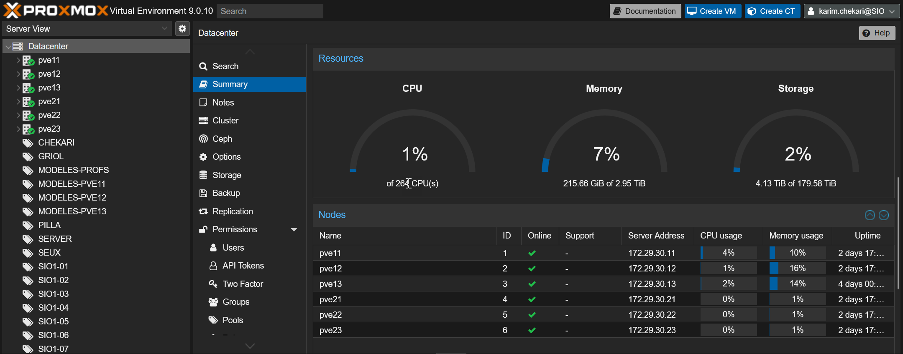
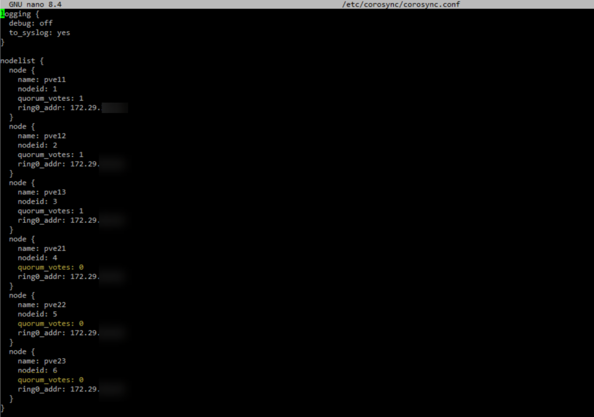

En plus de trois nouveaux serveurs Proxmox, j’ai voulu dans mon datacenter, inclure mes 3 anciens serveurs.

Problème, à 3 serveurs, Proxmox ne fonctionne plus s’il reste qu’un serveur opérationnel. Mais à 6 serveurs, le quorum passe à 4/6. Si mes anciens serveurs sont en maintenance, mes nouveaux serveurs se bloquent en attente du quorum 😅.

L’idée est donc d’exclure du quorum mes anciens serveurs.

Proxmox utilise corosync pour synchroniser ses fichiers et gérer le quorum.

Sur un serveur, modifier le fichier `/etc/corosync/corosync.conf`

Pour nos serveurs à exclure du quorum, on passe le paramètre quorum_votes à 0.  

```bash {5-6} del={5} ins={6}
nodelist {
    node {
        ring0_addr: pve-old-1
        nodeid: 1
        quorum_votes: 1
        quorum_votes: 0
    }
```

On redémarre le service corosync pour que le changement soit pris en compte et c’est réglé.

```bash
systemctl restart corosync
``` 
