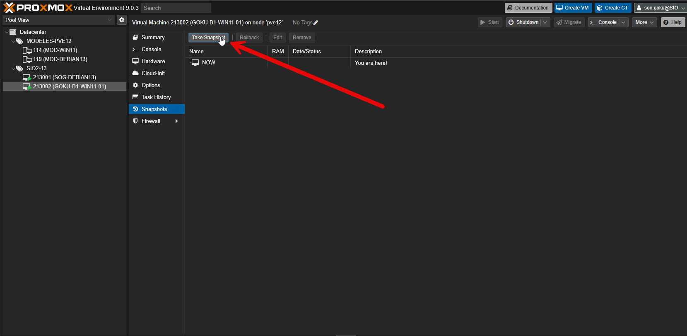
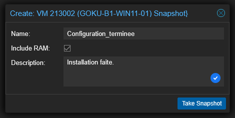
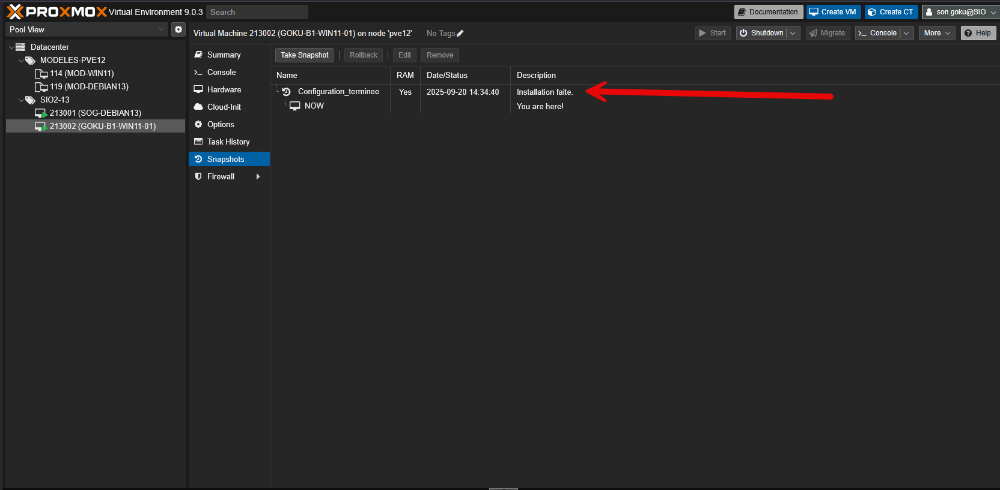
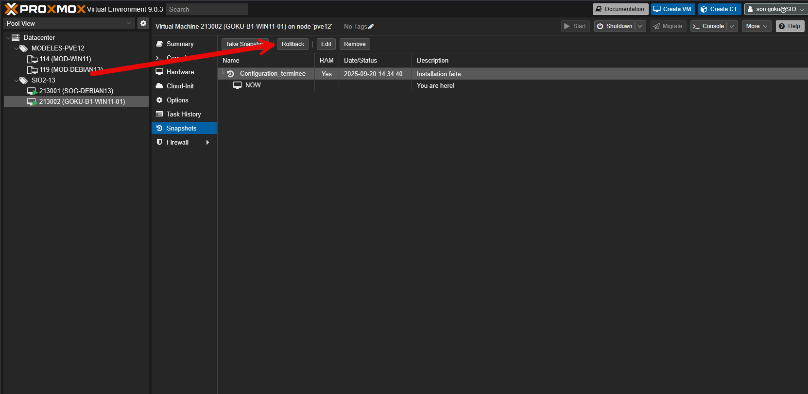
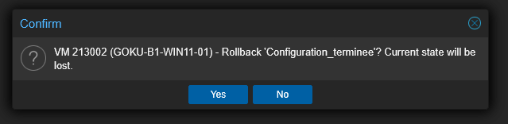

Un snapshot permet de créer et gérer des instantanés de la VM. Un snapshot enregistre l’état complet de la machine (système, disque, mémoire optionnelle) à un instant T, ce qui permet de revenir en arrière facilement en cas de problème ou pour tester une configuration.

## Faire un snapshot

Dans l’onglet snapshot, cliquer sur "Take Snapshot"

Dans la fenêtre qui s’ouvre, on doit donner un nom au snapshot (attention, les espaces et les caractères accentués ne sont pas autorisés). Ensuite, nous pouvons mettre une description.

Le snapshot apparait dans la fenêtre.

## Restaurer un snapshot

En sélectionnant un snapshot, vous pouvez l’appliquer en utilisant le bouton Rollback.

Une fenêtre de confirmation apparait. Choisir Yes.

