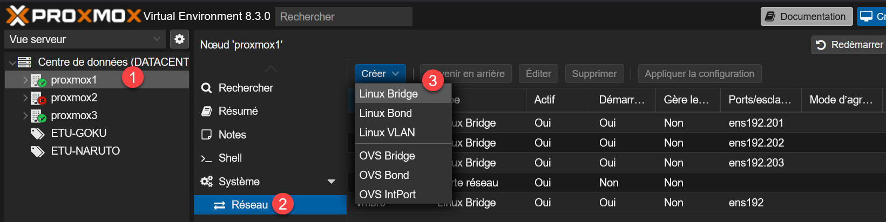
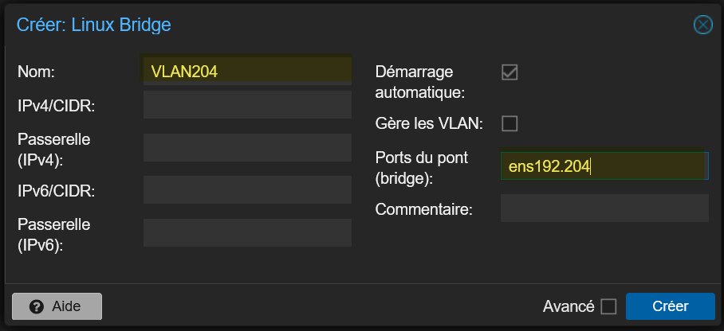
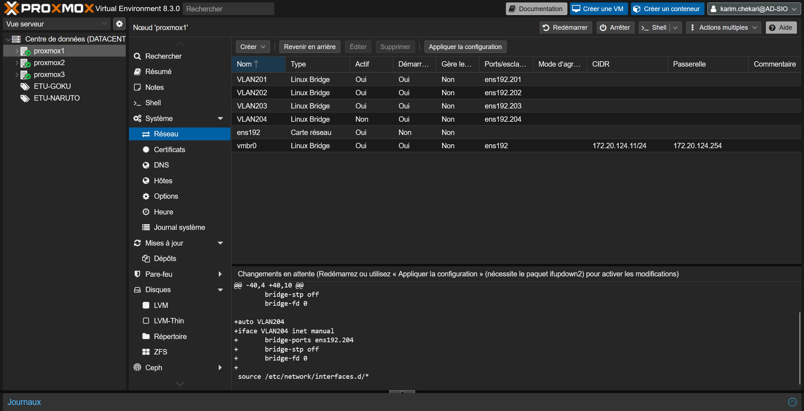

Pour créer un VLAN pour un étudiant par exemple, on peut aller sur un nœud de serveur et dans Système > Réseau > Créer Linux Bridge.

Mettre le nom à votre VLAN.
En ports du pont, mettre le nom de la carte réseau puis le numéro de votre VLAN (séparé par un point).
Si vous voulez faire passer plusieurs VLAN sur ce bridge, vous devez cocher « Gère les VLAN ».

On peut voir que le VLAN a été créé et le fichier /etc/network/interfaces a été mis à jour.

