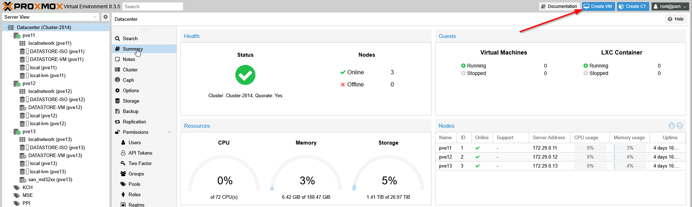
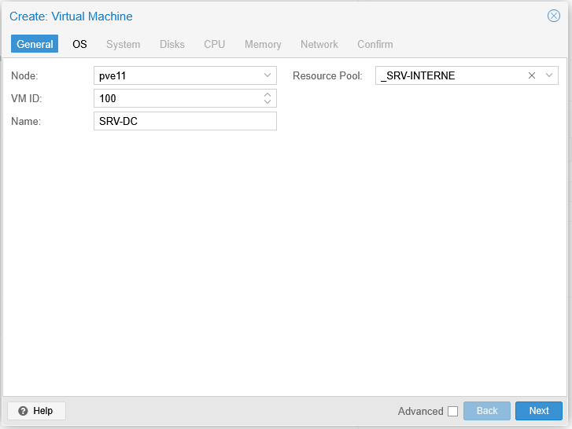
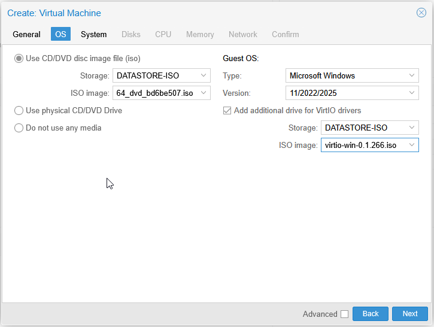
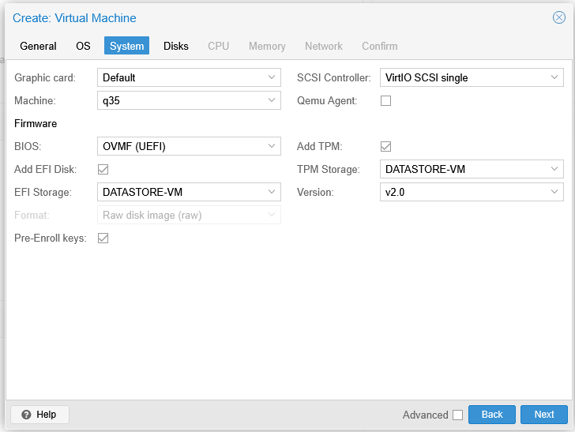
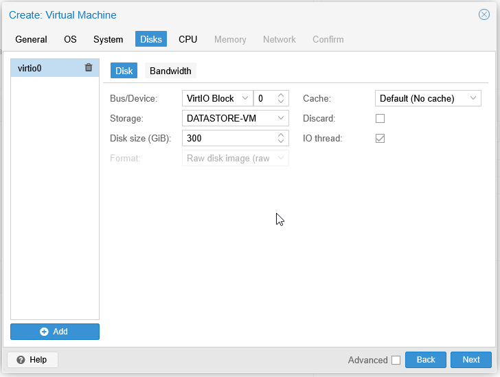
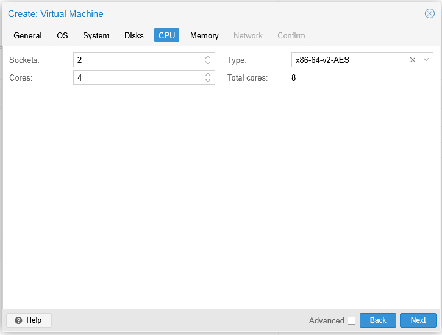
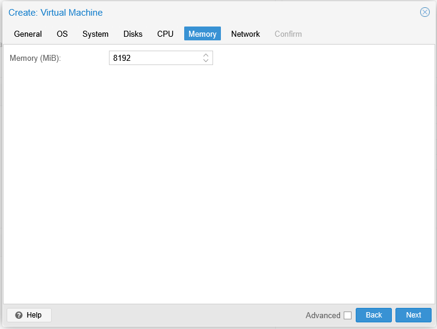
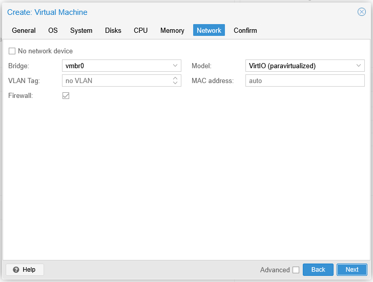
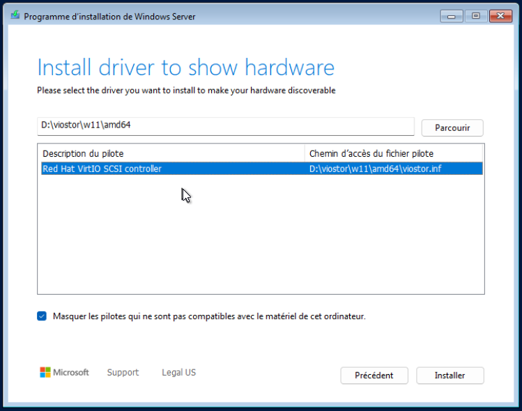

:::tip
Voici la configuration optimale pour installer Windows Server 2025 sur un hyperviseur Proxmox VE 8.3.5.
:::

Dans le DATACENTER, cliquer sur CREATE VM



### Général

- Choisir le nœud
- L’ID de la VM (normalement renseigné automatiquement)
- Le nom de la machine
- Le Pool de ressource en cas de besoin



### OS

Dans OS, nous allons choisir le stockage ISO ainsi que le fichier.
Mettre le Guest OS sur Microsoft Windows – 11/2022/2025.
On peut choisir de monter l’iso contenant les VirtIO drivers.



### System

Dans system, nous allons choisir de stocker le bios et le TPM sur le Datastore de la machine virtuelle.



### Disks

Choisir le BUS/Device VirtIO Block pour les performances ainsi que la compatibilité.

Préciser ensuite le stockage ainsi que la taille.



### CPU

Pour un Windows server, il faut prévoir large. Mettre 2 sockets et 4 Core avec comme type x86-64-v2-AES



### Memory

Mettre 8192 Mib



### Network

Laisser par défaut le model VirtIO



### Script

Pour créer la VM automatiquement, il est possible d’executer le script :

```bash
qm create 120 \
  --name win2025 \
  --memory 8192 \
  --cores 4 \
  --cpu x86-64-v2-AES \
  --numa 1 \
  --bios ovmf \
  --machine q35 \
  --scsihw virtio-scsi-single \
  --ostype win11 \
  --boot c \
  --bootdisk scsi0 \
  --efidisk0 local-lvm:1,pre-enrolled-keys=1 \
  --tpmstate0 local-lvm:1,version=2.0 \
  --scsi0 local-lvm:64,format=qcow2 \
  --net0 virtio,bridge=vmbr0 \
  --cdrom local:iso/Win11_24H2.iso \
  --ide2 local:iso/virtio-win.iso,media=cdrom
```

Personnaliser :
- 120 par l’ID que tu veux pour ta VM
- local-lvm par le nom de ton stockage
- Win11_24H2.iso et virtio-win.iso par les noms exacts de tes ISO dans /var/lib/vz/template/iso/

### Installation Windows 2025

Le disque dur n’est pas detecté, il faut charger le pilote du disque de drivers.

