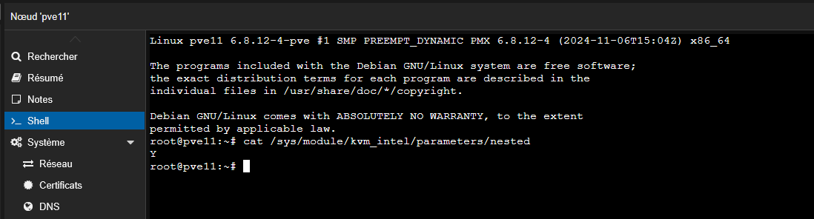
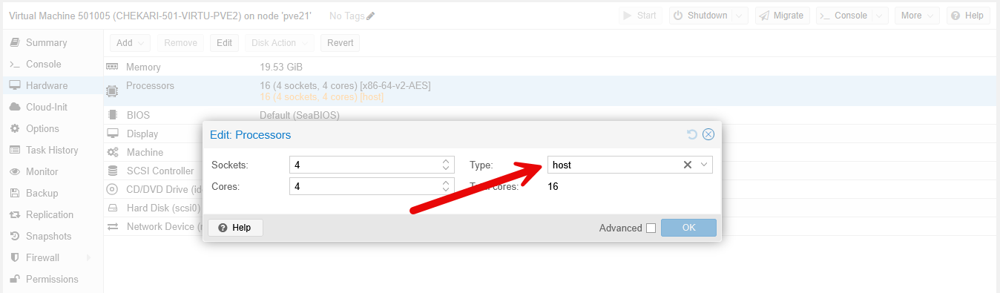

Pour voir si la virtualisation imbriquée est activée sur l’hyperviseur physique, il faut afficher un fichier.

Attention, il dépend du modèle de CPU sur la machine.

```bash
Intel :
# cat /sys/module/kvm_intel/parameters/nested
N ou Y
 
AMD :
# cat /sys/module/kvm_amd/parameters/nested
N ou Y
```



Si ce n’est pas activé, il faut ajouter la ligne suivante dans le fichier :

```bash
## INTEL
# echo "options kvm-intel nested=Y" > /etc/modprobe.d/kvm-intel.conf
## AMD
# echo "options kvm-amd nested=1" > /etc/modprobe.d/kvm-amd.conf 
```

On va ensuite redémarrer le module au niveau du Kernel

```bash
## INTEL
# modprobe -r kvm_intel
# modprobe kvm_intel
 
## AMD
# modprobe -r kvm_amd
# modprobe kvm_amd
```

Dans les configurations des machines virtuelles, il faut activer l’option suivante :

```bash
CPU Type : Host
```

