Il est possible de configurer une machine virtuelle VMWare Workstation pour qu'elle démarre directement à partir d'une clé USB. Cela peut être utile pour tester des systèmes d'exploitation ou des outils de récupération sans avoir à les installer sur le disque dur virtuel.

:::caution
Assurez-vous que la clé USB est correctement insérée et reconnue par votre système avant de commencer.
:::

[https://www.youtube.com/watch?v=ka_HDBn29LY](https://www.youtube.com/watch?v=ka_HDBn29LY)

## Étapes pour booter une VM sur une clé USB

1. **Ouvrez VMWare Workstation** et sélectionnez la machine virtuelle que vous souhaitez configurer.

2. Modifiez les paramètres de la machine virtuelle en cliquant sur "Edit virtual machine settings".

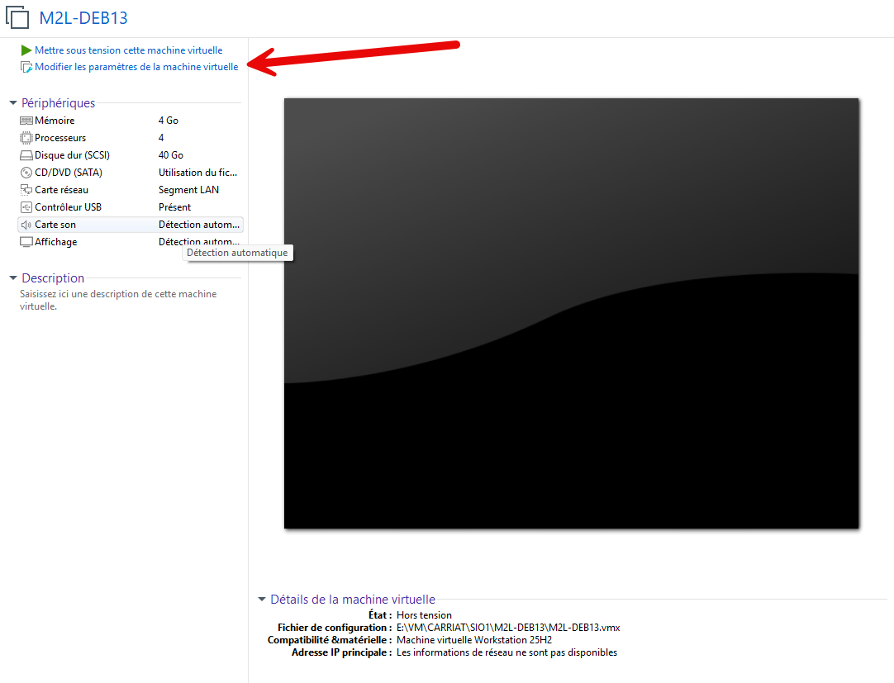

3. Dans la section "Hardware", cliquez sur "Add..." pour ajouter un nouveau périphérique.

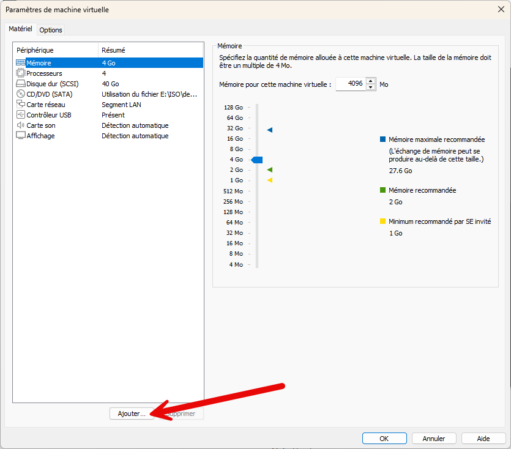

4. Identifier le numéro du disque qui correspond à votre clé USB.

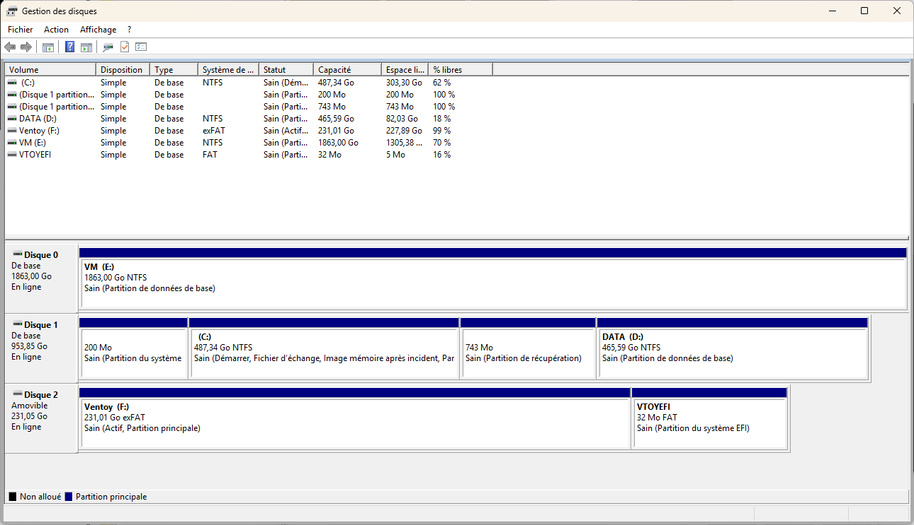

5. Sélectionnez "Hard Disk" et cliquez sur "Next".

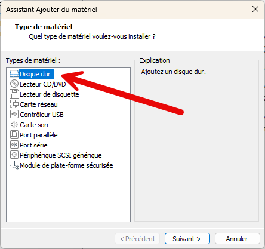

6. Choisir un disque IDE.

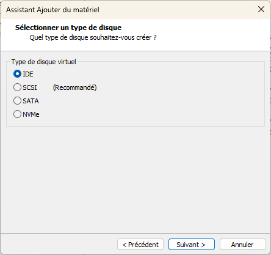

7. Choisissez "Use a physical disk (for advanced users)" et cliquez sur "Next".

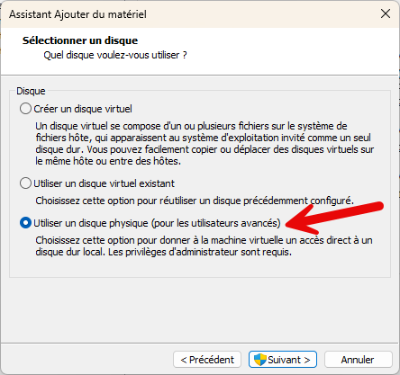

8. Sélectionnez le disque correspondant à votre clé USB dans le menu déroulant "Physical drive" et cliquez sur "Next".

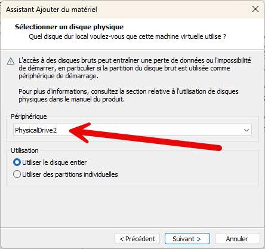

9. Renommer le disque.

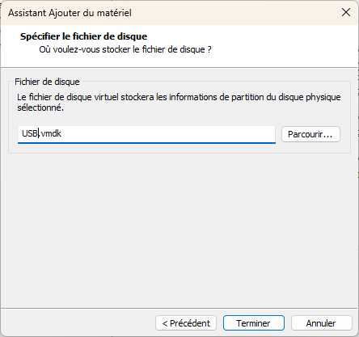

10. Dans les paramètres avancés, il faut bien être configuré en BIOS.

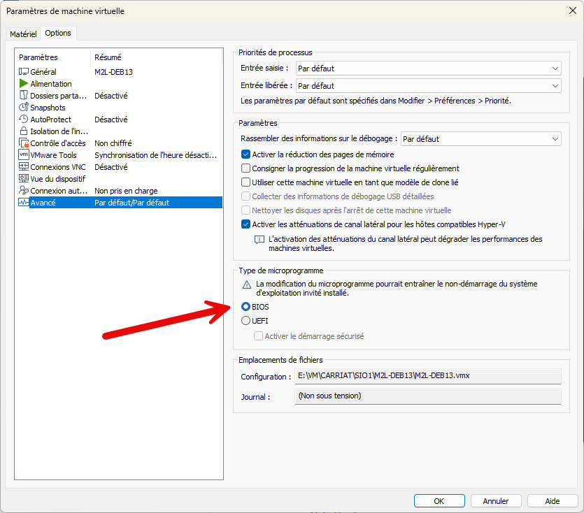

## Démarrer la machine virtuelle

1. Démarrez la machine virtuelle mais en utilisant le menu "Power on to BIOS".

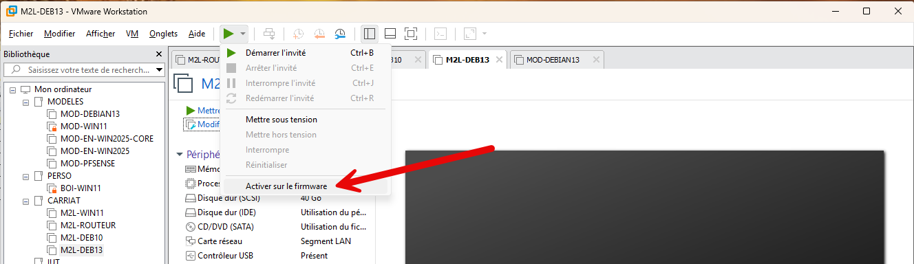

2. Dans le BIOS, allez dans l'onglet "Boot" et sélectionnez votre clé USB comme premier périphérique de démarrage.

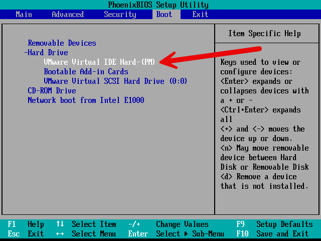

3. Sauvegardez les modifications et quittez le BIOS. La machine virtuelle devrait maintenant démarrer à partir de la clé USB.

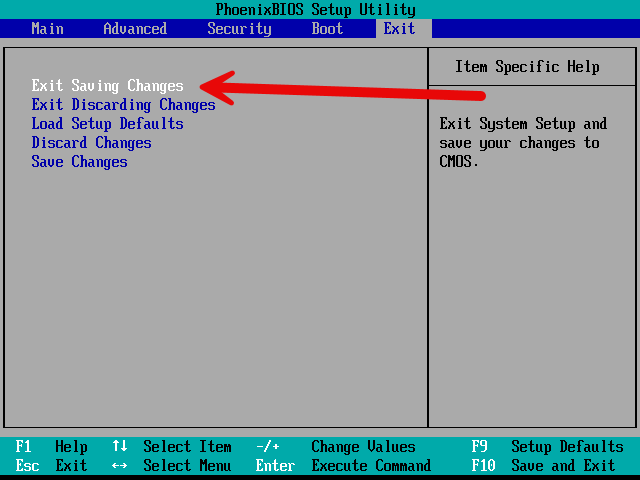

4. Le boot sur la clé USB est réussi !

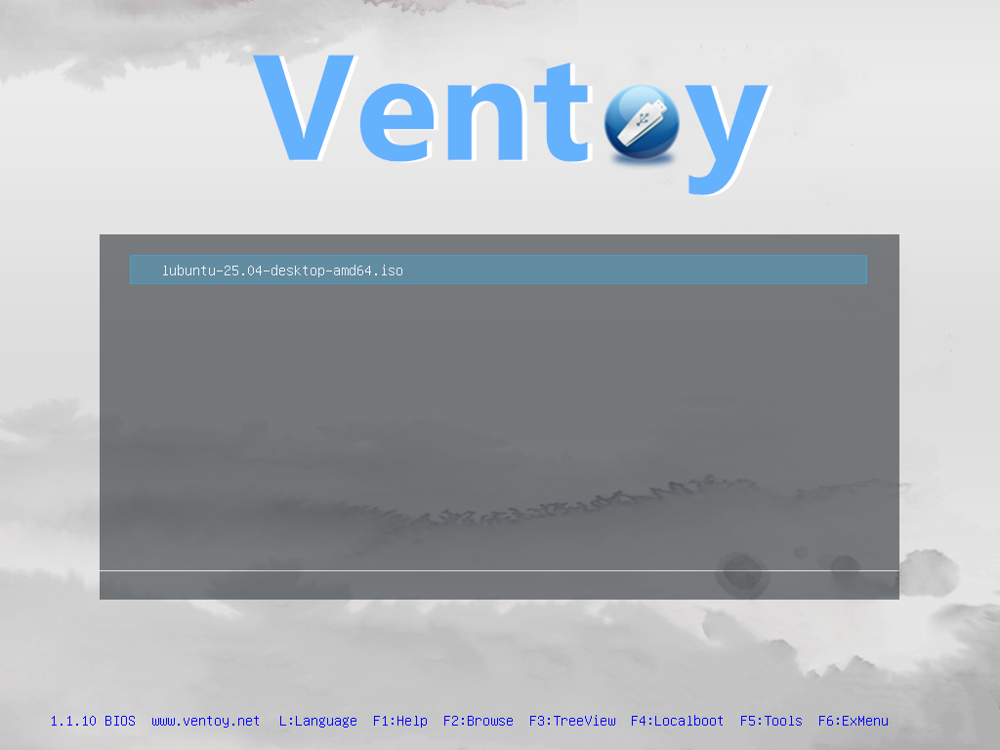