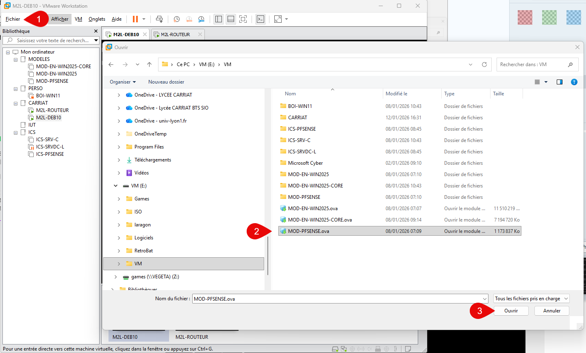
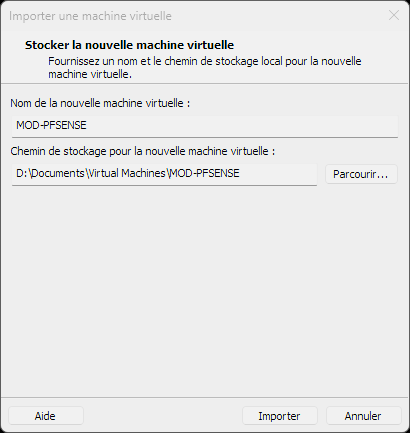

:::note
Testé sur Windows 11 & VMWare Workstation 17 25H2
:::

Dans ce guide, nous allons voir comment importer un fichier OVA dans VMWare Workstation.

Lancez l'application VMWare Workstation sur votre ordinateur.

Dans le menu principal, cliquez sur "File" (Fichier) puis sélectionnez "Open..." (Ouvrir...).

Dans la fenêtre qui s'ouvre, naviguez jusqu'à l'emplacement où se trouve votre fichier OVA. Sélectionnez le fichier et cliquez sur "Open" (Ouvrir).

Il est ensuite demandé de donner un nom à la machine virtuelle et de choisir son emplacement de stockage.

En fonction de l'origine du fichier OVA, il est possible que certaines options de configuration soient à modifier (par exemple les paramètres de réseau). Ajustez-les selon vos besoins.