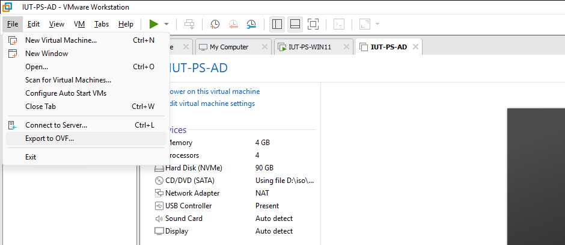
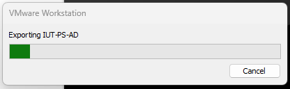
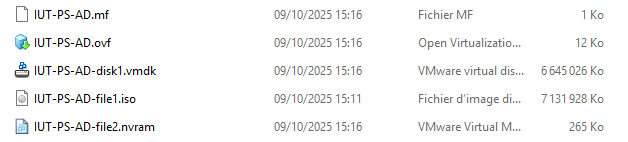
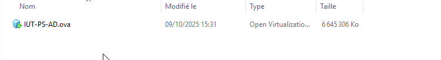

:::note
Testé sous VMWare Workstation 17 Pro
:::
Un fichier OVF (Open Virtualization Format) est un format standardisé utilisé pour exporter et importer des machines virtuelles. Lorsqu’il est généré par VMware Workstation, il contient la description complète d’une machine virtuelle : configuration matérielle (processeur, mémoire, cartes réseau, etc.), métadonnées, et liens vers les fichiers de disque virtuel associés (généralement au format VMDK). L’intérêt principal de ce format est sa portabilité : une machine virtuelle exportée en OVF peut être importée facilement dans d’autres environnements de virtualisation compatibles (comme VMware ESXi, VirtualBox ou Hyper-V via conversion). Cela facilite le partage, la sauvegarde ou le déploiement de machines virtuelles préconfigurées sur différentes plateformes, tout en garantissant une compatibilité et une interopérabilité accrues grâce à ce standard ouvert.

## Création d’un modèle OVF
On sélectionne la VM puis File > Export OVF…

Dans la fenêtre qui s’ouvre, il suffit de définir le répertoire de destination et le nom du fichier pour le sauvegarder.

En OVF, vous aurez plusieurs fichiers (configuration, iso, paramétrage, RAM …)

En OVA, vous aurez un seul fichier qui contient tout.

