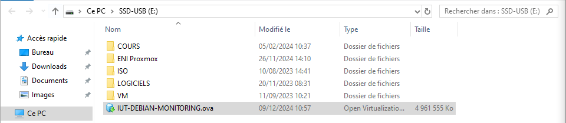
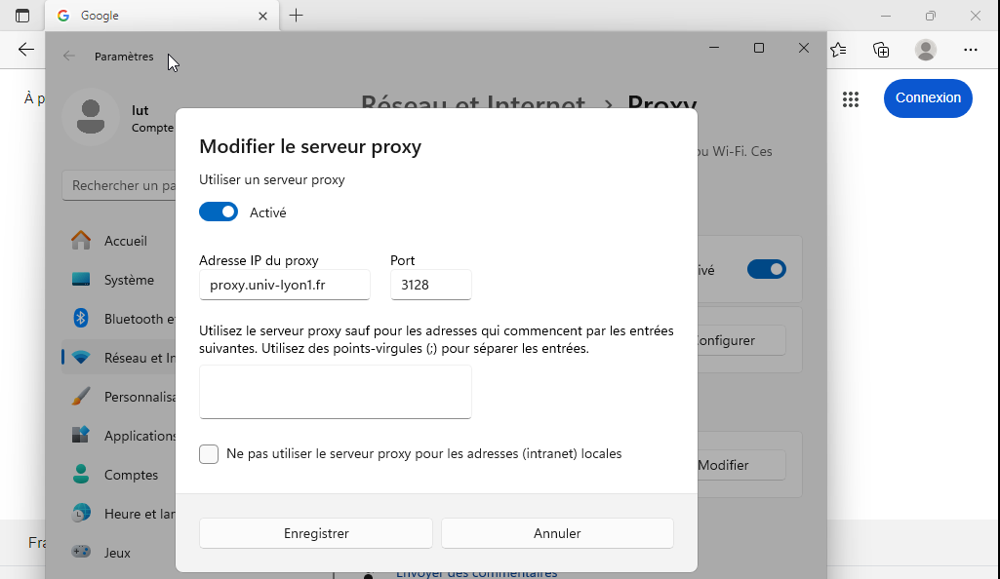

:::note
Testé sous VMWare Workstation 17 Pro
:::

## Restauration d'une VM

Vous devez récupérer une machine au format Workstation, OVA ou OVF.



Il faut la restaurer dans la dossier :
`D:\VMWARE_working-directory`


Le mot de passe pour utiliser la VM est noté dans la description.


Une fois la création faite, voilà comment améliorer son utilisation :

## Installation des paquets sous Linux / Connexion Internet

Il faut que la carte réseau soit en vmnet0.


On redémarre ensuite le service networking


Pour télécharger et installer des package avec apt sous Debian, Ubuntu, etc. 

Créer un  fichier `/etc/apt/apt.conf.d/myproxy.conf` et ajoutez les deux lignes suivantes
```bash
# nano /etc/apt/apt.conf.d/myproxy.conf
Acquire::http::proxy "http://proxy.univ-lyon1.fr:3128";
Acquire::https::proxy "https://proxy.univ-lyon1.fr:3128";
```


Il est maintenant possible d'installer des paquets.


Le proxy fonctionne pour apt mais il est possible de le faire fonctionner pour d'autres applications avec les variables d'environnement.
```bash
# nano /etc/environment
http_proxy="http://proxy.univ-lyon1.fr:3128/"
https_proxy="https://proxy.univ-lyon1.fr:3128/"
no_proxy=localhost,127.0.0.1,127.0.1.1
```


On peut verifier la présence des variable en se déconnectant puis reconnectant.
```bash
root@deb-monitoring:~# env | grep proxy
```


Ou en faisant un export


## Connexion en SSH à distance

Récupérer l'adresse IP de la VM


Lancer ensuite la commande SSH depuis une CMD Windows


## Connexion externe VM Windows

Avec une VM sur le VMNet0, aller dans les paramètres proxy de Windows et ajouter proxy.univ-lyon1.fr sur le port 3128



Il est possible d'ajouter les IP à exclure dans le cadre en dessous. Très utile pour cumuler proxy avec un accès à Grafana et Prometheus.
