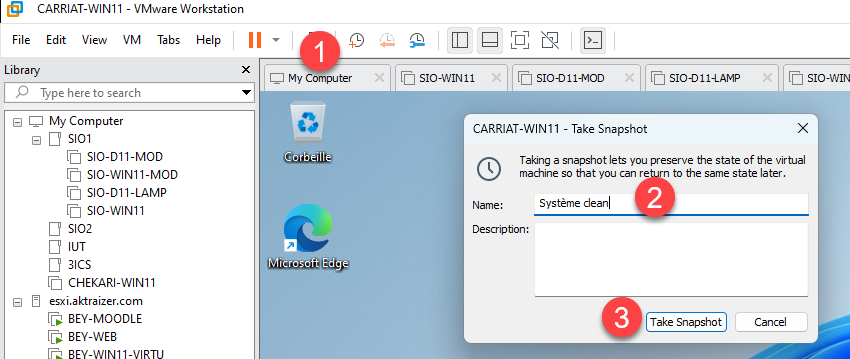
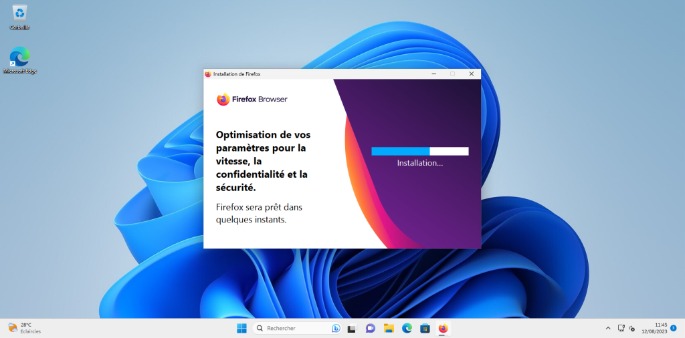
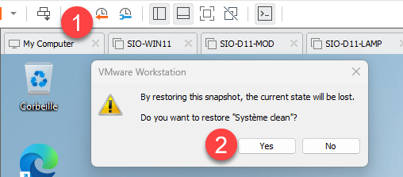

Dans un environnement virtuel comme VMware Workstation, les snapshots sont des points de sauvegarde instantanés d’une machine virtuelle à un moment donné. Ils enregistrent l’état complet du système (disque, mémoire, configuration), ce qui permet de revenir facilement en arrière si un test ou une manipulation provoque un problème. L’intérêt est particulièrement fort dans un cadre pédagogique ou de test : les étudiants peuvent expérimenter des installations de logiciels, des configurations réseau ou des manipulations système sans crainte d’endommager définitivement la machine. En cas d’erreur, il suffit de restaurer le snapshot pour retrouver la machine dans son état initial. C’est donc un outil idéal pour apprendre, tester et valider des scénarios en toute sécurité.

Faire un Snapshot du système actuel

En bas à gauche, vous pouvez voir l’avancement du Snapshot.
Ajouter un logiciel (exemple firefox) et copier un fichier sur la VM (un iso par exemple).

Restaurer le Snapshot au point de sauvegarde précédent.

Le fichier et Firefox ont disparus.