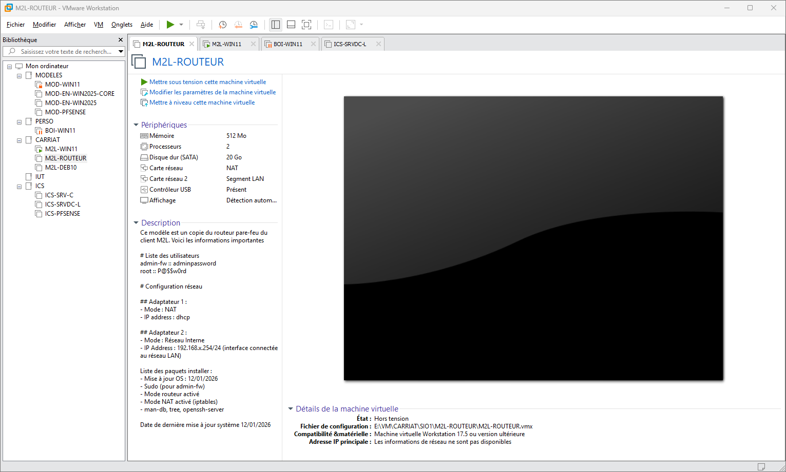
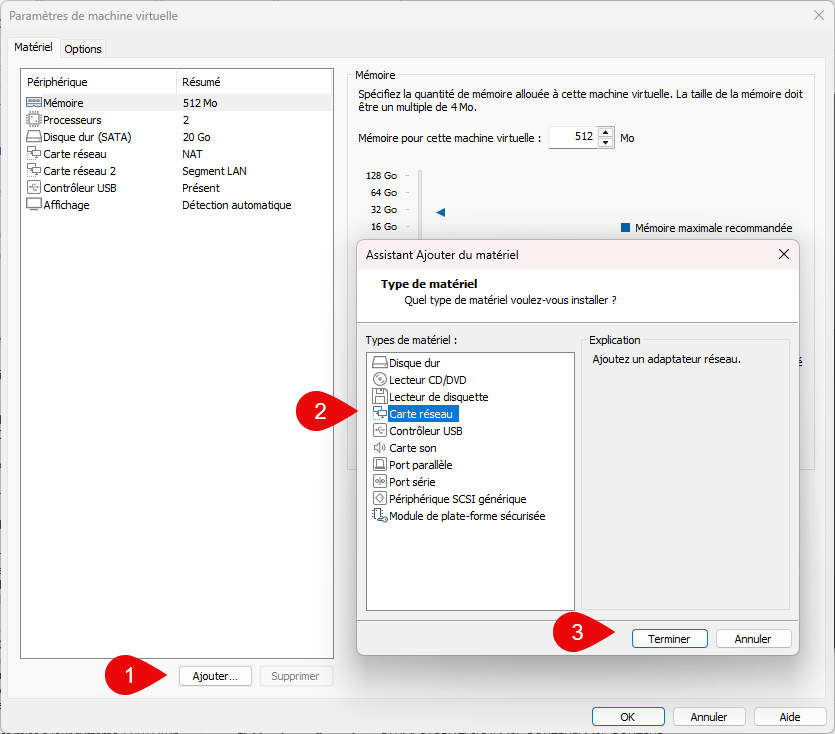

## Ajouter un périphérique à une VM existante

Pour ajouter un périphérique à une VM existante, il faut d’abord s’assurer que la VM est arrêtée.
Sélectionner la VM dans la liste puis utiliser le menu « VM » > « Settings… »

Dans l'onglet « Hardware », cliquer sur le bouton « Add… » en bas à gauche.

