## Création d'une machine virtuelle Windows 11 sur VMWare Workstation

Utiliser la barre de menu pour lancer la procédure de création d’une VM : File >New Virtual Machine …

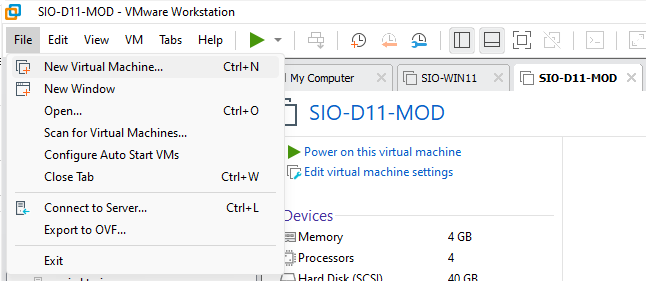

La procédure « Custom » ajoute des options supplémentaires pour la création d’une nouvelle machine, nous allons rester sur "Typical".

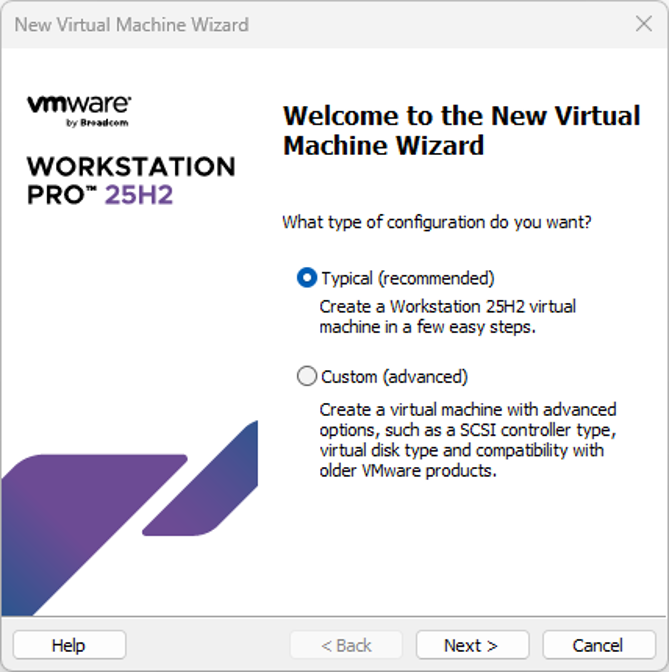

Ne pas insérer l'iso immédiatement afin d'éviter les options de configuration automatique.

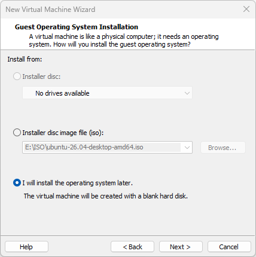

Choisir ensuite le système d'exploitation qui sera utilisé.

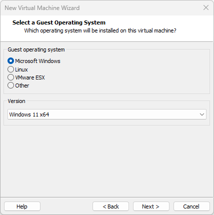

Le nom et l’emplacement sont importants car vous serez plusieurs à utiliser l’ordinateur. **La partition C: étant plus petite, ne mettez pas de VM dessus.**

- Nommer la machine en commençant par votre nom.
- Stocker la VM sur la deuxième partition D:  puis votre emplacement personnel.

Un répertoire sera automatiquement créé avec le nom de la VM.

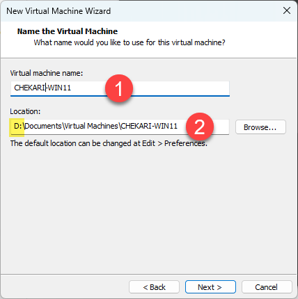

## Configuration du vTPM

Windows 11 nécessite un processeur TPM.

VMWare Workstation a besoin de créer un vTPM encrypter afin de vous permettre de créer une VM Windows 11.

Utiliser l’option « generate » puis « copy ».

:::note
Sauvegarder la clé dans votre OneNote.
:::

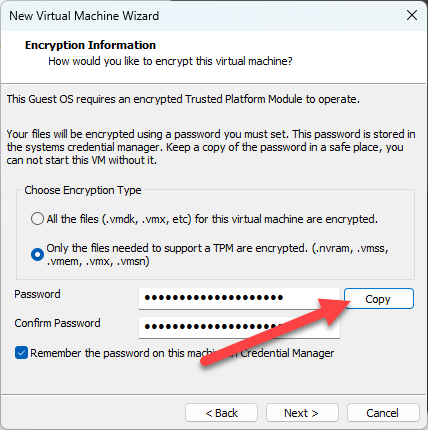

Créer un nouveau disque, il faut ensuite définir sa taille maximale en ne choisissant pas l’option « Allocate all disk space now ».

Choisir le stockage dans un seul fichier et **une taille de disque de 100go**.

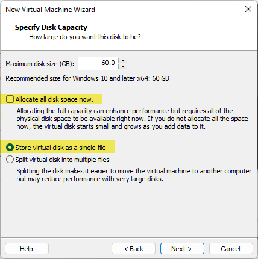

Il est possible de modifier, ajouter d’autres composants avant de terminer la création de la VM (nous n’ajouterons rien).

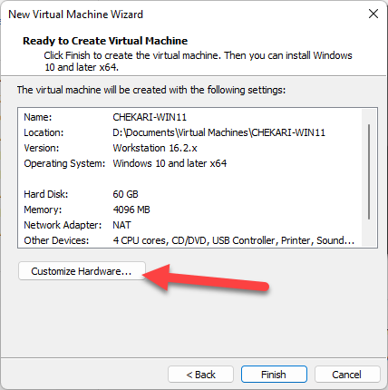

- Augmenter le nombre de CPU à 4.
- Augmenter la RAM à 6 Go.
- Charger le fichier ISO de Windows 11.

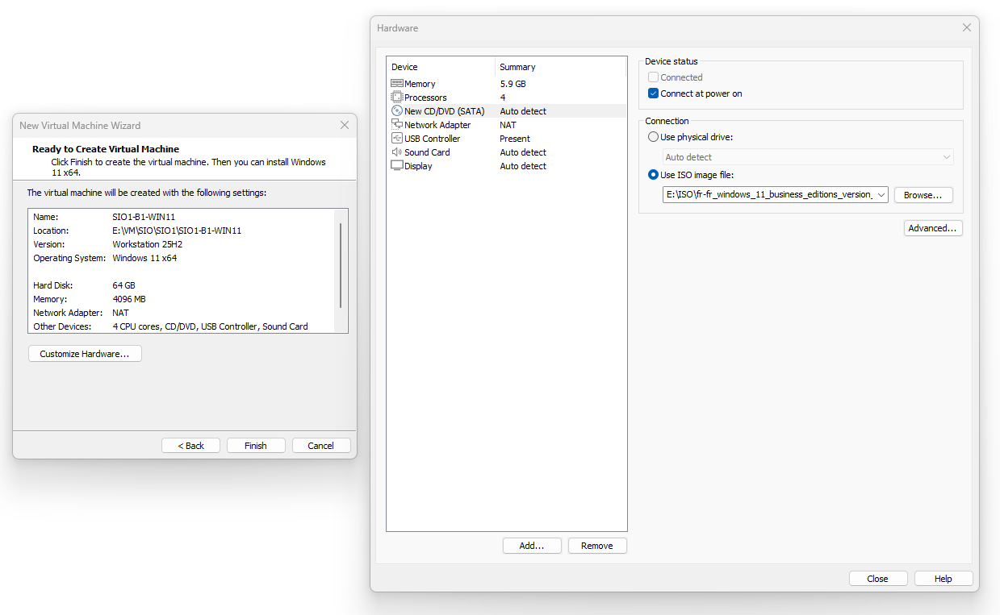

La machine étant créée, il est maintenant possible de la démarrer grâce à la barre de commande.

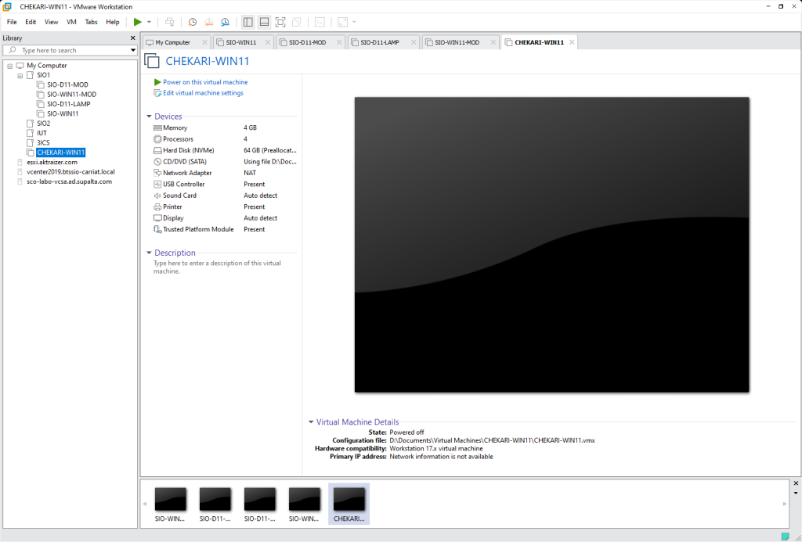

## Les Snapshots

Une mauvaise manipulation peut faire planter votre VM.

Les snapshots permettent de sauvegarder l’état d’une VM afin de pouvoir revenir en arrière.

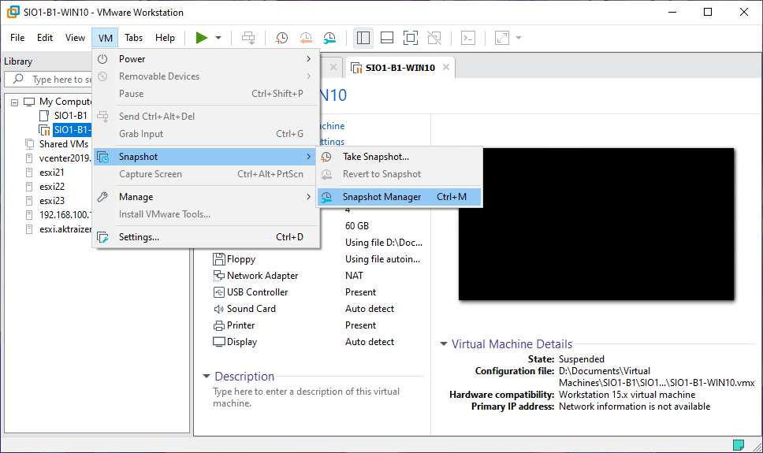

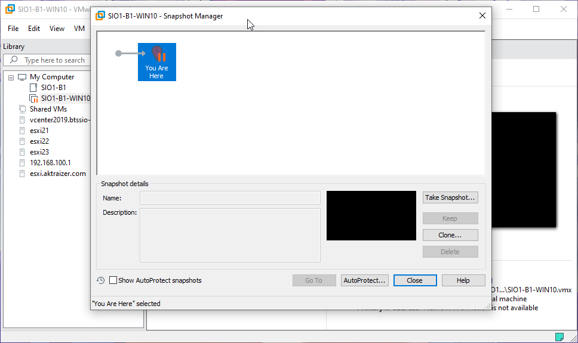