## Création d’une VM
Utiliser la barre de menu pour lancer la procédure de création d’une VM : File >New Virtual Machine …
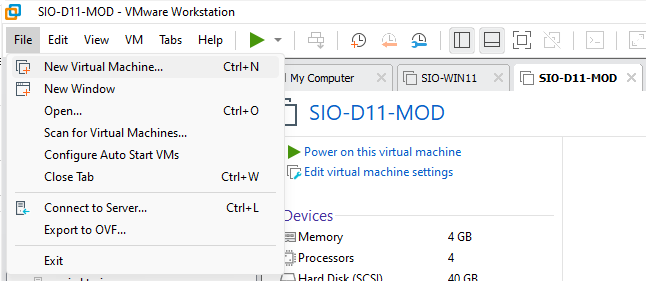
La procédure « Custom » ajoute des options supplémentaires pour la création d’une nouvelle machine.
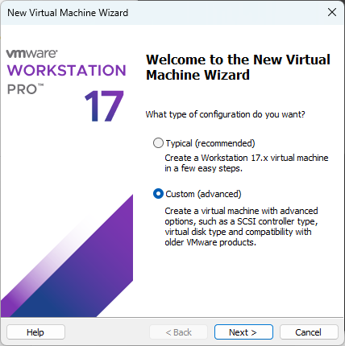
Choisir la compatibilité Workstation 17.x
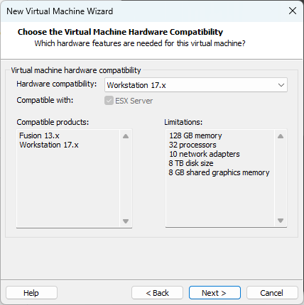
Aller chercher l’iso du système d’exploitation à installer. l’OS est détecté automatiquement sinon il faut le préciser.
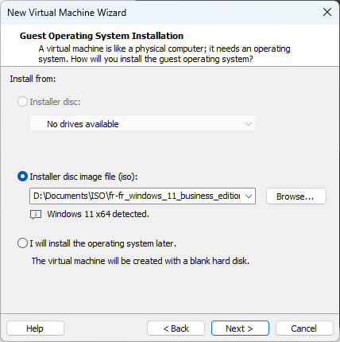
En fonction de la version de VMWare, il est possible de spécifier une clé produit, un utilisateur et un mot de passe, nous n’allons rien mettre.
Le nom et l’emplacement sont importants car vous serez plusieurs à utiliser l’ordinateur. La partition C: étant plus petite, il ne faut pas mettre de VM dessus.
Nommer la machine en commençant par votre nom.
Stocker la VM sur la deuxième partition D:  puis votre emplacement personnel.
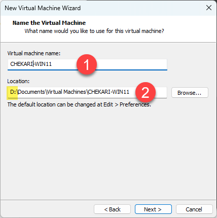
Un répertoire sera automatiquement créé avec le nom de la VM.

### Configuration du vTPM

Windows 11 nécessite un processeur TPM.
VMWare Workstation a besoin de créer un vTPM encrypter afin de vous permettre de créer une VM Windows 11.
Utiliser l’option « generate » puis « copy ».
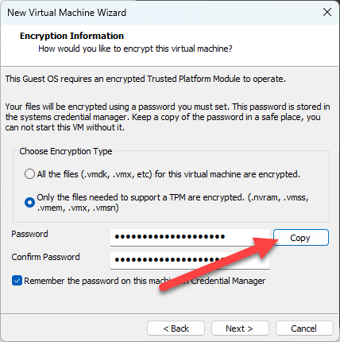

Sauvegarder la clé dans votre OneNote.

Le firmware de type UEFI permet de sécuriser le démarrage de la machine, car il nécessite un bootloader, un OS et des drivers signés.
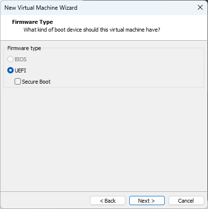
L’option « Secure Boot » vous permet en plus de vous protéger contre les bootkits et les rootkits.
Afin d’éviter des restrictions inutiles pour une machine de test, restez sur un Bios traditionnel.
Il faut adapter la configuration aux caractéristiques de l’hôte et de la puissance requise par la VM.
Il faut laisser des ressources disponibles sur l’hôte pour la gestion de son système.
Avoir une cohérence de configuration pour optimiser la VM.
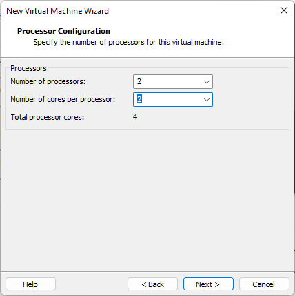
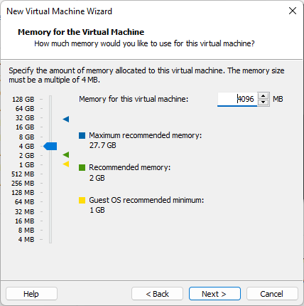
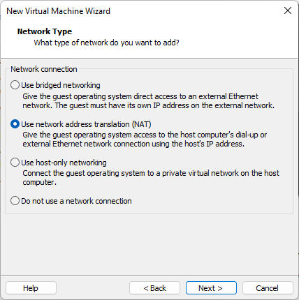
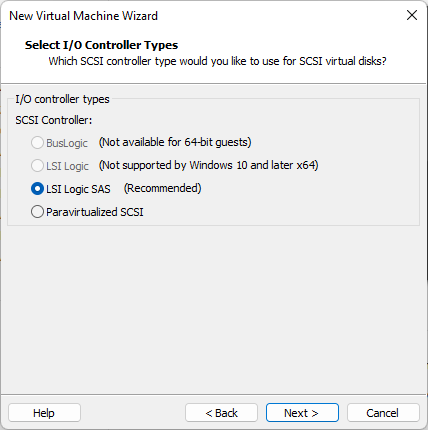
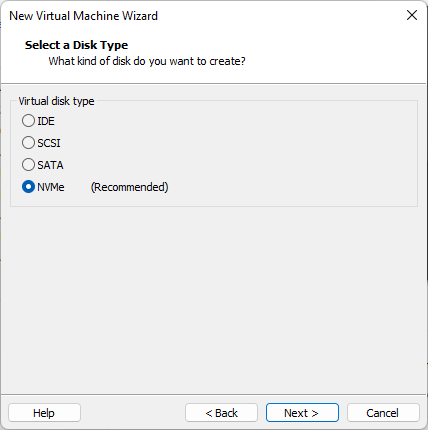
Créer un nouveau disque, il faut ensuite définir sa taille maximale en ne choisissant pas l’option « Allocate all disk space now ».
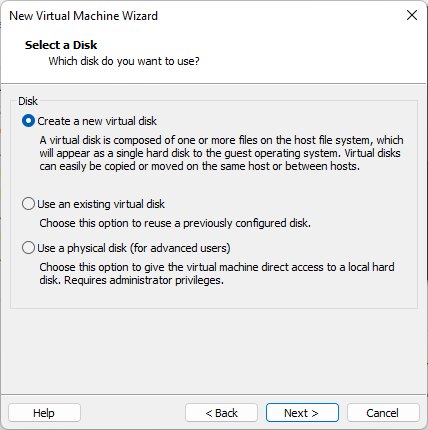
Choisir le stockage dans un seul fichier et une taille de disque de 100go.
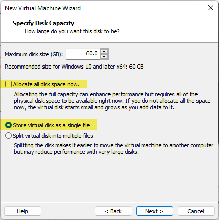
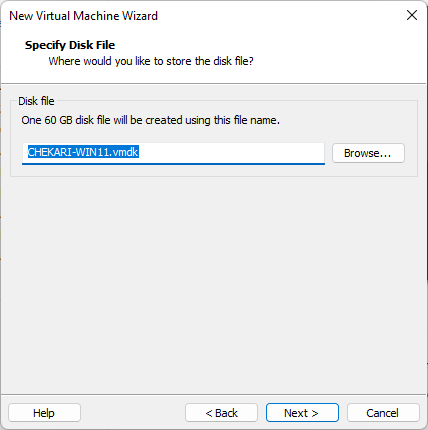
Il est possible de modifier, ajouter d’autres composants avant de terminer la création de la VM (nous n’ajouterons rien).
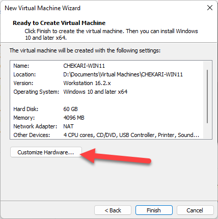
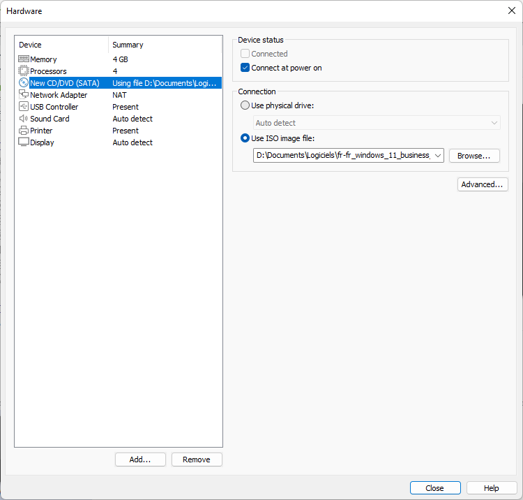
La machine étant créé, il est maintenant possible de la démarrer en utilisant la barre de commande.
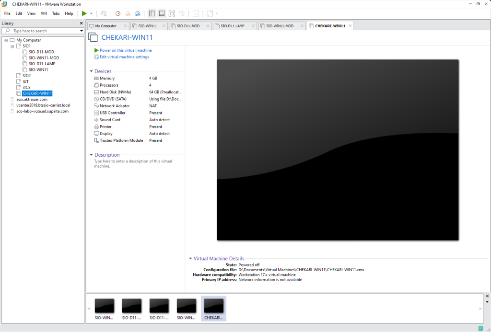

## Les Snapshots

Une mauvaise manipulation peut faire planter votre VM.
Les snapshots permettent de sauvegarder l’état d’une VM afin de pouvoir revenir en arrière.
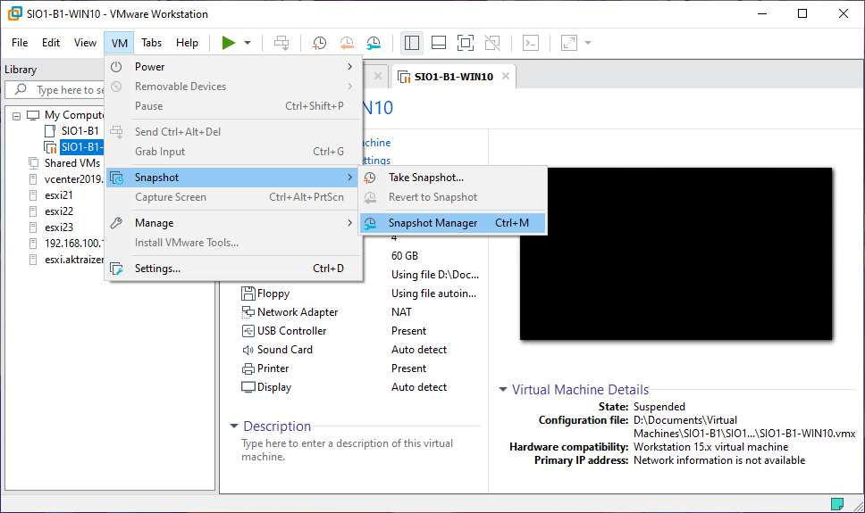
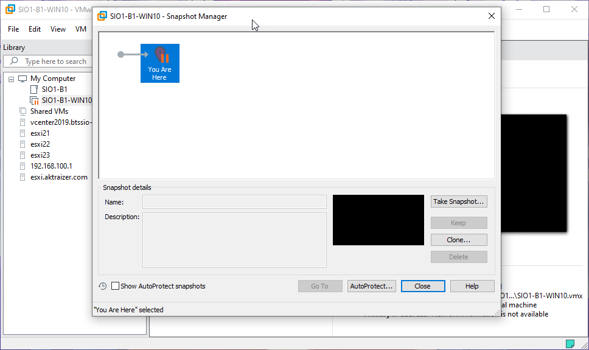